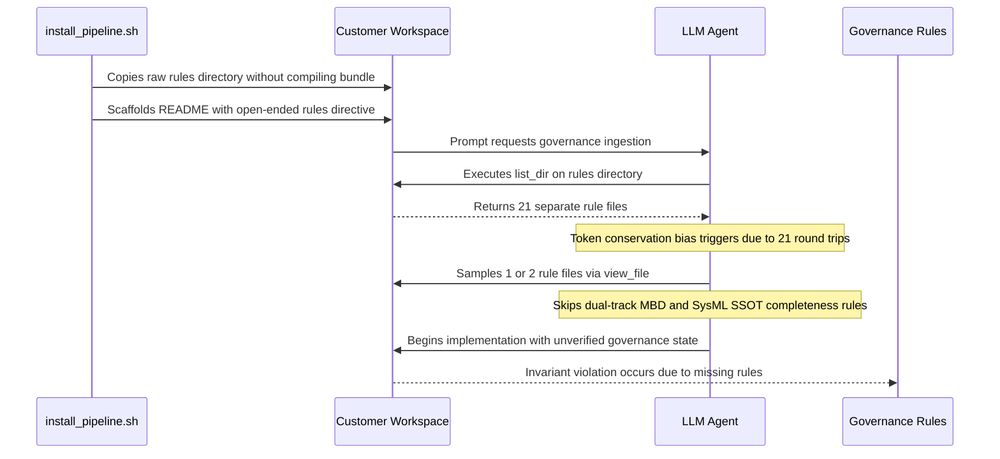

## 1. Context and References

<!-- test-target: tests/test_readme_scaffolding.py -->

- **File**: `scripts/install_pipeline.sh:360-890`
- **Pillar**: Semantic Traceability
- **Symptom**: Downstream onboarding prompts instruct agents to open-endedly ingest `rules/` or selectively read individual rule files, causing LLM agents to trigger token-conservation shortcuts (sampling 1-2 files or relying only on `list_dir`), because `scripts/install_pipeline.sh` fails to compile active governance rules into a consolidated single-file manifest (`.pipeline/ACTIVE_RULES_BUNDLE.md`) at installation time.
- **Test-Target**: `tests/test_readme_scaffolding.py`

## 2. Root Cause Analysis (5 Whys)

1. **Why do downstream AI agents fail to enforce active governance rules during project execution?** Because agents take ingestion shortcuts, sampling 1-2 rules or relying solely on directory listings rather than reading all 21 rule files.
2. **Why do agents take ingestion shortcuts instead of reading all 21 rule files?** Because the onboarding prompt catalog directs agents to open-ended directory paths (`rules/`) or isolated single rules (`rules/dual-track-mbd-verification.md`), triggering subconscious token-conservation heuristics against executing 21 sequential round-trip tool calls.
3. **Why does the onboarding catalog direct agents to an open-ended directory or isolated files?** Because no single consolidated rule bundle exists on disk for agents to target with a single atomic `view_file` operation.
4. **Why is there no single consolidated rule bundle available in downstream workspaces?** Because `scripts/install_pipeline.sh` merely copies the `rules/` directory via raw `cp -RPf` without an installation-time compilation step to concatenate and index all active rules into `.pipeline/ACTIVE_RULES_BUNDLE.md`.
5. **Why was no rule compilation pass implemented in `scripts/install_pipeline.sh`?** Because the onboarding pipeline design assumed agents would independently iterate over all directory entries in `rules/`, failing to account for LLM context limits, multi-turn latency, and open-ended folder directive fragility.

## 3. Correctness Analysis

The DEAP pipeline architecture mandates strict governance enforcement across all three tiers: Upstream Compiler, Tier 1 Domain Distribution Templates, and Tier 2 Customer Application Workspaces. Under the Pure Schema-Driven Compiler & Governance Invariant, all 21 active governance rules (including `rules/dual-track-mbd-verification.md`, `rules/sysml-ssot-completeness.md`, `rules/tdd-mandate.md`, and `rules/user-authorization-lock.md`) must govern every downstream specification and implementation micro-task. Furthermore, the Mandatory Direct-Path Read & Zero-Shortcut Invariant (`rules/constitution-first.md`, `rules/codebase-compliance.md`, `.pipeline/constitution.md`) strictly forbids agents from bypassing governance files or assuming file contents from names.

However, the current installation and scaffolding mechanism breaks this contract at three critical junctures:

1. Installation-Time Bundling Omission (`scripts/install_pipeline.sh:360`):
   During installation, `scripts/install_pipeline.sh` executes `cp -RPf "$INSTALLER_ROOT/rules" "$TARGET_DIR/"`. It replicates the 21 individual files into `$TARGET_DIR/rules/`, but never consolidates them into an indexed manifest at `$TARGET_DIR/.pipeline/ACTIVE_RULES_BUNDLE.md`.

2. Open-Ended Folder Directives (`scripts/install_pipeline.sh:809, 890`):
   In the scaffolded `README.md` files for both Domain Templates and Customer Workspaces, Section 3 Step 3 instructs agents:
   `3. **Load Governance Rules**: Ingest \`AGENTS.md\` and \`rules/\` to enforce project-scoped agentic rules, context-isolated subagent dispatch loops, and role boundary locks.`
   Because tool interfaces (such as `view_file`) reject directory targets with an error, the agent must either run `list_dir` or guess files.

3. Token-Conservation Bias Triggers (`scripts/install_pipeline.sh:1326`):
   When an agent runs `list_dir` on `rules/`, it receives 21 filenames. Executing 21 sequential round-trip `view_file` calls would exhaust conversation turns and token limits. Consequently, LLM agent heuristics trigger token-conservation behavior: the agent samples 1 or 2 files (e.g. `rules/role-boundary-lock.md`) and assumes the rest are redundant or covered by `AGENTS.md`. This bias is compounded in prompt catalogs (line 1326) where prompts selectively cite only one rule (`rules/dual-track-mbd-verification.md`), anchoring the agent to believe that no other rules apply.

As a result, downstream agents execute without loading critical invariants (such as SysML AST completeness, dual-track simulation parity, and non-closure commit rules). Moreover, `tests/test_readme_scaffolding.py` lacks any test asserting that a consolidated rule bundle is generated and enforced, allowing this governance blind spot to persist undetected.

## 4. UML Diagrams



## 5. Affected Callers / Downstream Impact

- Downstream Customer Projects (e.g. `uav-011`, tactical UAS workspaces) -- Autonomous agents initialize and execute without loading mandatory governance constraints, violating safety-critical engineering baselines.
- Worker Subagents (Worker 2B, micro-task implementers) -- Agents anchor to isolated rule citations in prompt headers, failing to synthesize dual-track simulation engines or enforce SysML v2 SSOT requirements.
- Quality Gates & Test Suites (`tests/test_readme_scaffolding.py`) -- Test suites pass without verifying rule consolidation or ingestion completeness, creating a false sense of compliance.

## 6. Proposed Correction

```bash
# In scripts/install_pipeline.sh:
# Automatically compile active governance rules into .pipeline/ACTIVE_RULES_BUNDLE.md
echo "Compiling active governance rules into .pipeline/ACTIVE_RULES_BUNDLE.md..."
BUNDLE_FILE="$TARGET_DIR/.pipeline/ACTIVE_RULES_BUNDLE.md"
mkdir -p "$TARGET_DIR/.pipeline"

cat << 'EOF' > "$BUNDLE_FILE"
# ACTIVE RULES BUNDLE — Consolidated Governance Manifest

> **Notice:** This bundle is compiled automatically at installation time by `scripts/install_pipeline.sh`.
> It aggregates all 21 mandatory governance rules from `rules/` into a single, unified source of truth.
> Autonomous agents MUST read this file in full before executing any implementation or orchestration tasks.

## Table of Contents
EOF

for rule_file in "$INSTALLER_ROOT"/rules/*.md; do
  [ -f "$rule_file" ] || continue
  rule_base=$(basename "$rule_file")
  rule_slug=$(echo "$rule_base" | tr '[:upper:]' '[:lower:]' | sed -e 's/[^a-z0-9]/-/g' -e 's/--*/-/g' -e 's/^-//' -e 's/-$//')
  echo "- [${rule_base}](#rule-${rule_slug})" >> "$BUNDLE_FILE"
done

echo "" >> "$BUNDLE_FILE"
echo "---" >> "$BUNDLE_FILE"
echo "" >> "$BUNDLE_FILE"

for rule_file in "$INSTALLER_ROOT"/rules/*.md; do
  [ -f "$rule_file" ] || continue
  rule_base=$(basename "$rule_file")
  rule_slug=$(echo "$rule_base" | tr '[:upper:]' '[:lower:]' | sed -e 's/[^a-z0-9]/-/g' -e 's/--*/-/g' -e 's/^-//' -e 's/-$//')
  echo "<a id=\"rule-${rule_slug}\"></a>" >> "$BUNDLE_FILE"
  echo "## Rule: ${rule_base}" >> "$BUNDLE_FILE"
  echo "" >> "$BUNDLE_FILE"
  cat "$rule_file" >> "$BUNDLE_FILE"
  echo "" >> "$BUNDLE_FILE"
  echo "---" >> "$BUNDLE_FILE"
  echo "" >> "$BUNDLE_FILE"
done

# In scripts/install_pipeline.sh README generation (lines 809, 890):
# Update step 3:
# 3. **Load Governance Rules**: Execute `view_file` on `.pipeline/ACTIVE_RULES_BUNDLE.md` to ingest the complete, consolidated suite of active governance rules in a single read (covering dual-track MBD, SysML SSOT completeness, role boundary locks, and TDD mandates).
```

## 7. Relationship to Existing Issues

Discovered in audit -- new finding.

## Audit Source

Adversarial Semantic Traceability Audit
SEVERITY: Important
FILE_LOCATION: scripts/install_pipeline.sh:360-890
