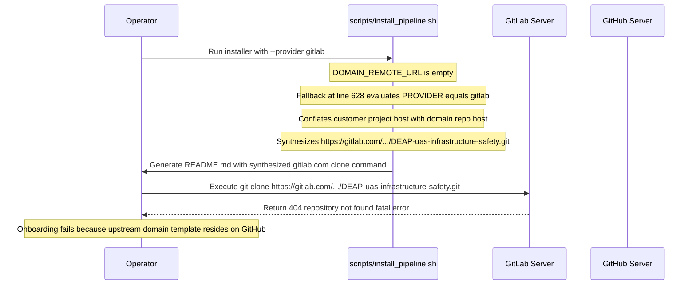

## 1. Context and References

<!-- test-target: tests/test_domain_url_synthesis.py -->

- **File**: `scripts/install_pipeline.sh:626-633`
- **Pillar**: Semantic Traceability
- **Symptom**: `install_pipeline.sh` synthesizes a non-existent `gitlab.com` clone URL for upstream domain repositories when `--provider gitlab` is specified, causing customer workspace onboarding to fail with repository not found.
- **Test-Target**: `tests/test_domain_url_synthesis.py`

## 2. Root Cause Analysis (5 Whys)

1. **Why does downstream customer project onboarding fail with fatal repository not found?** Because `git clone` attempts to fetch `https://gitlab.com/gintatkinson/DEAP-uas-infrastructure-safety.git`, which does not exist on GitLab.
2. **Why does the generated customer README specify a gitlab.com clone URL for the domain template?** Because `scripts/install_pipeline.sh` fallback logic executes lines 628-632 and constructs `DOMAIN_REMOTE_URL` using `GITLAB_URL` or `gitlab.com`.
3. **Why does the installer construct a GitLab URL for the domain repository?** Because the fallback resolution inspects `PROVIDER` and conflates the customer project git host with the host platform of the upstream domain template repository.
4. **Why are the customer project issue tracker and upstream domain repository host coupled?** Because the installer lacks a dedicated parameter or decoupling logic to independently specify or resolve the authoritative host of upstream domain templates.
5. **Why is this coupling an architectural violation?** Because DEAP architecture requires upstream domain templates hosted on GitHub to be consumable by downstream customer projects on any git host or issue tracker without forge coupling.

## 3. Correctness Analysis

In `scripts/install_pipeline.sh`, line 61 parses the target repository provider into variable `PROVIDER` (e.g. `--provider gitlab`). When generating the downstream `README.md` at line 610, `DOMAIN_REMOTE_URL` is resolved to provide turnkey customer onboarding instructions.

If `DOMAIN_REMOTE_URL` remains unresolved by lines 611-624, the script enters the fallback block at lines 626-633:
```bash
if [ -z "$DOMAIN_REMOTE_URL" ]; then
  CLEAN_NAME=$(echo "${DOMAIN_PROJECT_NAME:-downstream-project}" | tr ' ' '-')
  if [ "$PROVIDER" = "gitlab" ]; then
    DOMAIN_REMOTE_URL="${GITLAB_URL:-https://gitlab.com}/${GITLAB_GROUP:-your-group}/${CLEAN_NAME}.git"
  else
    DOMAIN_REMOTE_URL="https://github.com/${GITHUB_ORG:-your-org}/${CLEAN_NAME}.git"
  fi
fi
```

This logic erroneously assumes that the domain distribution template repository is hosted on the same platform as the downstream customer workspace. If a customer project specifies `--provider gitlab` (or is initialized in a GitLab environment), `DOMAIN_REMOTE_URL` evaluates to `https://gitlab.com/gintatkinson/DEAP-uas-infrastructure-safety.git`.

At line 674, this variable is interpolated into the onboarding command written to `$TARGET_DIR/README.md`:
```bash
git clone ${DOMAIN_REMOTE_URL} ./.tmp-pipeline && bash ./.tmp-pipeline/scripts/install_pipeline.sh . && rm -rf ./.tmp-pipeline
```

When an operator or automated agent follows these instructions in a customer workspace, git attempts to clone from `gitlab.com`, producing:
`remote: The project you were looking for could not be found or you don't have permission to view it.`
`fatal: repository 'https://gitlab.com/gintatkinson/DEAP-uas-infrastructure-safety.git/' not found`

Invariant violated: Decoupled Multi-Tier Platform Isolation. Upstream domain distribution templates (`Tier 1`, e.g. `DEAP-uas-infrastructure-safety`) reside on GitHub, whereas downstream customer projects (`Tier 2`, e.g. `uav-011`) may reside on GitLab, GitHub, or any other git forge. The downstream provider setting must never corrupt the upstream domain template remote URL.

## 4. UML Diagrams



## 5. Affected Callers / Downstream Impact

- Downstream Customer Projects -- Cannot onboard or bootstrap when configured with GitLab provider due to fatal git clone failure.
- Automated Agent Onboarding -- AI agents executing Turnkey Customer Project Onboarding from README.md encounter non-existent repository errors.
- Multi-Tier Distribution Architecture -- Breaks independent hosting where domain templates live on GitHub and customer projects live on GitLab.

## 6. Proposed Correction

```bash
  # Support explicit domain URL override
  DOMAIN_REMOTE_URL=""
  if [ -n "$DOMAIN_URL" ]; then
    DOMAIN_REMOTE_URL="$DOMAIN_URL"
  elif [ -n "$REMOTE_URL" ] && ! echo "$REMOTE_URL" | grep -q "DEAP01-spec-core"; then
    DOMAIN_REMOTE_URL="$REMOTE_URL"
  elif [ -n "$DETECTED_SERVER_URL" ] && [ -n "$DETECTED_NAMESPACE" ] && [ -n "$DETECTED_PROJECT" ] && [ "$DETECTED_PROJECT" != "DEAP01-spec-core" ]; then
    DOMAIN_REMOTE_URL="${DETECTED_SERVER_URL}/${DETECTED_NAMESPACE}/${DETECTED_PROJECT}.git"
  elif [ -n "$DETECTED_SERVER_URL" ] && [ -n "$DETECTED_NAMESPACE" ] && [ -n "$DOMAIN_PROJECT_NAME" ] && [ "$DOMAIN_PROJECT_NAME" != "Downstream Cyber-Physical Infrastructure Safety Project" ]; then
    CLEAN_NAME=$(echo "$DOMAIN_PROJECT_NAME" | tr ' ' '-')
    DOMAIN_REMOTE_URL="${DETECTED_SERVER_URL}/${DETECTED_NAMESPACE}/${CLEAN_NAME}.git"
  elif [ ! -e "$INSTALLER_ROOT/.pipeline/upstream" ]; then
    INSTALLER_REMOTE=$(git -C "$INSTALLER_ROOT" remote get-url origin 2>/dev/null || git -C "$INSTALLER_ROOT" config --get remote.origin.url 2>/dev/null || true)
    if [ -n "$INSTALLER_REMOTE" ] && ! echo "$INSTALLER_REMOTE" | grep -q "DEAP01-spec-core"; then
      DOMAIN_REMOTE_URL="$INSTALLER_REMOTE"
    fi
  fi

  if [ -z "$DOMAIN_REMOTE_URL" ]; then
    CLEAN_NAME=$(echo "${DOMAIN_PROJECT_NAME:-downstream-project}" | tr ' ' '-')
    # Decouple customer project provider from upstream domain template host.
    # Canonical DEAP domain templates reside on GitHub.
    DOMAIN_REMOTE_URL="https://github.com/${GITHUB_ORG:-gintatkinson}/${CLEAN_NAME}.git"
  fi
```

## 7. Relationship to Existing Issues

Discovered in audit -- new finding.

## Audit Source

Adversarial Semantic Traceability Audit
SEVERITY: Important
FILE_LOCATION: scripts/install_pipeline.sh:626-633
