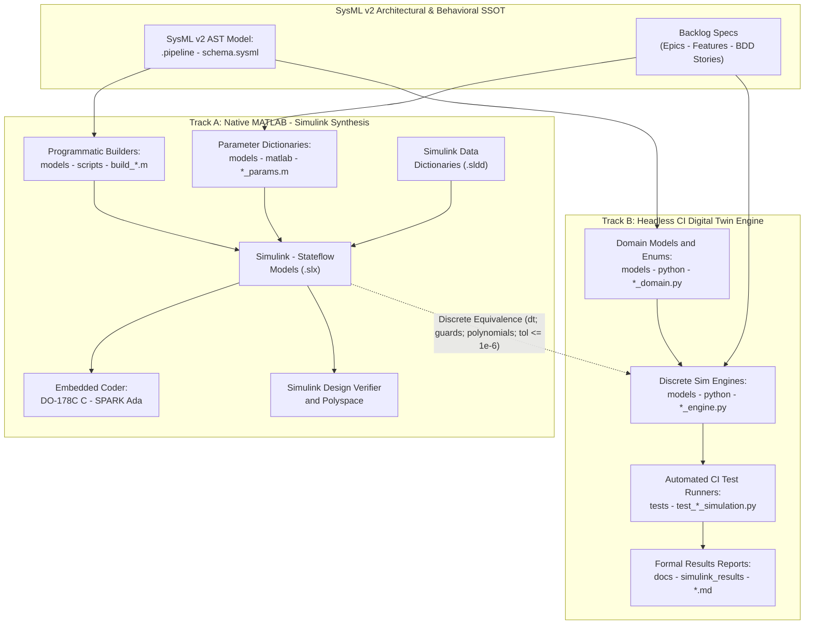

# ACTIVE RULES BUNDLE — Consolidated Governance Manifest

> **Notice:** This consolidated governance manifest is compiled automatically at installation time by `scripts/install_pipeline.sh`.
> It aggregates 100% of the active governance rules from `rules/` into a single, unified source of truth.
> Autonomous agents (Antigravity, Claude Code, Gemini CLI, Cursor) MUST execute `view_file` on this file to ingest the full suite of active governance rules in a single read before executing any implementation or orchestration tasks.

## Table of Contents

- [behavioral-trigger-coverage.md](#rule-behavioral-trigger-coverage-md)
- [codebase-compliance.md](#rule-codebase-compliance-md)
- [conops-mission-intent-integrity.md](#rule-conops-mission-intent-integrity-md)
- [constitution-first.md](#rule-constitution-first-md)
- [document-references.md](#rule-document-references-md)
- [domain-engineering-standards.md](#rule-domain-engineering-standards-md)
- [dual-track-mbd-verification.md](#rule-dual-track-mbd-verification-md)
- [latex-katex-integrity.md](#rule-latex-katex-integrity-md)
- [no-browser-automation.md](#rule-no-browser-automation-md)
- [platform-independence.md](#rule-platform-independence-md)
- [role-boundary-lock.md](#rule-role-boundary-lock-md)
- [serial-execution.md](#rule-serial-execution-md)
- [specification-metadata-integrity.md](#rule-specification-metadata-integrity-md)
- [subagent-dispatch-standards.md](#rule-subagent-dispatch-standards-md)
- [sysml-ssot-completeness.md](#rule-sysml-ssot-completeness-md)
- [tdd-mandate.md](#rule-tdd-mandate-md)
- [tracker-source-of-truth.md](#rule-tracker-source-of-truth-md)
- [uml-model-integrity.md](#rule-uml-model-integrity-md)
- [user-authorization-lock.md](#rule-user-authorization-lock-md)
- [verification-required.md](#rule-verification-required-md)

---

<a id="behavioral-trigger-coverage-md"></a>
<a id="rule-behavioral-trigger-coverage-md"></a>
<a id="behavioral-trigger-coverage"></a>
<a id="rule-behavioral-trigger-coverage"></a>
## Rule: behavioral-trigger-coverage.md

<!-- Copyright Gint Atkinson, gint.atkinson@gmail.com -->

# Rule: Behavioural Trigger Coverage

**ALWAYS enforce:** when the workspace schema contains a node named by a behavioural
trigger, the specifications MUST cover that trigger's documented requirements.

## What a behavioural trigger is

`rules/behavioral_triggers.json` declares a list of triggers. Each carries
`trigger_nodes` -- schema node names that arm it -- and `rules`, each of which names a
`target_type` (`user-story` or `use-case`), the terms or Mermaid block the specification
must contain, and the `error_message` reported when it does not.

A trigger is **active** only when one of its `trigger_nodes` is present in the parsed
schema modules. An inactive trigger imposes nothing. This is deliberate: the requirement
is conditional on the system actually having the capability, so a project that never
streams high-frequency data is not asked to specify concurrency control for it.

## Hard constraints

- **Active Trigger Nodes Must Be Covered**: for every active trigger node, at least one
  specification file of the rule's `target_type` MUST reference that node by name. A
  trigger armed by the schema and mentioned in no User Story or Use Case is an
  unspecified capability, and coverage by a *different* node's file does not satisfy it --
  each active node is evaluated independently so one documented node cannot stand in for
  another.
- **Trigger Rules Must Be Satisfied**: a specification file that references an active
  trigger node MUST also satisfy that trigger's rule -- the required Mermaid block and its
  match terms, the required body terms, and the required secondary body terms. Naming the
  node without specifying the behaviour the trigger exists to require is the failure mode
  this rule catches: the file looks like coverage and asserts nothing.

## Normative home & enforcement

**This file is the single normative home for behavioural trigger coverage.** It applies
across both specification types, so it is stated here rather than restated in
`spec-user-story-engineering/SKILL.md` and `spec-usecase-engineering/SKILL.md` -- the
fragmentation issue #289 fixed for the Mermaid rules. The per-trigger requirements
themselves are data, not prose, and live in `rules/behavioral_triggers.json`.

These rules are mechanically enforced, offline, by
`parity_auditor/validators/behavioral.py`. Before issue #304 they were enforced and
stated in no document at all -- the orphan-enforcement shape recorded as #299 -- so a
subagent drafting a User Story could not have known the requirement existed.

## Why

Behavioural requirements are the ones most easily lost between a structural schema and a
functional specification. The schema records that a capability exists; nothing in the
schema records that its concurrency, temporal or failure behaviour has been specified.
The trigger list is how the pipeline carries that obligation forward, and it is only
worth carrying if it is both enforced and readable by whoever writes the specification.

---

<a id="codebase-compliance-md"></a>
<a id="rule-codebase-compliance-md"></a>
<a id="codebase-compliance"></a>
<a id="rule-codebase-compliance"></a>
## Rule: codebase-compliance.md

<!-- Copyright Gint Atkinson, gint.atkinson@gmail.com -->

# Rule: Codebase Compliance

**ALWAYS enforce:** generated and hand-written source in a downstream workspace must
satisfy the compliance constraints below, and specification files must not leak
presentation detail into Tier 1.

## Scope, and why these are here rather than in a platform profile

Every rule below is **configuration-driven**. The validator reads the directories,
file extensions, keywords and patterns it matches from `codebase_rules.json` -- for
example `flutter_rules.ffi_keywords`, `flutter_rules.write_lock_keywords`,
`spec_rules.dom_leak_patterns`. The *rule* is therefore platform-independent and only its
vocabulary is platform-specific, so this file is its normative home and
`.pipeline/profiles/<platform>.md` supplies the vocabulary. That division follows
`rules/platform-independence.md` § *Where platform-specific details belong*.

Enforced offline by `parity_auditor/validators/codebase.py`. Every rule below was
enforced before issue #304 and stated in no document -- the orphan-enforcement shape
recorded as issue #299 -- so nothing generating code into a downstream workspace could
have been told what it had to satisfy.

## Workspace configuration

- **Configured Platform Directory Must Exist**: if `target_directories` names a platform
  directory, that directory MUST exist whenever the workspace actually contains source
  files of that platform's extensions. A configured directory that is absent while
  matching sources sit elsewhere means every platform check silently scans nothing -- a
  compliance bypass that reads as a clean run.
- **Design Tokens Path Must Be Configured**: `spec_rules.design_tokens_path` MUST be set.
  It is the authority for which colours are forbidden in source, so without it the
  hardcoded-colour rules below cannot run at all.
- **Design Tokens File Must Exist**: the configured path MUST resolve on disk.
- **Design Tokens File Must Be Loadable**: the file MUST parse as JSON.
- **Design Tokens Must Declare Colours**: at least one hex colour MUST be extractable
  from it. A token file with no colours makes every hardcoded-colour check vacuous, and a
  vacuous check is indistinguishable from a compliant codebase -- which is why the four
  rules above are reported as failures rather than skipped preconditions.

## Source file integrity

- **Source Files Must Be Valid UTF-8**: a file with a platform source extension MUST
  decode as UTF-8. A binary blob wearing a source extension is skipped by every
  content-based check below, so it is reported rather than passed over.
- **Source Files Must Be Readable**: a source file that cannot be opened is reported. The
  alternative -- continuing silently -- shrinks the audited corpus without saying so.

## Presentation and design tokens

- **Hardcoded Design Token Colours Are Forbidden**: no source file may embed a colour
  literal equal to a colour declared in the design tokens file. Reference the theme or
  the tokens configuration instead. A duplicated literal is the value that stops tracking
  the token when the token changes.
- **Python Source Must Not Hardcode Token Constants**: the same constraint, checked
  through the Python AST rather than by pattern, so a colour assembled from constants is
  caught as well as one written literally.

## Interaction and concurrency

- **Selection Setters Require An Event Echo Guard**: a file that both sets selection state
  and emits a change notification MUST carry a loop-guard flag (`userInitiated`,
  `programmatic` or an equivalent from `loop_guard_keywords`). Without one, the
  notification re-enters the setter and the selection oscillates.
- **UI Layers Must Not Import Banned Libraries**: files under the configured UI
  directories MUST NOT import the libraries listed in `forbidden_words`. Heavy
  computation belongs in a background isolate or worker; importing it into a view puts it
  on the frame-rendering thread.
- **Network Gateways Require A Write Lock**: files matching the configured network
  gateway patterns MUST define a write-lock control, so that egress mutations are blocked
  during timeline playback or scrubbing. Replaying history while writing to the live
  system is how a diagnostic view becomes an outage.
- **Viewports Require Playhead Rate Clamps**: files matching the viewport patterns MUST
  implement the configured playhead rate clamps. An unclamped rate lets a 4D
  spatial-temporal viewport request frames faster than the source can supply them.

## Foreign function interfaces

- **FFI Boundaries Require A Native Finalizer**: a file using the configured FFI keywords
  MUST register a native finalizer. Without one, native allocations outlive the managed
  objects that own them and the process leaks for as long as it runs.
- **FFI Boundaries Require Reference Counting**: the same files MUST implement reference
  counting over native allocations. A finalizer alone frees on collection; reference
  counting is what makes shared native memory safe to free at all.

## Specification files

- **Specifications Must Not Leak DOM Attributes**: files listed in `spec_rules.spec_files`
  MUST NOT contain DOM or accessibility attributes such as `aria-*` or `role="..."`.
  These name a specific rendering technology, which is the Tier 1 contamination
  `rules/platform-independence.md` exists to prevent, reaching the logical component
  specification rather than the backlog.
- **Specifications Must Not Hardcode Pixel Dimensions**: the same files MUST NOT contain
  literal pixel dimensions. Express size through configuration tokens, so one functional
  specification can drive implementations with different density and scaling.
- **Specification Files Must Be Readable**: a configured specification file that cannot be
  read is reported rather than skipped, for the same reason as the source-file rule above.

## Why

The two-tier architecture only holds if something checks it. These constraints are the
ones whose violation is invisible in review -- a duplicated colour literal, a missing loop
guard, an unclamped rate, an `aria-label` in a logical specification -- and each of them
degrades silently rather than failing loudly.

---

<a id="conops-mission-intent-integrity-md"></a>
<a id="rule-conops-mission-intent-integrity-md"></a>
<a id="conops-mission-intent-integrity"></a>
<a id="rule-conops-mission-intent-integrity"></a>
## Rule: conops-mission-intent-integrity.md

<!-- Copyright Gint Atkinson, gint.atkinson@gmail.com -->

# Rule: Hierarchical Concept of Operations & Tactical Mission Intent Integrity

**ALWAYS enforce:** All Concept of Operations (`docs/conops/units/conops/` and `CONOPS.md`) and Tactical Mission Intent (`docs/conops/units/mission_intent/` and `MISSION_INTENT.md`) specifications in the Digital Engineering Autonomous Pipeline (DEAP) MUST adhere strictly to pure open schema contracts ($N \ge N_{\mathrm{min}}$ with zero static row caps), open multi-domain threat taxonomies across all 7 operational domains, mandatory INCOSE SEH v5.0 MoE/MoP mathematical formulations, 100% public clause citations, and deterministic modular assembly via `scripts/assemble_conops.py`.

## Scope and Normative Authority

**This file is the single normative home for Concept of Operations (ConOps) and Tactical Mission Intent integrity rules across the DEAP framework.**

ConOps and Mission Intent specifications (Level 1B) operate as the authoritative digital bridge between high-level operational intent and downstream structural extraction (Level 2 Epics, Features, User Stories, and Use Cases) and Model-Based Design (MBD) synthesis.

This governance standard is aligned with:
- **ISO/IEC/IEEE 15288:2023**: Systems and software engineering -- System life cycle processes (§6.4.2 Stakeholder Needs and Requirements Definition & §6.4.3 Architecture Definition Process).
- **INCOSE Systems Engineering Handbook v5.0**: Concept Definition (§3.4.4), Measures of Effectiveness (MoE), Measures of Performance (MoP), and Operational Scenario Engineering.
- **ISO/IEC/IEEE 29148:2018**: Systems and software engineering -- Requirements engineering (§6.4.2 ConOps and §6.4.3 OpsCon).
- **NATO STANAG 4586**: Standard Interfaces of UAV Control System (UCS) for NATO UAV Interoperability.
- **MIL-STD-882E**: Department of Defense Standard Practice: System Safety and Hazard Analysis (Task 202: Operational Hazard Analysis).
- **SAE ARP4761 / ARP4754A**: Guidelines and Methods for Conducting the Safety Assessment Process on Civil Airborne Systems and Equipment (§3: Functional Hazard Assessment).
- **MIL-STD-1629A**: Procedures for Performing a Failure Mode, Effects and Criticality Analysis (Method 101: Functional FMECA, Method 102: Piece-Part Hardware FMECA).
- **JARUS SORA v2.5**: Specific Operations Risk Assessment, 4D Operational Volume, and Ground Risk Buffer (GRB) calculation.
- **OMG UAF v1.2 / v2.0**: Unified Architecture Framework Operational Domain Views (Op-Pr, Op-Tx, Op-Is).

Enforced offline by:
- `parity_auditor/validators/conops_completeness_validator.py` (Gate 26)
- `parity_auditor/validators/coverage_digest_validator.py` (Gate 28)
- `parity_auditor/validators/obligation_witness_validator.py` (Gate 29)

### Architecture Hierarchy & Standards Governance (INCOSE SEH v5.0 §3.4.4 / ISO/IEC/IEEE 15288:2023 / ISO/IEC/IEEE 29148:2018 §6.4.2)

In accordance with **INCOSE Systems Engineering Handbook v5.0 (§3.4.4 Concept Definition)**, **ISO/IEC/IEEE 15288:2023 (§6.4.2 Stakeholder Needs and Requirements Definition & §6.4.3 Architecture Definition Process)**, and **ISO/IEC/IEEE 29148:2018 (§6.4.2 ConOps & §6.4.3 OpsCon)**, the DEAP specification compilation framework enforces a strict 5-tier architecture hierarchy:
1. **Level 1A: Stakeholder Intent, Normative Baseline & Threat Context**: Normative Research Inventory (`docs/research/RESEARCH_INVENTORY.md`), Failure Mode Registry (`docs/research/FAILURE_MODE_REGISTRY.md`), and regulatory obligations baseline.
2. **Level 1B: Concept of Operations (ConOps) & Tactical Mission Intent**: Operational Activities (`OA-01`..`OA-N`), multi-threaded operational scenarios (`SCN-01`..`SCN-N`), operational information exchanges (`OpTx-01`..`OpTx-N`), METL tasks (`MET-01`..`MET-N`), operational lifecycle modes ($\Phi_{\mathrm{lifecycle}}$), SORA 4D containment math, and High-Level Operational Architecture (OV-1 / OV-2 / SV-1).
3. **Level 1C: Logical & Physical Interface Control Documents (ICD)**: Interface Control Documents (`docs/icd/ICD_01_SYSTEM_INTERFACE_MATRIX.md` and `docs/icd/ICD_02_MASTER_SIGNAL_DICTIONARY.md`), discrete port dictionaries, pinouts, bus topologies, and wire framing.
4. **Level 2: System Requirements Specification (SyRS) & Functional Architecture**: Downstream structural requirements consisting of Epics (`epic-xx`), Features (`feat-xx`), User Stories (`us-xx`), and formal System Use Cases (`uc-xx`).
5. **Level 3: Detailed Design & Model-Based Design (MBD)**: Low-level software and hardware requirements, MATLAB / Simulink / Stateflow / Embedded Coder synthesis models, target source code, and Piece-Part BOM FMECA (MIL-STD-1629A Method 102).

### Strict Level 1B vs. Level 2 Metamodel Abstraction Boundary
- **ConOps Operational Scope (Level 1B)**: ConOps models user operational viewpoints, user classes, operational activities (`OA-xx`), and operational scenarios (`SCN-xx`).
- **Strict Exclusion of Level 2 System Use Cases**: ConOps documents and SV-1 diagrams are strictly forbidden from defining, citing, or injecting formal Level 2 System Use Cases (`uc-xx`). Formal System Use Cases (`uc-xx`) specify technical system functions realizing Level 2 Features and belong strictly in downstream System Requirements Specifications (SyRS Level 2 under `docs/use-cases/`).

### System Architecture Diagram Representation Standard (Option 3) & 100% Mathematical Parity Invariant
In accordance with DoDAF v2.02 SV-1, IEEE 1362 §5.3, ISO/IEC/IEEE 15288:2023, INCOSE SE Handbook v5.0 (§3.4.4), and ISO/IEC/IEEE 29148:2018 §6.4.2–§6.4.3:
- **Option 3 Standard (Compact Subsystem Blocks with Embedded Port Attributes)**: Subsystems MUST be rendered as compact subsystem block nodes with embedded bulleted port declarations (`[<b>Name</b><br/>• PORT-... (DIRECTION)]`), rather than exploding ports into separate flowchart nodes within giant subgraphs.
- **Vertical Hierarchical Tier Partitioning (`direction TB`)**: Multi-subsystem and segment interface diagrams MUST declare `direction TB` inside subgraphs and partition nodes into vertical tiers with a maximum of 3 columns horizontally (max 3-column vertical tier partitioning).
- **100% Mathematical Parity with Section 4.8 Allocation Table**: Every subsystem block in the SV-1 diagram embeds the exact set of typed logical and physical ports (`• PORT-... (DIRECTION)`) matching the Section 4.8 Physical & Logical Interface Allocations table rows 1:1, derived deterministically from 100% of declared AST `part def` nodes in exact lockstep.
- **Strict Level 1B vs. Level 1C ICD Boundary**: Detailed internal wire-level interconnects, pinouts, RS-485 serial framing, opcodes (0x10, 0x11, etc.), register bitmasks, and CRC-16 equations belong strictly in Level 1C Interface Control Documents (`ICD_01_SYSTEM_INTERFACE_MATRIX.md` and `ICD_02_MASTER_SIGNAL_DICTIONARY.md`), NOT in the ConOps document. Section 8 (Op-Tx) captures high-level operational information exchanges (Op-Tx: C2 Commands, Telemetry, Video, Target Tracks, Arming Authorization) and strictly excludes component-internal serial opcode reference tables.

---

## The Six Core ConOps & Mission Intent Invariants

### 1. Pure Open Schema Contract ($N \ge N_{\mathrm{min}}$)
- **Zero Static Row Caps**: Artificial upper bounds, hardcoded array limits, or truncation heuristics in tabular specifications or lists are strictly forbidden. All schema contracts defined in `.pipeline/schemas/conops_specification_schema.json` and `.pipeline/schemas/mission_intent_specification_schema.json` are open collections ($N \ge N_{\mathrm{min}}$).
- **Minimum Cardinality Enforcement**: Specifications MUST satisfy domain-specific minimum cardinalities without restriction on upper expansion:
  * **Emergency Decision Matrix**: Minimum 7 canonical triggers ($N \ge 7$) covering `EMG-01` through `EMG-07` (Lost C2, Navigation Loss, Propulsion Failure, Sensor Fault, Geofence Breach, Structural Anomaly, Emergency / Critical Process Termination).
  * **PACE C2 Plan**: Minimum 4 communication tiers ($N \ge 4$) covering `Primary`, `Alternate`, `Contingency`, and `Emergency`.
  * **METL Tasks**: Minimum 1 task ($N \ge 1$), expanding to full doctrinal mission scope.
  * **Threat Matrix**: Minimum 1 threat ($N \ge 1$), expanding to all applicable operational threats.
  * **User Classes**: Minimum 1 class ($N \ge 1$).
  * **UAF Operational Activities**: Minimum 1 activity ($N \ge 1$).
  * **Operational Information Exchanges (Op-Tx)**: Minimum 1 exchange ($N \ge 1$).

### 2. Open Multi-Domain Operational Threat Matrices
- **9-Domain Minimum Requirement**: To guarantee comprehensive risk characterization beyond simple mechanical hardware failures, the Multi-Domain Operational Threat & Contested Environment Matrix MUST explicitly address at least one threat vector from every one of the following 9 operational threat domains ($N \ge 9$):
1. **Kinetic**: Ballistic impact, hostile shrapnel, mid-air object collision (e.g., bird strike, debris), explosive blast overpressure.
2. **Mechanical**: Structural flutter, fatigue failure, control surface/actuator jamming, motor bearing seizure, propeller delamination.
3. **Power / Thermal**: Battery cell thermal runaway, power rail brownout, electronic speed controller (ESC) thermal throttling, generator disconnect.
4. **Environmental**: Extreme ambient temperature, severe turbulence/wind gusts exceeding structural / airframe limits, icing/pitot probe freeze, lightning discharge, heavy precipitation, volcanic particulate.
5. **EW / Cyber**: GNSS spoofing/jamming, RF command uplink jamming, telemetry sniffing, man-in-the-middle packet injection, unauthorized command injection, firmware tampering.
6. **Optical**: High-energy laser blinding of optical tracking sensors, sensor dazzling, camera saturation, optical flow denial.
7. **Signature / Acoustic**: Acoustic emission harmonics, infrared plume radiation, radar cross-section (RCS) observability.
8. **Human Factors**: Ground operator input disparity, operator / pilot fatigue, unauthorized control override, communication protocol desynchronization.
9. **CBRN**: Chemical plumes, biological particulates, radiological contamination, toxic corrosive environments.

Restricting threat analysis to an arbitrary single domain or omitting applicable threat vectors is strictly prohibited.

### 3. Mandatory INCOSE SEH v5.0 MoE/MoP Mathematical Formulations
- **Mathematical Formulations**: Every Measure of Effectiveness (MoE) and Measure of Performance (MoP) defined in Section 3 of Mission Intent MUST provide an explicit mathematical equation or formula expressing the metric in KaTeX format.
- **Threshold & Objective Value Pairs**: Every metric MUST declare both a minimum acceptable **Threshold** performance value and an optimal **Objective** target value.
- **SI & Normalized Units**: Every metric MUST define its unit of measurement using normalized SI units, percentages, or explicit `Dimensionless` designations.

### 4. 100% Public Clause Citations
- **Traceability Rule**: Every operational requirement, normative standard, threat mitigation rule, and METL task MUST cite verifiable, publicly accessible standard clauses (e.g., `ISO/IEC/IEEE 29148:2018 §6.4.2`, `NATO STANAG 4586 Annex B §3.2`, `JARUS SORA v2.5 Annex B §2.1`, `MIL-STD-882E §4.3`, `RTCA DO-178C §6.3.1`).
- **Prohibition of Un-Cited Additions**: Speculative, ungrounded, or heuristic requirements lacking authoritative clause citations are strictly forbidden across all specification units.

### 5. LaTeX & KaTeX Mathematical Rendering Integrity
Per [`rules/latex-katex-integrity.md`](latex-katex-integrity.md):
- **Display Math Blocks**: All mathematical formulations (SORA 4D Ground Risk Buffer $R_{\mathrm{GRB}}$, Bingo Energy dynamics $E_{\mathrm{bingo}}(t)$) MUST use dedicated display blocks `$$ \begin{aligned} ... \end{aligned} $$` on separate newlines.
- **Pure Symbolic Math**: Embedding physical unit macros (e.g. `\text{ m}`, `\text{ m/s}`, `\text{ J}`) inside LaTeX math blocks is strictly prohibited.
- **Accompanying Parameter Tables**: Display equations MUST be immediately followed by a parameter definition table defining every mathematical symbol, nominal value, SI unit, and engineering constraint.
- **No Table Math Delimiters**: Math delimiters (`$ ... $` or `$$ ... $$`) inside Markdown table headers, delimiter rows, and data cells are strictly prohibited. Use standard plain text and Unicode characters (e.g. `h_max m`, `v_wind m/s`, `J`, `deg`, `tau_max ms`).

### 6. Deterministic Modular Assembly & Cross-Model Allocation
- **Modular Unit Storage**: ConOps and Mission Intent specifications MUST be authored as discrete modular unit files under `docs/conops/units/conops/` (12 modules: `01_METADATA_AND_OVERVIEW.md` through `12_EMERGENCY_DECISION_MATRIX.md`) and `docs/conops/units/mission_intent/` (10 modules: `01_COMMANDERS_INTENT.md` through `10_OPERATIONAL_ALLOCATION_TAGS.md`).
- **Deterministic Assembly Engine**: Master documents (`docs/conops/CONOPS.md` and `docs/conops/MISSION_INTENT.md`) MUST be compiled via `python3 scripts/assemble_conops.py`.
- **Zero Placeholder Tokens**: Assembled specifications MUST contain zero unresolved `{{...}}` template tokens.
- **Gate 24 Operational Allocation**: Every UAF Operational Activity (`OA-XX`) and METL Task (`MET-XX`) MUST define a machine-verifiable Gate 24 allocation tag (`/// OperationalAllocation: [OA-XX]` or `/// OperationalAllocation: [MET-XX]`) linking operational tasks to structural and behavioral SysML v2 AST elements.

---

## The 3-Tier Multi-Run Safety & Threat Derivation Lifecycle

Safety, threat, and hazard derivation in DEAP follows a strict three-tier, multi-run architectural lifecycle to eliminate circular dependency deadlocks between operational concept definition and physical component selection:

### Tier 1 (Run 1: Mission Intent / Concept Formulation)
- **Primary Methodologies**: Functional Hazard Assessment (FHA) under **SAE ARP4761 §3** and Operational Hazard Analysis (OHA) under **MIL-STD-882E Task 202**.
- **Derivation Mechanism**: Threats and operational hazards are derived systematically from declared **Mission Functions** (`Propel`, `Navigate`, `Communicate`, `Sense`, `Contain`) and **Operating Domains** (`Kinetic`, `Mechanical`, `Power/Thermal`, `Environmental`, `EW`, `Cyber`, `Optical`, `Signature`, `Human Factors`, `CBRN`) using standardized hazard guide words:
  * `Loss`: Complete absence or cessation of the required mission function.
  * `Degraded`: Sub-nominal capacity, reduced bandwidth, or inadequate control authority.
  * `Intermittent`: Sporadic, discontinuous, or jittery functional execution.
  * `Uncommanded`: Inadvertent, unrequested, or anomalous functional activation.
- **Resolution & Scope Rule**: Run 1 **does NOT require piece-part BOM FMECA** (which creates a fatal circular dependency deadlock before physical hardware components are architected and selected). Instead, Run 1 strictly enforces 100% complete FHA and OHA functional hazard coverage across all declared mission functions and operational threat domains.

### Tier 2 (Run 2: ConOps / Logical Architecture & SysML)
- **Primary Methodologies**: Functional Failure Mode, Effects, and Criticality Analysis (FMECA) under **MIL-STD-1629A Method 101** and System-Theoretic Process Analysis (**STPA**).
- **Derivation Mechanism**: Failure modes and safety constraints are derived from logical subsystem blocks, data bus interfaces (e.g. CAN, Ethernet, Serial), inter-subsystem control loops, and operational activity transitions (`OA-*`).
- **Focus**: Logical interface boundaries, feedback loop delays, unsafe control actions (UCAs), and loss of functional redundancy.

### Tier 3 (Run 3: Detailed Engineering & Physical BOM)
- **Primary Methodologies**: Piece-Part Hardware Failure Mode, Effects, and Criticality Analysis (FMECA) under **MIL-STD-1629A Method 102**.
- **Derivation Mechanism**: Calculates quantitative failure rates ($\lambda$) and criticality metrics ($C_r$) for specific physical hardware components, commercial-off-the-shelf (COTS) parts, electrical interconnects, and circuit components based on empirical reliability handbooks (e.g. MIL-HDBK-217F, NPRD-2016).

---

## Standard Metric & Volume Equations

### SORA Ground Risk Buffer Formulation
$$
\begin{aligned}
V_{\mathrm{4D}} &= V_{\mathrm{SpatialGeometry}} \cup V_{\mathrm{ContingencyVolume}} \cup V_{\mathrm{GRB}} \\
R_{\mathrm{GRB}} &= h_{\mathrm{max}} \cdot \tan(\theta_{\mathrm{impact}}) + v_{\mathrm{wind,max}} \cdot \sqrt{\frac{2 h_{\mathrm{max}}}{g}} + d_{\mathrm{glide,max}}
\end{aligned}
$$

- Parameter Definitions & Engineering Units:
- $V_{\mathrm{4D}}$: Total 4D spatial-temporal operational volume envelope.
- $R_{\mathrm{GRB}}$: Declared ground risk buffer radius.
- $h_{\mathrm{max}}$: Maximum operating altitude above reference surface (m).
- $\theta_{\mathrm{impact}}$: Worst-case operational trajectory impact angle (deg).
- $v_{\mathrm{wind,max}}$: Maximum operational wind speed limit (m/s).
- $g$: Standard gravitational acceleration constant ($9.80665\text{ m/s}^2$).
- $d_{\mathrm{glide,max}}$: Maximum unpowered lateral displacement margin (m).

### Bingo Energy Dynamics Formulation
$$
\begin{aligned}
E_{\mathrm{bingo}}(t) &= E_{\mathrm{return}}(\mathbf{p}(t), \mathbf{p}_{\mathrm{dest}}) + E_{\mathrm{divert}}(\mathbf{p}_{\mathrm{dest}}, \mathbf{p}_{\mathrm{alt}}) + E_{\mathrm{reserve}} + E_{\mathrm{contingency}} \\
E_{\mathrm{reserve}} &\ge 0.20 \cdot E_{\mathrm{capacity}}
\end{aligned}
$$

- Parameter Definitions & Engineering Units:
- $E_{\mathrm{bingo}}(t)$: Dynamic Bingo energy threshold triggering immediate return or divert.
- $E_{\mathrm{return}}$: Energy required to transit from current coordinate $\mathbf{p}(t)$ to primary recovery point $\mathbf{p}_{\mathrm{dest}}$.
- $E_{\mathrm{divert}}$: Energy required to divert from primary recovery point to alternate recovery point $\mathbf{p}_{\mathrm{alt}}$.
- $E_{\mathrm{reserve}}$: Statutory reserve energy (must be $\ge 20\%$ of total storage capacity $E_{\mathrm{capacity}}$).
- $E_{\mathrm{contingency}}$: Dynamic holding pattern and wind compensation buffer.

---

## Why

Treating operational concepts and mission intent as informal, ad-hoc prose leads to unverified airspace risks, untraced mission requirements, under-dimensioned safety containment buffers, and catastrophic system failures during contingency events.

Enforcing strict schema contracts, open multi-domain threat modeling, mathematical formulations, public clause citations, and deterministic assembly ensures that Level 1B operational concepts are as rigorous and machine-verifiable as low-level source code.

---

<a id="constitution-first-md"></a>
<a id="rule-constitution-first-md"></a>
<a id="constitution-first"></a>
<a id="rule-constitution-first"></a>
## Rule: constitution-first.md

<!-- Copyright Gint Atkinson, gint.atkinson@gmail.com -->

# Rule: Constitution First

**ALWAYS enforce:** Before beginning any pipeline task, read the project constitution.

## Required reads

1. **Agent operating rules** (`.agents/AGENTS.md`) -- project-scoped agent rules, including the **Strict Planning Gate** that governs when file writes are permitted. Read this FIRST, before the constitution. It states the strictest authorization rule in the repository, and omitting it leads agents to act on weaker rules found elsewhere.
2. **Functional constitution** (located at the path resolved from configuration, e.g., `.pipeline/constitution.md`) -- domain rules, spec standards, agent behavior, quality gates. Read this before ANY task (specification or implementation).
3. **Implementation profile** (located under the profiles directory, e.g., `.pipeline/profiles/<platform>.md`) -- platform-specific coding standards, testing mandates, build config. Read this ONLY when implementing features, not during spec generation.

## Hard constraints

- If the functional constitution file exists in the repository, you MUST read it before starting work. Do not skip it.
- If you are implementing a feature and no implementation profile exists for the target platform, HALT and ask the human to create one.
- If a proposed change conflicts with any constitution document, HALT and escalate to the human.
- Specification workers/modules MUST NOT read implementation profiles -- they operate on functional specs only.
- You MUST read `.agents/AGENTS.md` before writing or modifying any file. Its *Strict Planning Gate* requires an approved implementation plan and overrides any rule that treats an authorization keyword alone as sufficient. See `rules/user-authorization-lock.md` § *Precedence*.
- `.pipeline` and `.agents` are hidden directories and generic glob tools may exclude them. You MUST read `.agents/AGENTS.md`, `.pipeline/constitution.md` and `.pipeline/profiles/` directly by their explicit paths. A file absent from this list and hidden from glob is effectively invisible -- that is how the strictest authorization rule came to be missed.

## Why

The constitution captures non-negotiable project constraints. Without reading it, agents may violate platform rules, skip required test types, use forbidden dependencies, or produce specs that don't conform to domain standards.

---

<a id="document-references-md"></a>
<a id="rule-document-references-md"></a>
<a id="document-references"></a>
<a id="rule-document-references"></a>
## Rule: document-references.md

<!-- Copyright Gint Atkinson, gint.atkinson@gmail.com -->

# Rule: Document References Must Resolve

**ALWAYS enforce:** A governance document that refers to a path, a step, or another
document must refer to something that exists.

## Hard constraints

- **Repository-Relative Skill Paths**: Governance documents MUST cite skill files through
  the repository-relative `skills/` prefix, never through the `.agents/skills/` symlink.
  The symlink is tracked (git mode `120000`, pointing at `../skills`) and resolves under a
  normal checkout, but it is not guaranteed to be materialised under archive extraction,
  `core.symlinks=false`, or a filesystem without symlink support. The failure is
  asymmetric and confusing: a `skills/` reference on one line still resolves while an
  `.agents/skills/` reference on the next fails, pointing debugging at the wrong subsystem.
- **Cited Paths Must Resolve**: Every repository path named in a governance document MUST
  exist on disk. A dangling path is worse than no reference, because it sends the reader --
  or a dispatched subagent instructed to read it -- somewhere empty, and the resulting
  silence looks like an absence of instructions rather than a broken link.
- **Markdown Links Must Resolve**: Every relative markdown link in a backlog specification
  MUST point at a file that exists. This is the specification-corpus counterpart of the
  rule above -- that one governs paths named in governance prose, this one governs
  `[text](target)` links in Epics, Features, User Stories and Use Cases, and it is
  enforced by a different checker (`link_validator.py`, offline, no network). A broken
  link inside a specification is worse than a broken prose reference, because the
  specification is published to the tracker where the link renders as live and resolves
  to a 404 for every reader.
- **Cited Steps Must Resolve**: Every cross-document citation of another document's numbered
  step MUST name a step that exists in the cited document. A citation to a step that is not
  there defeats verification: a reader checking whether an override or cross-reference
  actually covers the text it claims to cover cannot locate the target, and any step the
  citation omits is silently excluded from whatever the citing document asserts.
- **Runtime Tool Names Belong In The Dispatch Table**: A normative sentence that directs an
  agent to dispatch, spawn or terminate a subagent MUST state the **capability** required and
  MUST NOT name the concrete tool that provides it. Concrete per-runtime tool names belong
  only in the dispatch table in `.agents/AGENTS.md` § *Mandatory Subagent Dispatch for
  Research, Specification & Implementation Loops*, which is the single place a change of
  runtime has to be reflected. A directive naming a tool the active runtime does not expose
  is unexecutable, and an agent facing it does the work itself rather than halting -- the
  failure recorded in issue #312, where the coordinator wrote every file directly for an
  entire session. This is the same shape as the three constraints above: a reference to
  something that is not there, differing only in that the missing referent is a tool rather
  than a path or a step. **Naming a tool in order to prohibit its use remains permitted** --
  a prohibition that no longer matches the runtime becomes inert, not unexecutable.

- **Authoritative Source Locators Must Be Preserved Verbatim**: A `Source References`
  entry describing an external artefact -- a structural schema or a normative
  specification -- MUST carry the authoritative upstream URL exactly as supplied, and MUST
  NOT be rewritten to point at this repository. Those artefacts are external by
  definition, so a self-referential locator means the upstream URL was replaced during
  drafting, breaking the traceability the reference exists to provide. Generative models
  bias heavily toward local paths, so this needs stating rather than assuming (issue
  #322). Enforcement is structural and offline: reachability is deliberately NOT checked,
  because `.pipeline/upstream/pipeline-tooling.md` § *Validation Gates* forbids network
  egress in a blocking gate and forbids sending specification content to a third party.
- **Existence Claims Must Use Commands That Observe Symlinks**: A claim of path existence or absence MUST be derived from a command capable of observing symlinks and symlink targets (such as `test -e`, `ls`, or `find` without `-type f`). `find -type f` lists neither symlinks nor their targets, producing false absence claims (as occurred in #305 and #294).

## Scope

These constraints apply to every document under `rules/`, `skills/`, `.agents/` and
`.pipeline/` -- the corpus scanned by `tests/test_skill_path_references.py`. Hidden
directories are explicitly in scope; omitting them is how the prefix rule went unenforced
against the only document that violated it (issue #305).

## Enforcement

Mechanically enforced, offline, by `tests/test_skill_path_references.py`. The pairing
between each constraint above and its enforcing assertion is registered in
`tests/rule_contracts.py`, so removing either side fails the suite.

## Why

Until issue #310 these three rules were enforced by tests and stated in no document.
`rules/constitution-first.md` requires agents to read `rules/` before any task, so a rule
absent from `rules/` is invisible to the process meant to guarantee compliance -- an agent
could follow every documented rule and still fail the suite. It also left the rules
unamendable, because there was no text to propose a change against.

That is the **orphan enforcement** failure mode `tests/rule_contracts.py` exists to detect,
and the same class as issue #299, where the Mermaid parser rejected unquoted relationship
labels that `rules/platform-independence.md` never mentioned.

The fourth constraint was added afterwards, and has the reverse provenance. Issue #312
already established it twice -- `.agents/AGENTS.md` § *Mandatory Subagent Dispatch* states
that concrete tool names belong in its dispatch table "and nowhere else in this document",
and `rules/user-authorization-lock.md` restates it for the authorization lock. Both
statements are scoped to their own file, so `skills/` was covered by neither, and the #312
sweep left one live violation behind in `skills/feature-driven-implementation/SKILL.md`.
Stating the rule here gives it a normative home with repository-wide scope and a mechanical
gate, rather than two file-local assertions that no document generalises and no test checks.

---

<a id="domain-engineering-standards-md"></a>
<a id="rule-domain-engineering-standards-md"></a>
<a id="domain-engineering-standards"></a>
<a id="rule-domain-engineering-standards"></a>
## Rule: domain-engineering-standards.md

<!-- Copyright Gint Atkinson, gint.atkinson@gmail.com -->

# Rule: Domain Engineering Standards

**ALWAYS enforce:** All domain models, interfaces, value objects, domain errors, and state entities in target codebases MUST adhere strictly to the 15 mandatory domain engineering standards detailed below.

## Scope and Architecture

These standards govern Tier 1 domain models and clean architecture boundaries across all supported target platforms. They ensure immutability, exhaustive error handling, static type safety, and spec-to-code traceability across downstream application codebases.

Enforced offline by `parity_auditor/validators/profile_compliance_validator.py` and platform profiles (`.pipeline/profiles/<platform>.md`).

## The 15 Non-Negotiable Domain Engineering Standards

1. **Result<T> Over Exceptions**: All fallible domain operations and repository methods MUST return explicit `Result<T>` signatures (`Success<T>` or `Failure<T>`) rather than throwing untyped runtime exceptions.
2. **Sealed Class Hierarchies**: Domain states, algebraic data types, events, and error hierarchies MUST use sealed class hierarchies (`sealed class`) to enforce exhaustive pattern matching and prevent invalid state variants.
3. **Named Constructors with Validation**: Complex domain entities MUST declare private or named constructors that perform assertion and validation logic on inputs to guarantee invalid objects cannot be instantiated.
4. **Typed Errors per Domain**: Every domain module MUST define explicit, strongly-typed error classes extending a sealed domain error base (`DomainError`) rather than returning raw error strings or untyped exceptions.
5. **@immutable Annotation Mandatory**: Every domain class, entity, value object, event, and state container MUST be annotated with `@immutable` to enforce compile-time immutability.
6. **Interface Segregation**: Domain interfaces and repository contracts MUST be narrow, lean, and highly cohesive so that clients are not forced to depend on methods they do not use.
7. **Zero dynamic**: The use of `dynamic` or untyped `Object?` in domain signatures, interfaces, properties, or variables is strictly prohibited. All data flows must be strongly typed.
8. **BDD Test Naming**: Unit and integration test names for domain logic MUST use explicit BDD behavior-driven naming patterns (`given_when_then` or `should [behavior] when [condition]`).
9. **UML Traceability Tags Mandatory (`/// Realises: [...]`)**: Every public domain class, interface, mixin, extension, or typedef header MUST include a DartDoc traceability tag (`/// Realises: [SpecName/ClassName]`) referencing its underlying specification or UML classifier.
10. **Public Member Docstrings Mandatory (`///`)**: Full DartDoc comments (`///`) are mandatory for every public class, interface, method, function, constructor, getter, and property in the domain layer.
11. **const Constructors**: Immutable domain classes and value objects with `final` fields MUST declare `const` constructors to support compile-time constant canonicalization.
12. **Value Equality (`==`/`hashCode`)**: All domain value objects and entities MUST override `operator ==` and `hashCode` (or extend `Equatable`) to guarantee value-based equality rather than reference identity.
13. **Typedefs for Callbacks**: Callback functions, listener signatures, and event handlers MUST be declared as explicit `typedef` aliases rather than raw inline function types.
14. **Private Constructors with Public Factories**: Domain entities requiring construction validation MUST restrict direct instantiation via private constructors (`._()`) and expose public factory constructors or builder methods.
15. **Separation of Serialization**: Domain models MUST remain completely decoupled from JSON, database, or network serialization logic (such as `fromJson`/`toJson`). Serialization logic MUST reside strictly in separate DTOs or data layer adapters.

## Why

Unenforced domain boundaries lead to runtime null-pointer crashes, unhandled exception leaks, fragile dynamic casting, and drift between functional specs and source implementations. Codifying and auditing these 15 rules guarantees high robustness and automated verification across the codebase.

---

<a id="dual-track-mbd-verification-md"></a>
<a id="rule-dual-track-mbd-verification-md"></a>
<a id="dual-track-mbd-verification"></a>
<a id="rule-dual-track-mbd-verification"></a>
## Rule: dual-track-mbd-verification.md

<!-- Copyright Gint Atkinson, gint.atkinson@gmail.com -->

# Rule: Dual-Track Model-Based Design (MBD) Architecture & Headless CI Verification Protocol

**ALWAYS enforce:** All control law, operating dynamics, safety statechart, and physical estimation features in the Digital Engineering Autonomous Pipeline (DEAP) MUST adhere strictly to the Dual-Track Model-Based Design (MBD) and Headless CI Verification Protocol. Every cyber-physical control or safety feature must deliver both native MATLAB / Simulink synthesis artifacts and a standalone, license-free digital twin execution engine for automated continuous integration.

## Scope and Normative Authority

**This file is the single normative home for Dual-Track Model-Based Design (MBD) architecture and headless continuous integration (CI) verification standards across the DEAP framework.**

Safety-critical aerospace systems governed by RTCA DO-178C / EUROCAE ED-12C and RTCA DO-331 (Model-Based Development and Verification Supplement) demand formal model synthesis, structural coverage (MC/DC), and deterministic code generation. Concurrently, high-velocity autonomous digital engineering pipelines require 100% license-free, headless test execution within containerized CI runners. This protocol formalizes the dual-track MBD execution strategy bridging DO-178C / DO-331 Model-Based Design with modern automated CI/CD pipelines.

## Dual-Track MBD Execution Architecture



## The Four Non-Negotiable Core Invariants

1. **Track A (Native MATLAB / Simulink Synthesis)**:
   - All control law, safety statechart, and physical estimation features MUST provide programmatic MATLAB model construction scripts (`models/scripts/build_*.m`), parameter dictionaries (`models/matlab/*_params.m`), and Simulink Data Dictionaries (`.sldd`).
   - Construction scripts MUST programmatically synthesize native `.slx` block diagrams and Stateflow charts using official MATLAB/Simulink APIs (`new_system`, `add_block`, `Stateflow.Data`, `Stateflow.State`, `Stateflow.Transition`).
   - The resulting block diagrams and statecharts MUST be configured for deterministic fixed-step solvers (`FixedStepDiscrete`), strict signal logging (`logsout`), and Embedded Coder DO-178C C / SPARK Ada code synthesis.

2. **Track B (Headless CI Digital Twin Engine)**:
   - All control law and safety statechart features MUST provide a standalone, license-free discrete-time execution engine (`models/python/` or C++/Rust).
   - The digital twin engine MUST execute at the exact same discrete loop rate ($dt$) and implement identical transition guards, algebraic transfer functions, polynomial blending curves, and 6-DOF vehicle kinematics.
   - The engine MUST expose strongly typed domain models, state vectors, telemetry logs, and step functions (`step(dt, inputs) -> outputs`).

3. **Zero License Blocker Invariant**:
   - Automated CI regression runners MUST execute 100% of safety, fault-injection, and control verification test cases without requiring a proprietary MathWorks desktop license or dongle.
   - Any engineer, automated pipeline agent, or headless container (e.g. GitHub Actions, GitLab CI/CD) MUST be capable of running the entire simulation verification test suite offline and validating safety invariants locally.

4. **Mathematical & Discrete Equivalence Mandate**:
   - Both Track A and Track B implementations MUST adhere to identical discrete sample times ($dt$), polynomial order, transition hierarchies, state priority rules, and floating-point tolerances ($\le 10^{-6}$).
   - Verification reports (`docs/reports/simulink_results/*.md`) MUST document end-to-end mathematical equivalence, fault-injection test scenarios, guard condition tables, and timing metrics across both execution paths.

## Deliverable Layout & Artifact Structure

Every feature containing control laws, system guidance, physical plant estimators, or safety state machines MUST deliver the following artifact set:

```
models/
├── scripts/
│   └── build_<feature_slug>_model.m        # Track A: Programmatic Simulink/Stateflow builder
├── matlab/
│   ├── <feature_slug>_params.m            # Track A: MATLAB physical & threshold parameters
│   └── <feature_slug>_data.sldd           # Track A: Simulink Data Dictionary (when required)
└── python/
    ├── <feature_slug>_domain.py           # Track B: Strongly-typed domain state & telemetry
    └── <feature_slug>_engine.py           # Track B: Standalone 250 Hz discrete simulation engine

tests/
└── test_<feature_slug>_simulation.py      # Automated CI test suite executing Track B headless engine

docs/reports/simulink_results/
└── <FEATURE-ID>_simulation_results.md     # Formal DO-331 simulation & verification report
```

## Mathematical & Discrete Formulation Standards

All discrete-time algorithms implemented across Track A and Track B must adhere to explicit mathematical formulation standards:

1. **Fixed-Step Integration**:
   Continuous plant dynamics must be discretized using identical integration methods (Euler or 4th-Order Runge-Kutta) evaluated at uniform step size $\Delta t$:
   $$
   \mathbf{x}_{k+1} = \mathbf{x}_k + \Delta t \cdot \mathbf{f}(\mathbf{x}_k, \mathbf{u}_k)
   $$

2. **Polynomial Blending Curves**:
   Control transitions and Bumpless Transfer arbitrations (e.g. ASTM F3269-17) must evaluate identical cubic or quintic weighting polynomials:
   $$
   \begin{aligned}
   \lambda(\tau) &= 3\tau^2 - 2\tau^3, \quad \tau = \frac{t - t_{\text{trip}}}{t_{\text{switch}}} \\
   u_{\text{cmd}}(t) &= (1.0 - \lambda(\tau)) u_{\text{nominal}}(t) + \lambda(\tau) u_{\text{recovery}}(t)
   \end{aligned}
   $$

3. **Numerical Precision Threshold**:
   Differences in calculated state vectors $\mathbf{x}_{\text{Simulink}}$ and $\mathbf{x}_{\text{DigitalTwin}}$ across identical initial conditions and input vectors $\mathbf{u}(t)$ must satisfy:
   $$
   \max_k \|\mathbf{x}_{\text{Simulink}}[k] - \mathbf{x}_{\text{DigitalTwin}}[k]\|_\infty \le 10^{-6}
   $$

## DO-178C / DO-331 Compliance Mapping

| Standard Requirement | Track A (Simulink / Embedded Coder) | Track B (Headless CI Digital Twin) |
| :--- | :--- | :--- |
| **High-Level Requirement Traceability** | SysML v2 ports & requirement links in `.slx` | Traceability tags (`Realises`) in Python engine |
| **Low-Level Requirement Verification** | Stateflow truth tables & transition tests | Automated unit & parameterized CI test suites |
| **Model Coverage (MC/DC)** | Simulink Coverage / Simulink Test | Python coverage (`pytest-cov` branch analysis) |
| **Formal Property Proving** | Simulink Design Verifier (SLDV) | SMT solver / property-based hypothesis testing |
| **Target Code Generation** | Embedded Coder DO-178C C / SPARK Ada | Pure reference model for validation & oracle |
| **Continuous Regression Execution** | Triggered in licensed batch builds | Executed on every pull request & commit in CI |

## Why

Relying exclusively on proprietary desktop MBD tools creates friction in automated software development pipelines, introduces license bottlenecks in containerized CI environments, and slows agentic iteration. Conversely, relying solely on ad-hoc scripts sacrifices DO-178C / DO-331 airworthiness compliance, formal model coverage, and auto-coded embedded safety targets.

The Dual-Track MBD Verification Protocol provides the ideal synthesis: uncompromised DO-178C / DO-331 aerospace certification rigor via Track A, paired with instantaneous, 100% license-free regression testing in headless CI via Track B.

---

<a id="latex-katex-integrity-md"></a>
<a id="rule-latex-katex-integrity-md"></a>
<a id="latex-katex-integrity"></a>
<a id="rule-latex-katex-integrity"></a>
## Rule: latex-katex-integrity.md

<!-- Copyright Gint Atkinson, gint.atkinson@gmail.com -->

# Rule: LaTeX & KaTeX Mathematical Rendering Integrity

**ALWAYS enforce:** Mathematical formulas and equations across all specification documents, requirements, architecture documentation, and codebase artifacts MUST strictly conform to KaTeX / LaTeX parsing and rendering integrity standards.

## Normative Constraints

- **Pure Symbolic Mathematical Separation Rule**: Display math blocks (`$$ \begin{aligned} ... \end{aligned} $$` or `$$ ... $$`) MUST express **pure symbolic equations only**. All formulas must represent clean mathematical relations, physical dynamics, kinematics, or control laws using standard symbolic variables and mathematical notation.
- **Prohibition of Embedded Physical Unit Macros in Display Math**: Embedding physical unit macros or unit annotations (e.g., `\text{ ms}`, `\text{ kg}`, `\text{ m/s}`, `\text{ bar}`, `\text{ V}`, `\text{ Hz}`, `\text{ rad/s}`, `\text{ N}`) inside display math equations is strictly prohibited. Display math MUST NOT mix mathematical operators with physical measurement unit text.
- **Mandatory "Parameter Definitions & Engineering Units" Section**: All physical values, numerical limits, operational constants, calibration thresholds, and engineering units MUST be defined in the accompanying prose, bulleted list, or tabular section (under the explicit heading or intro "- Parameter Definitions & Engineering Units:", "**Parameter Definitions & Engineering Units:**", or "where:") immediately following the display math block.
- **Markdown Table Math Prohibition Rule**: Strictly prohibit `$ ... $` and `$$ ... $$` LaTeX math delimiters inside Markdown table headers, delimiter rows, and data cells. Mathematical symbols, indices, physical units, and parameters inside tables MUST be expressed in plain text and standard Unicode characters (e.g., `Initial S`, `ΔV`, `λ`, `°C`, `≥`, `≤`, `→`, `10⁻⁶`, `V_cruise`, `V_max`, `V_s`).
- **Markdown Table Column Count Consistency**: All Markdown tables MUST maintain a strict 1:1 column count match between header rows and delimiter rows (e.g. `| :--- | :---: | ---: |`). Mismatched column counts between header and delimiter rows break Markdown table parsing and are strictly prohibited.
- **Prohibition of Dangling Operators and Syntax Malformations**: Dangling operators (such as trailing `/` with no denominator, `+`, `-`, or `\times` without an operand) are strictly prohibited in all mathematical expressions.
- **Text and Subscript Escaping (Prohibition of Unescaped Underscores)**: Unescaped underscores inside `\text{}` blocks are strictly prohibited (e.g., `\text{yaw_disturbance}` is invalid). Authors MUST use hyphenated plain text (e.g., `\text{yaw-disturbance}`) or structured LaTeX subscripts (e.g., `\Delta v_{\text{yaw,dist}}` or `\Delta v_{\mathrm{yaw,dist}}`).
- **Multi-Line Aligned Display Math Blocks**: Multi-line aligned display math blocks MUST use `\begin{aligned} ... \end{aligned}` enclosed in `$$` delimiters placed on dedicated newlines.
- **Forbidden Bare Alignment Operators**: The alignment operator (`&`) is strictly forbidden outside an explicit alignment/tabular environment (`aligned`, `matrix`, `bmatrix`, `pmatrix`, `cases`, `array`). Bare `&` characters in math mode cause parser crashes in KaTeX.
- **Prohibition of Top-Level `align` / `align*` in Markdown Math Mode**: Top-level `\begin{align}` and `\begin{align*}` environments are strictly prohibited inside markdown `$$ ... $$` math blocks. Authors MUST use `\begin{aligned} ... \end{aligned}` within `$$ ... $$` instead.
- **Inline Math Scope and Currency Escaping**: Inline math MUST use single `$...$` or `\(...\)` on a single line and must not span multiple paragraphs. Any literal currency dollar signs or non-math dollar symbols MUST be escaped as `\$`.
- **Forbidden Delimiters for Alphanumeric Identifiers**: Non-mathematical identifiers, including requirement IDs (`SC-XX`, `REQ-SYS-XX`), hazard identifiers (`H-X`), SORA objective codes (`OSO-XX`), loss identifiers (`L-X`), unsafe control actions (`UCA-X`), and physical unit tags (`m/s`), MUST NOT be enclosed in `$...$` math delimiters. Use standard bold text (`**SC-01**`, `**H-1**`, `**OSO-11**`) or code spans instead.
- **Balanced Display Math Delimiters**: Opening and closing `$$` blocks MUST be strictly balanced, and display math delimiters `$$` MUST reside on isolated, dedicated lines.

## Why

Markdown rendering engines (such as GitHub, web portals, and documentation generators) utilize KaTeX / MathJax to parse equations. KaTeX renders expressions directly in math mode inside `$$ ... $$` delimiters:
1. **Pure Symbolic Math Integrity & AST Solvers**: Pure symbolic math expressions ensure compatibility with symbolic math solvers (e.g., SymPy, MATLAB/Simulink Symbolic Math Toolbox), code synthesis engines (Embedded Coder, Stateflow), and AST parsing pipelines. Mixing physical unit strings into symbolic equations contaminates algebraic parsing.
2. **Rendering Cleanliness & Parser Compatibility**: Embedding unit macros inside KaTeX display math causes rendering glitches, font mismatches, baseline misalignments, and breaks automated equation extractors. Defining parameters and units in the "- Parameter Definitions & Engineering Units:" section ensures clean readability and strict traceability of physical dimensions and engineering units per ISO/IEC/IEEE 29148.
3. **Markdown Table Parser Stability & Portability**: Markdown table parsers (in GitHub Flavored Markdown, GitLab, KaTeX, and static site generators) split cells on unescaped pipe `|` characters and often fail to isolate math delimiters inside tables, leading to truncated columns, unrendered math strings, table corruption, or KaTeX delimiter parsing collisions. Using plain Unicode characters (`Initial S`, `ΔV`, `λ`, `°C`, `≥`, `≤`, `→`, `10⁻⁶`) ensures crisp, robust table rendering across all Markdown platforms and AST parsers. Furthermore, strict 1:1 column count matching between header rows and delimiter rows prevents table rendering crashes.
4. **TeX/KaTeX Syntax Errors from Unescaped Underscores**: In TeX/KaTeX math mode, the underscore `_` is a reserved subscript operator. Placing an unescaped underscore inside `\text{...}` triggers fatal parser crashes or malformed token errors. Hyphenation (`\text{yaw-disturbance}`) or proper subscripts (`\Delta v_{\text{yaw,dist}}`) prevent syntax errors.
5. **Dangling Operators**: Trailing operators without operands (e.g., `x /` or `a +`) are malformed mathematical grammar that crash parsers and invalidate downstream verification tooling.
6. **Incompatible Top-Level Environments**: `\begin{align}` and `\begin{align*}` are LaTeX document-level environments incompatible with math mode and trigger KaTeX parse errors.
7. **Unenclosed Alignment Operators**: Unenclosed alignment tabs (`&`) cause fatal syntax errors unless wrapped in an alignment environment such as `aligned`.
8. **Unbalanced Delimiters**: Unbalanced `$$` delimiters or unescaped currency literals break subsequent markdown formatting, swallowing text and invalidating downstream documentation parsers.
9. **Alphanumeric Identification Clashes**: Enclosing plain alphanumeric requirement or hazard tags in `$...$` math delimiters causes KaTeX to parse multi-letter tags as implicit algebraic multiplication with subtraction operators (e.g., `$SC-01$` parsed as $S \times C - 01$), producing corrupted duplicate or triplicate text in web tracker interfaces (e.g., GitLab Work Items, GitHub Issues).

---

<a id="no-browser-automation-md"></a>
<a id="rule-no-browser-automation-md"></a>
<a id="no-browser-automation"></a>
<a id="rule-no-browser-automation"></a>
## Rule: no-browser-automation.md

<!-- Copyright Gint Atkinson, gint.atkinson@gmail.com -->

# Rule: No Browser Automation

**ALWAYS enforce:** Do not use automated browser tools for UI verification unless the project explicitly mandates it.

## Hard constraints

- Do NOT use `browser_subagent`, headless browsers, Puppeteer, or Selenium for UI verification unless the project's test suite and implementation profile explicitly include E2E testing (e.g., Playwright).
- All web UI verification must be performed manually by the human, with clear instructions provided by the agent.
- If the project uses Playwright or another E2E framework (check the implementation profile), then automated E2E tests ARE permitted -- but only through the project's own test framework, never ad-hoc browser scripts.

## What to do instead

- Provide step-by-step manual verification instructions in the solution walkthrough.
- Include screenshots or describe the expected visual state.
- If E2E tests exist in the project, run them via the project's test runner command (e.g. `npm run test:e2e` or similar command specified in the implementation profile).

## Why

Ad-hoc browser automation is flaky, environment-dependent, and creates false confidence. Manual verification by the human or project-configured E2E suites are the only reliable options.

---

<a id="platform-independence-md"></a>
<a id="rule-platform-independence-md"></a>
<a id="platform-independence"></a>
<a id="rule-platform-independence"></a>
## Rule: platform-independence.md

<!-- Copyright Gint Atkinson, gint.atkinson@gmail.com -->

# Rule: Platform Independence in Specifications

**ALWAYS enforce:** Epics, Features, User Stories, and Use Cases must be purely functional and platform-independent.

## Hard constraints

- Specification documents MUST describe *what* the system does, never *how* it is built.
- Feature specs MUST NOT contain framework-specific component names (e.g., no `<Drawer>`, no `showModalBottomSheet`).
- Feature specs MUST NOT contain a `platform` field in their YAML frontmatter.
- Acceptance criteria MUST be platform-independent (e.g., "the detail view displays the address" -- not "the React Drawer component renders the address").
- The `Interface Requirements` section describes data, payloads, layout, or protocols logically, without referencing specific frameworks or transport libraries.
- Every Mermaid diagram or code block MUST be strictly and explicitly closed using matching closing fences (e.g. ```` ``` ```` on a new line) to prevent layout/parser leakage.
- **Mermaid Class Diagram Syntax Rules**: Colons are strictly prohibited inside Mermaid class member strings (e.g., do not use `+methodName() : ReturnType` or `+methodName(arg : Type)`), as secondary colons confuse the parser and break rendering. Use standard spacing instead (e.g., `+ReturnType methodName(Type arg)`).
- **Mermaid Class Naming Rules**: Double quotes MUST NOT be used in class names. Colons are explicitly forbidden in unbackticked class names; any class names containing colons must be enclosed in backticks (e.g., `` class `Nw:network` ``). Use backticks (e.g., `class `My Class` {`) or label brackets if names contain special characters or spaces.
- **Mermaid Note Rules**: Colons are strictly prohibited inside Mermaid class diagram note strings (e.g., do not use `note "Status: Active"` or `note for ClassA : "Status: Active"`), as colons in notes confuse the parser and break rendering.
- **Mermaid Relationship Rules**: Double angle brackets, stereotypes, or HTML entities representing stereotypes (e.g., `<<`, `>>`, `&lt;&lt;`, `&gt;&gt;`, `«`, `»`) are strictly prohibited on class diagram relationship lines. Relationship labels must be plain strings without stereotypes (e.g., use `-->` with a label like `references` instead of `<<references>>`).
- **Mermaid Relationship Label Rules**: Relationship labels containing spaces MUST be enclosed in double quotes (e.g., use `RootContainer *-- NestedContainer : "contains a nested container"`, not `RootContainer *-- NestedContainer : contains a nested container`). An unquoted multi-word label is a parse error. A single unquoted word is permitted (e.g., `A --> B : references`).
- **Mermaid Relationship Label Colon Rules**: Colons are strictly prohibited inside relationship labels, **quoted or not**. This rule previously grouped colons with spaces as characters that quoting makes safe. That is true of spaces and false of colons: Mermaid parses `:` as a statement separator wherever it occurs, so a label such as `"augments nw:node"` ends the statement mid-label and GitHub fails with `Parse error: Expecting 'NEWLINE', 'EOF', got 'LABEL'`. The offline gate passed it because the label satisfied the quoting rule, so nothing caught it until a renderer refused the diagram (issue #333). Drop the namespace prefix or replace the colon -- `: "augments nw node"`.
- **Mermaid Semicolon Rules**: Semicolons (`;`) are strictly prohibited inside Mermaid `Note` statements and inside message text (e.g., do not write `Note over Val: n = len(x); error when n > 1` or `A->>B: do a thing; then another`). Mermaid parses `;` as a statement separator, so the remainder of the line becomes a new statement and collides with whatever follows, breaking rendering. Replace semicolons with commas, dashes, or spaces.
- **Mermaid Empty Class Body Rules**: An empty class body MUST NOT be written on a single line -- do not write `class ParentContainer {}`. Put the opening brace at the end of the declaration line and the closing brace on its own line, or omit the braces entirely (`class ParentContainer`). Attribute-less classes themselves remain legal and are in places mandatory: an ancestor container node on a schema containment path carries the containment relationship and often has no attributes of its own, and the canonical Feature template ships exactly that. The prohibition is on the spelling, not on the empty class. Reason: a class block is opened by `class X {` and closed only by a line consisting of `}`, so a same-line closing brace never closes the block; a later `}` -- the one closing a `namespace`, for instance -- pops the leaked class block instead, and every following class is silently attached to the wrong namespace with no parse error raised. Note that this is a distinct rule from the prohibition on *isolated* classes (a class with no relationships), which is enforced by the UML validator.
- **Mermaid Unquoted Bracket Rules**: Unquoted `<` and `>` characters are strictly prohibited in **every** diagram type -- `graph`, `flowchart`, `sequenceDiagram` and `stateDiagram-v2` alike. A transition, label or guard containing a comparison operator or bracket MUST enclose the whole label in double quotes (e.g. `ActiveCounting --> ActiveCounting: "incrementCounter [value < maxBound] / updateValue"`). Unquoted, Mermaid reads `<` as the start of markup and the diagram fails to render. This rule was enforced by `mermaid_syntax_validator.py` and stated only in `.agents/AGENTS.md`, not in this file -- its normative home -- so an author working from the Mermaid rules alone could breach it (the #289 fragmentation shape).
- **Mermaid Node Label Quoting Rules**: In `graph` and `flowchart` diagrams, a node label containing a slash, colon, parenthesis or bracket MUST be enclosed in double quotes (e.g. `Node["Save/Restore (Local DB)"]`). Those characters are node-shape and edge syntax to the parser, so an unquoted label is read as structure rather than text. Same provenance as the rule above: enforced, and until now documented outside its normative home.
- **Mermaid Quoted Label Content Rules**: Commas (`,`) and slashes (`/`) are strictly prohibited inside quoted Mermaid labels (node labels, transition labels, edge labels, or relationship labels) across `graph`, `flowchart`, `stateDiagram`, and `stateDiagram-v2` diagrams (e.g., do not write `"ESAD powered on, safety pin in place"` or `Node["SitaWare HQ / ATAK / DELTA"]`). While headless Mermaid parses them, GitLab's pinned Glfm/Mermaid renderer rejects commas and slashes inside quoted labels as syntax errors. Replace commas with hyphens, and replace slashes with spaces or hyphens, or split the label into multiple nodes or transitions.
- **Mermaid Subgraph Title Quoting Rules**: A `subgraph` title containing spaces or hyphens MUST be enclosed in double quotes (e.g. `subgraph "System Boundary"`). Unquoted, Mermaid reads only the first word as the title and the remainder as syntax it cannot parse.
- **Mermaid Quote Balance Rules**: Double quotes inside a diagram line MUST be balanced. An unclosed quote swallows the remainder of the line -- and often the following lines -- into a single string literal, so the diagram either fails to parse or renders with silently missing elements. This is the failure mode the three quoting rules above create when applied halfway.
- **Mermaid Class Member Brace Rules**: Curly braces (`{` `}`) are strictly prohibited inside Mermaid class member lines (e.g., do not write `+Decimal64 dim_0 {range = "-90.0..90.0"}`), as they crash GitHub and Mermaid CLI renderers. Use parentheses or simple brackets instead, e.g., `(default earth)` or `[default earth]`.
- **Mermaid Sequence Diagram Participant Alias Rules**: Mermaid reserved keywords (`link`, `links`, `actor`, `participant`, `loop`, `opt`, `alt`, `rect`, `note`, `end`, `par`, `and`, `critical`, `option`, `break`, `activate`, `deactivate`, `autonumber`, `box`, `create`, `destroy`) MUST NOT be used as participant aliases or IDs in sequence diagrams (e.g. `participant link as Link Service` or `actor link as Link Interface`). The parser interprets reserved keywords as structural sequence grammar, breaking diagram rendering.

## Universal Mermaid Diagram Ergonomics & Layout Invariant (Zero Horizontal Sprawl)

To guarantee diagram readability, visual ergonomics, and prevent extreme horizontal aspect-ratio elongation across GitHub, GitLab, and IDE Markdown previewers, all Mermaid diagrams across all specifications, blueprinted interface documents, and architectural overviews MUST adhere to the following four ergonomics rules (E1–E4):

- **Rule E1 (Horizontal Flow Prohibition)**: Unconstrained horizontal chaining and horizontal root layouts (`flowchart LR`, `graph LR`, `graph RL`) are strictly prohibited across all specification diagrams. Horizontal layouts force downstream renderers to scale diagrams into unreadable wide ribbons or trigger horizontal scrollbars. All flowcharts and topology graphs MUST use top-down orientation (`flowchart TD` or `graph TD`).
- **Rule E2 (Mandatory Node Label Line-Wrapping <= 35 chars per line with `<br/>`)**: Long single-line node labels cause Mermaid boxes to stretch horizontally. Node labels MUST NOT exceed 35 characters on any single line. Any multi-word, descriptive, or compound label exceeding 35 characters MUST be broken into multiple lines using explicit `<br/>` tags inside the quoted string (e.g., `Node["Primary Telemetry Stream<br/>and Health Status Monitor"]`).
- **Rule E3 (Mandatory `direction TB` and Max 3-Column Vertical Tier Partitioning)**: Multi-subsystem, interface, and topological connectivity diagrams MUST declare `direction TB` inside subgraphs and partition nodes into vertical tiers (e.g., Tier 1: Ingestion & Sensing, Tier 2: Core Processing & Control, Tier 3: Actuation & Output). Tier subgraphs or clusters MUST NOT exceed 3 columns horizontally. This vertical tiering guarantees visual hierarchy and bounds horizontal diagram width.
- **Rule E4 (Universal Option 3 Compact Subsystem Blocks with Embedded Bulleted Ports)**: Large subsystem architectures with numerous interface ports MUST NOT explode individual ports into separate flowchart nodes within giant subgraphs (e.g., strictly prohibiting 35-port exploded single-node subgraphs). Subsystems MUST be rendered as compact subsystem block nodes with embedded bulleted port declarations using `<br/>` and `•` bullets inside a single node:
  ```mermaid
  flowchart TD
      subgraph Tier1 ["Tier 1: Sensing & Inputs"]
          direction TB
          SubA["<b>Subsystem A</b><br/>• port_data_out (OUT: DataPort)<br/>• port_cmd_in (IN: CommandPort)"]
      end
  ```
  Topological connections bind directly between subsystem block nodes with descriptive edge labels (e.g. `SubA -->|"CONN-01 (Telemetry)"| SubB`).

## Document integrity constraints

These are the non-Mermaid constraints on the same corpus, enforced offline by
`parity_auditor/validators/docs.py`. They are stated here because each one exists to keep
a Tier 1 document functional and standard-agnostic, or to keep it parseable by the tools
that read it -- the same subject as the rules above. The three fence rules are deliberately
**distinct** from `mermaid-fence-must-be-closed` in the Mermaid syntax checker: that rule
governs a `mermaid` fence inside a diagram under audit, these govern the enclosing
Markdown document, and conflating them would make a grouped multi-workspace report unable
to say which checker fired.

- **Obsolete Token Namespace Rules**: documentation and specification files MUST NOT
  reference retired design-token namespaces (`color.alarm`, `alarm.cleared`,
  `alarm.minor`, `alarm.critical`). Use the standard-agnostic status mappings instead. A
  retired namespace resolves to nothing, so the document describes styling that cannot be
  applied.
- **Hardcoded Standard Reference Rules**: no README, implementation profile or backlog
  specification may name a standard listed in `spec_rules.forbidden_standards_blocklist`.
  Naming the standard binds the specification to it, which is the contamination this rule
  file exists to prevent, one layer up from framework names.
- **Backlog Standard And Platform Leak Rules**: backlog specifications additionally MUST
  NOT contain a Code Realization Table, an `Error Handling & Codes` or
  `Protocol & Endpoint Definitions` header, a literal HTTP status code, or a reference to
  an implementation source file. Each belongs to Tier 3 and states *how* rather than
  *what*. Code Realization Tables belong in walkthroughs; the others have no Tier 1 home
  at all.
- **Markdown Construct Leak Rules**: a Markdown heading, blockquote, list bullet, link,
  inline code span, image or table row appearing *inside* an open `mermaid` fence means
  the fence leaked -- the diagram was never closed and the prose after it is being parsed
  as diagram source. Reported at the line the block opened on, because that is where the
  missing fence belongs.
- **Code Fence Closure Rules**: every fenced block in a specification MUST be closed,
  whatever its language. This is broader than the Mermaid rule above: an unclosed
  `json` or `bash` fence swallows the remainder of the document just as effectively, and
  the reader sees a truncated specification rather than an error.
- **Diagram Fence Parity Rules**: the count of `mermaid` fence markers in a document MUST
  be even. Parity catches the case the leak scan above cannot see -- a `mermaid` block
  closed by nothing at all, with no stray Markdown construct following it to betray the
  omission, typically at the end of a file.

## Normative home & enforcement

**This file is the single normative home for Mermaid syntax constraints.** Skills that emit Mermaid MUST reference this section rather than restating their own subset. These rules were previously fragmented across four files with disjoint subsets, so an author working from one file could breach a constraint documented in another -- see issue #289.

These rules are mechanically enforced, offline, by `parity_auditor/validators/mermaid_syntax_validator.py`. That checker is a rule checker, not a full Mermaid grammar parser: a clean result means no documented rule was violated, which is not proof that a diagram renders. Blocking gates must not call remote renderers -- see `.pipeline/upstream/pipeline-tooling.md` § *Validation Gates*.


## Where platform-specific details belong

- Implementation profiles: `.pipeline/profiles/<platform>.md`
- Implementation plans: `implementation_plan.md` created during The Grill (Step 2 of feature-driven-implementation)
- Solution walkthroughs: paths defined by design and implementation guidelines (e.g. `<walkthrough_dir>/feat-<N>-solution.md` or as configured)

## Why

A single set of functional specs can drive implementations on React, Flutter, .NET, or any other platform. Contaminating specs with platform details forces re-specification when targeting a new platform and violates the two-tier constitution architecture.

---

<a id="role-boundary-lock-md"></a>
<a id="rule-role-boundary-lock-md"></a>
<a id="role-boundary-lock"></a>
<a id="rule-role-boundary-lock"></a>
## Rule: role-boundary-lock.md

<!-- Copyright Gint Atkinson, gint.atkinson@gmail.com -->

# Rule: Role Boundary Lock & Phase-Based Tool Enforcement

**ALWAYS enforce:** The agent must enforce strict role boundaries between specification phases and implementation phases. Coordinators must never directly write codebase files or specifications, and subagents must only write within their designated domain boundaries.

## Hard constraints

- **Coordinator Direct Writing & Research Lock**: The coordinator agent is strictly forbidden from directly writing or modifying target functional specifications (Epics, Features, User Stories, Use Cases) or codebase source files, and is locked from directly conducting technology stack research (Step 1.5). All codebase write and update operations must be delegated to spawned implementer subagents, and all tech stack research must be delegated to a dedicated research subagent (role: `Codebase Researcher`).
- **Specification Phase Boundary**: Spec workers and specification subagents are strictly forbidden from reading, writing, or referencing implementation profiles, implementation plans, or target source code files. They must operate strictly within logical, functional, and platform-independent boundaries.
- **Implementation Phase Boundary**: Implementation subagents and micro-task implementers are strictly forbidden from generating or directly modifying upstream specification files (Epics, Features, User Stories, Use Cases) unless explicitly authorized via a synchronized backlog reconciliation task.
- **Strict Subagent Tool Locking**: Spawned subagents must only execute tools that fall within their explicit domain (e.g., spec subagents do not run build/test commands or modify code, and implementation subagents do not edit high-level specifications).
- **Subagent Cleanup**: The coordinator MUST immediately terminate or reclaim any spawned subagents once the subagent's task is completed and the work is integrated, using whichever capability the active runtime provides. Concrete per-runtime tool names are listed only in `.agents/AGENTS.md` § *Mandatory Subagent Dispatch for Research, Specification & Implementation Loops*; where the runtime reclaims subagents automatically on completion, confirming completion satisfies this rule (issue #312). Subagents must never be left in an idle or dormant state.
- **Scope of the Coordinator Writing Lock**: The delegation duty binds for all repository source and specification writes, not only during named skill phases. Governance, tooling, rule, test and documentation repair are repository writes and are in scope even when no skill is active. See `rules/user-authorization-lock.md` § *Hard constraints*, point 4 of the Karpathy check, and issue #312.
- **Mandatory Full Compilation Build**: Before completing any implementation phase, a full compilation build of the entire application (e.g. `flutter build` or `npm run build` as specified by the platform profile) must be executed to ensure the system compiles without errors and is completely ready to run.


## Why

To prevent context window bloat, avoid memory leakage across phases, and maintain the integrity of the two-tier project constitution by ensuring specification remains purely functional and separate from implementation.

---

<a id="serial-execution-md"></a>
<a id="rule-serial-execution-md"></a>
<a id="serial-execution"></a>
<a id="rule-serial-execution"></a>
## Rule: serial-execution.md

<!-- Copyright Gint Atkinson, gint.atkinson@gmail.com -->

# Rule: Serial Execution

**ALWAYS enforce:** Implement strictly **one feature at a time**. Do not start feature N+1 until feature N is completely verified, merged, documented, and closed.

## What this means

- Never work on multiple features simultaneously.
- A feature is "closed" only when: tests pass, code is merged, solution walkthrough is committed, the tracker issue/ticket is closed with a traceability comment, and the parent Epic checklist is updated.
- If the user asks you to start a new feature while one is in progress, remind them of this mandate and confirm they want to abandon or pause the current feature.

## Why

Parallel feature work causes context drift, merge conflicts, and incomplete verification. Serial execution guarantees each feature is fully validated before moving on.

---

<a id="specification-metadata-integrity-md"></a>
<a id="rule-specification-metadata-integrity-md"></a>
<a id="specification-metadata-integrity"></a>
<a id="rule-specification-metadata-integrity"></a>
## Rule: specification-metadata-integrity.md

<!-- Copyright Gint Atkinson, gint.atkinson@gmail.com -->

# Rule: Specification Metadata Integrity & Native Markdown Metadata Tables

**ALWAYS enforce:** All engineering specification files across the repository (`docs/epics/`, `docs/features/`, `docs/user-stories/`, and `docs/use-cases/`) MUST start at lines 1–10 with a native CommonMark two-column Markdown Metadata Table. Raw `--- ... ---` YAML frontmatter blocks are strictly forbidden in specification markdown documents.

## Scope and Normative Authority

**This file is the single normative home for specification metadata integrity, frontmatter elimination, and document-relative schema traceability across all backlog artifacts in the Digital Engineering Autonomous Pipeline (DEAP).**

This standard applies unconditionally to all specification documents residing under:
- `docs/epics/`
- `docs/features/`
- `docs/user-stories/`
- `docs/use-cases/`

## Hard Constraints

1. **Strict Prohibition of Raw YAML Frontmatter**:
   - Raw `--- ... ---` YAML frontmatter blocks are **strictly forbidden** in repository specification markdown files.
   - Frontmatter blocks render as unstructured raw text dumps or unformatted blocks in many web file viewers, GitLab Work Items, GitHub issue previews, and downstream documentation renders.
   - All metadata previously carried in YAML frontmatter blocks MUST be converted to native CommonMark two-column tables.

2. **Native CommonMark Two-Column Metadata Table**:
   - Every specification document MUST begin within lines 1–10 (optionally preceded only by copyright comments) with a native CommonMark two-column table with the exact header:
     ```markdown
     | Attribute | Specification Detail |
     | :--- | :--- |
     ```
   - The table MUST contain all mandatory attributes defined for its specification type.
   - Column 1 contains the attribute name; Column 2 contains the corresponding specification value.

3. **Valid Document-Relative Specification Source Locators**:
   - The `Specification Source` attribute MUST use a valid document-relative path (e.g., `../../schema/SystemModel.sysml` or `[schema/SystemModel.sysml](../../schema/SystemModel.sysml)`).
   - Absolute filesystem paths, bare repository-root paths without relative navigation, or dangling references that do not resolve from the specification's filesystem directory are strictly prohibited.
   - This ensures offline traceability and navigation directly from file browsers and markdown viewers.

## Mandatory Attributes per Specification Type

Each specification artifact type MUST include its designated mandatory attributes in the metadata table:

### 1. Epics (`docs/epics/`)

Epics define high-level system packages, major structural assemblies, or top-level subsystems.

- **Mandatory Attributes**:
  - `Issue ID`: Tracker issue identifier or integer ID.
  - `Title`: Full epic title (e.g., `EPIC-001: Core System Architecture`).
  - `Type`: Literal string `epic`.
  - `Package`: Formal SysML v2 package or namespace (e.g., `SystemModelDefinitions`).
  - `Subsystem`: Subsystem classification name.
  - `Generation Mode`: Mode of generation (e.g., `subagent` or `spec-orchestrator`).
  - `Specification Source`: Document-relative link to the authoritative source model (e.g., `[schema/SystemModel.sysml](../../schema/SystemModel.sysml)`).

#### Epic Metadata Table Example:
```markdown
| Attribute | Specification Detail |
| :--- | :--- |
| **Issue ID** | 1 |
| **Title** | EPIC-001: Core System Architecture |
| **Type** | epic |
| **Package** | SystemModelDefinitions |
| **Subsystem** | Core Subsystems |
| **Generation Mode** | subagent |
| **Specification Source** | [schema/SystemModel.sysml](../../schema/SystemModel.sysml) |
```

---

### 2. Features (`docs/features/`)

Features define modular subsystem components, structural part definitions (`part def`), or data item definitions (`item def`).

- **Mandatory Attributes**:
  - `Issue ID`: Tracker issue identifier or integer ID.
  - `Title`: Full feature title (e.g., `feat-001a-subsystem-structural-mounting`).
  - `Type`: Literal string `feature`.
  - `Parent Epic`: Identifier or relative link to parent Epic (e.g., `EPIC-001` or `[EPIC-001](../epics/EPIC-001.md)`).
  - `Interface Type`: Interface classification (e.g., `Physical / Structural / Umbilical`, `CAN / PWM / Serial`, `Ethernet / IP`).
  - `Schema Containers`: SysML block or container definitions (e.g., `SubsystemAssembly`, `SystemModelDefinitions::Subsystem`).
  - `Generation Mode`: Mode of generation (e.g., `subagent`).
  - `Specification Source`: Document-relative link to the source model (e.g., `[schema/SystemModel.sysml](../../schema/SystemModel.sysml)`).

#### Feature Metadata Table Example:
```markdown
| Attribute | Specification Detail |
| :--- | :--- |
| **Issue ID** | 10 |
| **Title** | feat-001a-subsystem-structural-mounting |
| **Type** | feature |
| **Parent Epic** | [EPIC-001](../epics/EPIC-001.md) |
| **Interface Type** | Physical / Structural / Umbilical |
| **Schema Containers** | `SystemModelDefinitions::SubsystemAssembly` |
| **Generation Mode** | subagent |
| **Specification Source** | [schema/SystemModel.sysml](../../schema/SystemModel.sysml) |
```

---

### 3. User Stories (`docs/user-stories/`)

User Stories define behavioral interactions, operational workflows, control actions (`action def`), or state transitions (`state def`).

- **Mandatory Attributes**:
  - `Issue ID`: Tracker issue identifier or integer ID.
  - `Title`: Full user story title (e.g., `us-001-subsystem-coupling-verification`).
  - `Type`: Literal string `user-story`.
  - `Parent Epic`: Identifier or relative link to parent Epic.
  - `SysML Interaction`: Behavioral action or state definition (e.g., `VerifySubsystemInterface`, `ExecuteControlAllocation`).
  - `SysML Test Case`: Associated formal verification or test case element (e.g., `TestInterfaceCouplingTorque`).
  - `Generation Mode`: Mode of generation (e.g., `subagent`).
  - `Specification Source`: Document-relative link to the source model (e.g., `[schema/SystemModel.sysml](../../schema/SystemModel.sysml)`).

#### User Story Metadata Table Example:
```markdown
| Attribute | Specification Detail |
| :--- | :--- |
| **Issue ID** | 30 |
| **Title** | us-001-subsystem-coupling-verification |
| **Type** | user-story |
| **Parent Epic** | [EPIC-001](../epics/EPIC-001.md) |
| **SysML Interaction** | `SystemModelDefinitions::VerifySubsystemInterface` |
| **SysML Test Case** | `SystemModelDefinitions::TestInterfaceCouplingTorque` |
| **Generation Mode** | subagent |
| **Specification Source** | [schema/SystemModel.sysml](../../schema/SystemModel.sysml) |
```

---

### 4. Use Cases (`docs/use-cases/`)

Use Cases define formal operational capabilities (`use case def`), subject boundaries, and actor interactions.

- **Mandatory Attributes**:
  - `Issue ID`: Tracker issue identifier or integer ID.
  - `Title`: Full use case title (e.g., `uc-001-assemble-and-verify-subsystem`).
  - `Type`: Literal string `use-case`.
  - `Parent Epic`: Identifier or relative link to parent Epic.
  - `Schema Containers`: SysML use case element or container definition (e.g., `AssembleAndVerifySubsystem`).
  - `Generation Mode`: Mode of generation (e.g., `subagent`).
  - `Specification Source`: Document-relative link to the source model (e.g., `[schema/SystemModel.sysml](../../schema/SystemModel.sysml)`).

#### Use Case Metadata Table Example:
```markdown
| Attribute | Specification Detail |
| :--- | :--- |
| **Issue ID** | 50 |
| **Title** | uc-001-assemble-and-verify-subsystem |
| **Type** | use-case |
| **Parent Epic** | [EPIC-001](../epics/EPIC-001.md) |
| **Schema Containers** | `SystemModelDefinitions::AssembleAndVerifySubsystem` |
| **Generation Mode** | subagent |
| **Specification Source** | [schema/SystemModel.sysml](../../schema/SystemModel.sysml) |
```

---

## Tooling & Parsing Guidelines

- **Markdown-First Parsing**: Tooling, validators, and issue trackers that ingest specification metadata MUST parse the initial CommonMark table directly.
- **Regex & AST Extraction**: Automated tools can extract key-value pairs from lines matching `\|\s*\*{0,2}(?P<key>[^|*]+?)\*{0,2}\s*\|\s*(?P<val>[^|]+?)\s*\|`.
- **Bidirectional Traceability**: The `Specification Source` relative path allows automated integrity scanners (e.g., `link_validator.py` and document reference tests) to verify that the source SysML file exists and contains the referenced containers.

## Why

1. **Tracker & Web Portal Rendering**: Web-based project management interfaces (such as GitLab Work Items, GitHub Issues, and standard static site generators) often do not render YAML frontmatter blocks cleanly in body markdown views, resulting in unsightly raw YAML headers (`--- ... ---`).
2. **Standardized Native Presentation**: Two-column CommonMark tables render natively across all markdown parsers, web browsers, and document converters without requiring frontmatter extensions.
3. **Rigorous Traceability**: Enforcing required attributes per specification type guarantees that every Epic, Feature, User Story, and Use Case remains strictly linked to its parent Epic, formal SysML definitions, and relative source models.

---

<a id="subagent-dispatch-standards-md"></a>
<a id="rule-subagent-dispatch-standards-md"></a>
<a id="subagent-dispatch-standards"></a>
<a id="rule-subagent-dispatch-standards"></a>
## Rule: subagent-dispatch-standards.md

<!-- Copyright Gint Atkinson, gint.atkinson@gmail.com -->

# Rule: Subagent Dispatch Standards & Self-Rejection Pre-Flight Gate

**ALWAYS enforce:** All context-isolated subagent dispatches must adhere strictly to canonical prompt payload standards, single-item micro-task scoping, direct-path skill reading, and the mandatory subagent self-rejection pre-flight gate.

## Hard Constraints

### 1. Mandatory Pre-Flight Verification Gate & Self-Rejection Armor
Every spawned subagent operates with an active self-rejection defense to prevent prompt degradation, context drift, leading line-level steering, and compliance bypasses.
Before taking any action, verify that your incoming prompt begins with the instruction to execute `view_file` on `SKILL.md` by exact path, contains the repository classification, and contains zero leading line-level steering. If invalid, halt immediately and emit `ERROR: Prompt rejected`.

### 2. Mandatory Skill Direct-Path Read Directive
When dispatching a subagent, the prompt MUST explicitly instruct the subagent to execute `view_file` on the target `SKILL.md` file by explicit path (e.g., `skills/feature-driven-implementation/SKILL.md`) as its very first step before executing any file edits, commands, or tools. Summarized or truncated skill instructions in the dispatch prompt are strictly forbidden.

### 3. Repository Classification Indicator
Every subagent dispatch prompt MUST state the verbatim repository classification (e.g., `UPSTREAM_SPEC_CORE_COMPILER`) to ensure the subagent respects repository role boundaries and domain separation.

### 4. Zero Leading Line-Level Steering
Coordinators are strictly forbidden from injecting leading line-level steering, manual pseudo-code summaries, or pre-digested code implementations ahead of the canonical skill read directive. The subagent must read the authoritative skill and target specifications directly.

### 5. Mandatory Single-Item Micro-Task Scope
Every subagent dispatch prompt MUST target at most 1 specification item (max 1 Epic, 1 Feature, 1 User Story, or 1 Use Case) or 1 single bounded micro-task (2-5 minutes). Multi-item or batch execution prompts are strictly prohibited.

### 6. Mandatory Defect Filing Directives
Prompts launching workers, auditors, or validators MUST explicitly instruct the subagent to file defects via both `gh issue create` (GitHub) and `glab issue create` (GitLab). Issue auto-closing keywords or issue close commands (`gh issue close`, `glab issue close`) in prompts or commit messages are strictly forbidden.

### 7. Trailing Authorization Token
The coordinator MUST append the authorization token `PROCEED` (case-insensitive) to the end of the subagent prompt payload to authorize tool execution in the subagent's isolated context.

## Subagent Pre-Flight Self-Rejection Protocol

When initialized, the subagent MUST parse and validate the prompt header against the following checklist:

| Check | Requirement | Failure Action |
| --- | --- | --- |
| 1. Step 1 Directive | Directs `view_file` on `SKILL.md` as step 1 / first action | Emit `ERROR: Prompt rejected: missing view_file directive on SKILL.md` and HALT |
| 2. Classification | Contains verbatim repository classification | Emit `ERROR: Prompt rejected: missing repository classification` and HALT |
| 3. Zero Steering | Zero leading line-level code steering before skill read | Emit `ERROR: Prompt rejected: leading line-level steering detected` and HALT |
| 4. Untruncated Payload | Zero `[...]`, `[summarized]`, or `[truncated]` markers | Emit `ERROR: Prompt rejected: prompt truncation/summarization detected` and HALT |
| 5. Single-Item Scope | Max 1 Epic, Feature, Story, or Use Case | Emit `ERROR: Prompt rejected: micro-task scope violation` and HALT |
| 6. Authorization | Contains `PROCEED` token | Emit `ERROR: Prompt rejected: missing authorization token` and HALT |

## Why

Prompt summarization and preamble degradation lead to unverified assumptions, lost quality gates, and drift from canonical engineering standards. Enforcing self-rejection at the subagent pre-flight level ensures that no subagent can be coerced or accidentally steered into bypassing repository invariants.

---

<a id="sysml-ssot-completeness-md"></a>
<a id="rule-sysml-ssot-completeness-md"></a>
<a id="sysml-ssot-completeness"></a>
<a id="rule-sysml-ssot-completeness"></a>
## Rule: sysml-ssot-completeness.md

<!-- Copyright Gint Atkinson, gint.atkinson@gmail.com -->

# Rule: SysML v2 Model-as-SSOT & Non-Drifting Elaboration Invariant

**ALWAYS enforce:** SysML v2 is the 100% Single Source of Truth (SSOT) for all system architecture, behavior, interface definitions, and safety invariants in the Digital Engineering Autonomous Pipeline (DEAP). All downstream engineering artifacts and backlog specifications must be formally declared in and synchronized with the SysML v2 Abstract Syntax Tree (AST).

## Scope and Normative Authority

**This file is the single normative home for SysML v2 Single Source of Truth (SSOT) completeness and non-drifting elaboration invariants.**

The SysML v2 model (`.pipeline/schema.sysml` and underlying AST definitions) is the authoritative, mathematically grounded system model. Downstream specifications (Epics, Features, User Stories, and Use Cases), verification plans, and code generation targets are formal projections and elaborations of this model.

## Primary Commercial Toolchain Integration Context

This project explicitly declares **MATLAB / Simulink / Stateflow / Embedded Coder** as the Primary Tier-1 Commercial Toolchain Integration Context.

- **Model-Based Design (MBD)**: High-level architectural blocks and dynamic plant/controller interactions defined in SysML v2 map directly to Simulink block diagrams and subsystem hierarchies.
- **Control Law Synthesis & State Machines**: SysML v2 statecharts, action sequences, and operational modes drive Stateflow truth tables, state transition diagrams, and discrete-event supervisors.
- **High-Integrity Code Generation**: Structural definitions, typed ports, and algorithmic actions feed Embedded Coder for DO-178C / DO-331 qualified C and SPARK Ada safety-critical embedded software synthesis.
- **Verification & Validation**: Simulink Test, Simulink Design Verifier (SLDV), and Polyspace static analysis enforce formal property checking against SysML v2 requirement definitions and STPA/FMECA invariants.

## Formal Specification Declaration Invariants

Every downstream engineering specification artifact MUST be formally rooted in and mapped to corresponding SysML v2 AST elements:

1. **Epics & Features -> Structural Definitions (`package`, `part def`, `item def`)**:
   - Every Epic must map to a top-level or architectural `package` defining subsystem boundaries.
   - Every Feature specification must map to at least one `part def` (structural component/block) or `item def` (data definition/message payload).
   - Component hierarchies, composition relationships, and data item schemas must be formally defined in SysML v2 before Feature elaboration.

2. **User Stories -> Behavioral & Interface Definitions (`action def`, `state def`, `port def`)**:
   - Every User Story must map to formal behavioral elements: discrete computational operations (`action def`), lifecycle and operational modes (`state def`), or interface boundaries (`port def`).
   - Given-When-Then BDD scenarios must execute against the actions, states, and ports declared on the parent component's SysML definition.
   - Parameter inputs (`in`), outputs (`out`), and flow directions must be explicitly typed.

3. **Use Cases -> Formal Use Case Definitions (`use case def`)**:
   - Every Use Case specification must be declared as a formal `use case def` in the SysML v2 model.
   - Each `use case def` MUST formally specify:
     - `subject`: The system or subsystem part under design (`part def`) providing the capability.
     - `actor`: Primary initiating actors and secondary participating actors (bound via typed ports/interfaces).
     - `objective`: Formal operational goal and success criteria.
     - `include` / `extend`: Formal relationships connecting modular or conditional sub-use-cases.

4. **Safety Invariants -> Formal Requirement Definitions (`requirement def`)**:
   - All safety constraints derived from STPA (System-Theoretic Process Analysis: Unsafe Control Actions, Loss Scenarios) and FMECA (Failure Mode, Effects, and Criticality Analysis) MUST be modeled as formal `requirement def` nodes.
   - Requirements must define unique identifiers, textual statements, formal constraint expressions (`assume` / `require`), and risk/hazard IDs.
   - Every `requirement def` must declare explicit `satisfy` or `verify` dependencies linking to the implementing `part def`, `action def`, or `state def`.

## Zero Model Drift & Bidirectional Parity Mandate

SysML v2 model parity is non-negotiable across all lifecycle phases:

- **Tandem Elaboration**: When downstream specifications (Epics, Features, User Stories, Use Cases) are created, refined, or modified during pipeline execution, the SysML v2 model (`.pipeline/schema.sysml`) MUST be updated in tandem.
- **100% Bidirectional Parity**: No specification element, state transition, port interface, or action signature may exist in backlog Markdown without a corresponding SysML v2 AST declaration, and no SysML v2 model element may remain unextracted/untraced in specifications.
- **Re-Generation & Verification Gate**: Any modification to functional requirements or behavioral flows must regenerate the SysML v2 AST digest (`.pipeline/schema-digest.json`) and pass parity auditor validation before commits are accepted.

## Prohibition of Heuristic Prose Parsing

- **Formal AST Priority**: Tools, linters, validators, and code generators MUST operate directly on the structured SysML v2 Abstract Syntax Tree (AST) nodes.
- **Zero Heuristic Parsing**: Inferring system structure, types, ports, or message signatures from unstructured natural language Markdown prose is strictly prohibited when formal SysML v2 AST nodes exist.
- **Deterministic Toolchain Ingestion**: Downstream synthesis tools (including MATLAB/Simulink bridges, state machine generators, and interface validators) must consume the validated AST representation to ensure mathematical determinism and prevent specification ambiguity.

## Pure Schema-Driven & Domain-Agnostic Compilation

- **Generic AST Invariant**: SysML v2 parsing, AST extraction, and verification gates in DEAP operate purely on generic AST tokens (`package`, `part def`, `item def`, `action def`, `state def`, `port def`, `requirement def`, `use case def`, and their typed relationships) without domain-specific heuristics, assumptions, or hardcoded entity names.
- **Zero Domain-Biasing**: The MBSE compiler and verification tools MUST NOT encode domain-specific rules (e.g., flight controllers, automotive sensors, medical infusion logic) into parsing or checking algorithms. All semantics are derived purely and deterministically from user-provided schema definitions in `schema/`.
- **Mathematical Determinism**: Universal token-based processing ensures absolute mathematical determinism and cross-domain portability across aerospace, automotive, defense, medical, and industrial automation engineering domains.

## Automated Closed-Loop Reverse Synchronization

To guarantee zero model drift between agile specification backlogs and the architectural model, DEAP mandates the **Automated Closed-Loop Reverse Synchronization standard**:

- **Reverse Sync Compilation Mandate**: Whenever subagents or engineers elaborate, refine, or add new structural elements, state transitions, port interfaces, action signatures, use cases, or safety constraints in markdown specifications (`docs/epics`, `docs/features`, `docs/user-stories`, `docs/use-cases`), the reverse synchronization compiler MUST be executed:
  ```bash
  python3 scripts/compile_sysml.py --reverse-sync
  ```
- **Automated AST Extraction & Elaboration**: The `--reverse-sync` engine mechanically extracts:
  1. *Structural Blocks & Items*: Ingests YAML frontmatter metadata and Mermaid class diagrams, compiling newly declared components and payload schemas into `part def` and `item def` nodes.
  2. *Behavioral Statecharts & Actions*: Ingests Mermaid state diagrams and Given-When-Then BDD scenarios, compiling state transitions, guards, events, and action signatures with typed parameters into `state def` and `action def` nodes.
  3. *Use Cases & Interaction Flows*: Ingests Use Case realization tables, actor/subject bindings, and include/extend trees, compiling them into formal `use case def` nodes.
  4. *Safety & RTA Invariants*: Ingests STPA UCA and FMECA tables, compiling safety rules into formal `requirement def`, `constraint def`, and `assert constraint` nodes.
- **Non-Destructive Semantic Merge & Digest Regeneration**: The AST merge engine merges extracted AST deltas into `.pipeline/schema.sysml` without destroying existing formal invariants, serializes the updated model via canonical `to_sysml()` emission, and regenerates the SHA-256 cryptographic digest in `.pipeline/schema-digest.json`.
- **Pre-Commit Verification Lock**: All reverse-synchronized models MUST immediately undergo verification via `verify_model_coverage.py` across all 23 parity gates before commits or pull requests are merged.

## Check 23: Factual Grounding & Numeric Provenance Gate (Attribute-Level AST Closure & SSOT Citation Contract)

Check 23 enforces absolute physical fidelity, attribute-level AST closure, and factual provenance across all downstream specifications (`docs/conops`, `docs/features`, `docs/epics`, `docs/icds`, `docs/use-cases`, `docs/user-stories`) against the SysML v2 AST and Level 0 OEM schema (`schema/` and `schema/extracted/`).

### 1. Mandatory SSOT Bill of Materials (BOM) Extraction & Parameter Grounding
- **Level 0 Ground Truth Extraction**: All physical components, quantities, actuation mechanisms, and environmental/operational boundaries declared in Level 0 OEM specification tables and Bill of Materials (BOM) in `schema/` or `schema/extracted/` form the immutable parametric foundation of the system.
- **AST Attribute Parameter Grounding**: Extracted physical parameters must be formally declared in SysML v2 as typed attributes (e.g. `attribute actuatorCount : Integer = 4;`, `attribute maxOperatingLimit : Real = 12.0;`) or part definitions.

### 2. Attribute-Level AST Closure
- **Universal Parameter Alignment**: All numeric limits, actuator and channel counts, structural configurations, electrical/datalink communication protocols, and physical dimensions referenced across downstream specifications must be formally declared in and grounded against the SysML AST and schema ground truth.
- **Rejection of Ungrounded Structural Assertions**:
  - *Structural & Component Drift*: Claiming a dual-redundant topology when the BOM or SysML AST defines 4 quad-redundant channels, or asserting 2 actuators when 4 are defined, is strictly prohibited and rejected under rule `factual-grounding-numeric-drift`.
  - *Fabricated Operational Limits & Thresholds*: Fabricating operational limits or physical metrics (e.g., asserting an ungrounded 18g/18-bar dynamic load when the schema limit is 12.0 or unsubstantiated) is strictly prohibited under rule `factual-grounding-numeric-drift`.
  - *Unverified Communication & Electrical Protocols*: Mentioning ungrounded protocol standards (e.g., STANAG 4586, STANAG 4609, MIL-STD-1553, ARINC 429, CANopen) that are not declared in SysML AST port/item definitions or Level 0 OEM documents is rejected under rule `factual-grounding-unverified-protocol`.

### 3. Temporal Safety in Sequence Diagrams (Mandatory HITL Authorization)
- **Prohibition of Autonomous Arming**: Autonomous generation of physical arming, firing, ignition, or weapon/pyrotechnic release signals is strictly forbidden.
- **Explicit Temporal Precedence**: In any Mermaid sequence diagram (`sequenceDiagram`) across `docs/`, every physical arming, firing, or motor-enable signal targeting safety-critical actuators, pyrotechnics, rocket motors, or fuzing circuits MUST be preceded temporally by an explicit Human-in-the-Loop (HITL) C2 arming command, operator consent, or pilot authorization.
- **Enforcement Rule**: Any sequence diagram attempting physical arming without prior human operator C2 consent is immediately rejected under rule `factual-grounding-temporal-safety-violation`.

### 4. SSOT Citation Contract & Machine-Resolvable Provenance
- **Traceability Citations**: Any specification claim or parametric assertion derived from OEM baseline data must carry explicit, machine-resolvable citations. Acceptable forms include:
  - HTML citation comments: `<!-- Source: schema/model.sysml -->` or `<!-- SSOT: schema/extracted/oem_bom.md -->`
  - Markdown links to schema files: `[OEM Airframe Spec](schema/.../oem_spec.md)`
  - YAML frontmatter metadata: `source_references` or `realized_ast_nodes` declaring the exact source files.
- **Contextual Non-Normative Filtering**: Non-normative sections (e.g., Glossaries, Acronym lists, MCDA Trade Studies / Alternatives Analysis evaluating rejected design candidates) and Markdown code fences/comments are exempt from positive assertion drift checks.

## M2 Metamodel Closed-Vocabulary Typing Invariant (Check 19 & Universal Parity Gates)

To ensure pure schema-driven compilation and absolute platform decoupling, the DEAP upstream specification core compiler (`UPSTREAM_SPEC_CORE_COMPILER`) enforces the **M2 Metamodel Closed-Vocabulary Typing Invariant** across all 23 parity verification gates:

### 1. Closed M2 Metamodel Allowlist (`ALLOWED_M2_METAMODEL_TYPES`)
All upstream tools, validator modules, AST parsers, and prompt payload generators operate strictly within the closed set of abstract M2 metamodel entity definitions:
- **Structural Core**: `Component`, `Class`, `Port`, `Interface`, `Statechart`, `Constraint`, `Signal`, `Event`, `AcceptanceCriterion`, `Scenario`, `TraceLink`
- **SysML v2 Definitions**: `Package`, `PackageDefinition`, `PartDefinition`, `PortDefinition`, `StateDefinition`, `ItemDefinition`, `ActionDefinition`, `RequirementDefinition`, `UseCaseDefinition`, `ConstraintDefinition`, `AttributeDefinition`, `ConnectionDefinition`, `AllocationDefinition`, `ViewDefinition`, `ViewpointDefinition`
- **Roles & Actor Boundary Types**: `ActorDefinition`, `HumanOperator`, `SystemController`, `SafetyInterlock`, `PhysicalActuator`, `Sensor`, `SystemUnderStudy`, `ExternalSystem`, `OperatorConsole`
- **Canonical M2 Tokens & Meta Prefixes**: `Actor`, `Part`, `Item`, `Action`, `State`, `Requirement`, `UseCase`, `Attribute`, `Connection`, `Allocation`, `Transition`, `Guard`, `Trigger`, `Effect`, plus any entity prefixed with `meta_` or `Meta` (e.g., `meta_component`, `MetaPart`).

### 2. Upstream M2 Compiler vs Downstream M1 Instance Boundary
- **Upstream Spec Core Compiler**: Strictly prohibited from defining, hardcoding, or expecting concrete M1 domain instance entities (e.g., specific vehicle models, airframe names, flight control PID gains, medical dosage algorithms, or automotive ECUs). Upstream logic must be 100% abstract, generic, and schema-agnostic.
- **Downstream Application Workspaces**: Concrete M1 domain models, OEM parameters, and system instances reside exclusively in downstream repositories (`DOWNSTREAM_APPLICATION_WORKSPACE`) and are parsed dynamically from `schema/*.sysml` AST nodes.

### 3. Rejection Rule: `domain-metamodel-typing-violation`
Any upstream Python script, AST visitor, validator dictionary, or static data structure that declares or returns unvalidated M1 domain instance tokens/dictionaries is rejected immediately by Check 19 (`check_domain_agnostic_ast_cleanliness` powered by `ClosedGrammarMetamodelValidator`) under the deterministic rule ID `domain-metamodel-typing-violation`.

### 4. Context Sandboxing & Downstream Path Stripping (`sandbox_upstream_dispatch_payload`)
When dispatching subagents in upstream compiler mode:
- All prompt payloads undergo deterministic context sandboxing via `sandbox_upstream_dispatch_payload()`.
- Any downstream customer workspace paths or external jail directories are automatically stripped.
- The formal M2 Metamodel Contract directive is injected into subagent instructions to guarantee isolated abstract execution without context drift.

## Why

Treating textual specifications and models as separate entities inevitably causes specification drift, where documentation diverges from the architectural model and code generation toolchains. Enforcing SysML v2 as the 100% Single Source of Truth guarantees model integrity, enables automated bidirectional validation, and provides an unbroken digital thread from high-level safety invariants to generated DO-178C / ISO 26262 C/SPARK Ada safety-critical code.

---

<a id="tdd-mandate-md"></a>
<a id="rule-tdd-mandate-md"></a>
<a id="tdd-mandate"></a>
<a id="rule-tdd-mandate"></a>
## Rule: tdd-mandate.md

<!-- Copyright Gint Atkinson, gint.atkinson@gmail.com -->

# Rule: Test-Driven Development (TDD)

**ALWAYS enforce:** All implementation MUST follow the RED-GREEN-REFACTOR cycle.

## The cycle

1. **RED:** Write a failing test FIRST. Run it. Confirm it fails.
2. **GREEN:** Write the minimal code to make the test pass. Run it. Confirm it passes.
3. **REFACTOR:** Clean up the code while keeping tests green.

## Hard constraints

- Code written before its corresponding failing test must be deleted and re-implemented after the test.
- Never skip the "confirm it fails" step -- a test that passes before implementation is not a valid driving test.
- **A compile error is not a RED phase.** A test that does not compile has not run, so it evidences nothing: a correctly-failing test and a broken one are indistinguishable. RED means an executed test failing on an assertion, with the failure message recorded.
- **Do not let a compile failure mask a behavioural one.** Where a task adds new symbols *and* corrects existing behaviour, land the tests that compile against the existing symbols first and observe them fail on their assertions. Those failures are the evidence the task exists. Bundling them behind an undefined-symbol error throws that evidence away and reports only that the new names are absent, which was never in doubt.
- Each micro-task (2-5 minutes of work) must have a driving test specified before execution begins.
- Use the test framework specified in the project's implementation profile (`.pipeline/profiles/<platform>.md`).

## Required assertion classes

A test suite can be green, large, and still assert nothing about the constraints the
specifications actually state. These are the assertion classes the parity auditor
requires a downstream test suite to demonstrate, enforced offline by
`parity_auditor/validators/test_completeness_validator.py`. They are stated here rather
than in a platform profile because the checker scans every supported test file type
(`_test.dart`, `.test.ts`, `.test.tsx`, `.spec.ts`, `.spec.tsx`) and the requirement is
about what is asserted, not about which framework asserts it.

- **Test Suite Must Exist**: a workspace with no discoverable test files fails outright.
  A suite that does not exist cannot be said to pass, and reporting the absence is what
  distinguishes an untested project from a compliant one.
- **Regex Pattern Assertions Required**: BDD acceptance criteria that constrain a string
  format MUST be verified by a pattern-matching assertion. Asserting only equality on one
  example value confirms the example, not the constraint.
- **Numerical Precision Assertions Required**: specifications that state decimal places or
  tolerances MUST be verified with a precision-aware assertion. Exact float equality
  either over-constrains or silently passes, depending on the platform's arithmetic.
- **Computed Style Assertions Required**: layout highlight and selection states MUST be
  verified against computed style rather than against the presence of a class name or
  flag. A widget can carry the state and render nothing.
- **Layout Size Assertions Required**: minimum widths and pane dimension constraints
  stated in a specification MUST be asserted. These are the constraints that regress
  invisibly, because a broken layout still renders.
- **Exception Path Assertions Required**: every specified failure or validation-error path
  MUST have an assertion that the failure actually occurs. A suite exercising only the
  happy path leaves the error contract unverified.

## Why

TDD prevents false confidence. A test written after the code is confirmation bias -- it tests what was built, not what was specified. RED-GREEN-REFACTOR guarantees the test actually validates the requirement.

---

<a id="tracker-source-of-truth-md"></a>
<a id="rule-tracker-source-of-truth-md"></a>
<a id="tracker-source-of-truth"></a>
<a id="rule-tracker-source-of-truth"></a>
## Rule: tracker-source-of-truth.md

<!-- Copyright Gint Atkinson, gint.atkinson@gmail.com -->

# Rule: Tracker as Source of Truth

**ALWAYS enforce:** Use the issue tracker's CLI commands resolved from configuration to query the tracker for authoritative issue state. Never trust local files or checklist documentation alone.

## Hard constraints

- Before working on a feature, verify its status using the tracker's configured issue view command.
- Before creating issues, check for duplicates using the tracker's configured issue query command.
- All issue lifecycle operations (create, close, edit, transition) MUST use the tracker's configured issue management commands -- never modify local files as the primary operation.
- Every local specification file MUST include the tracker issue ID in its YAML frontmatter (`issue_id: <int>`).
- When referencing Issue IDs in markdown, use the live tracker Issue number -- never hard-code or assume numbers.
- When constructing links to files in issue descriptions, dynamically determine the remote URL from the repository settings (e.g., `meta.upstream_repository`). Never use relative paths like `../features/...` in issue bodies.
- **Registered Issues Must Have A Local Specification**: every tracker issue carrying the Epic or Feature label MUST have a corresponding local specification file. A registered issue with no file means the branch baseline is incomplete, and the reconciler will write checklist state back to an issue whose specification nobody can read.
- **Local Indices Must Not Collide With Registered Issues**: a local specification whose ordinal (`epic-02`, `feat-07`) is already claimed on the tracker by a *differently titled* issue is a collision and MUST be renumbered. Reconciliation addresses specifications by ordinal, so the ambiguity silently retargets updates at the wrong issue.
- **Local Specification Titles Must Be Unique Within A Spec Type**: no two Epics, no two Features, no two User Stories and no two Use Cases may declare titles that normalise to the same key. Uniqueness is scoped **per spec type, not globally**: an Epic naming a theme and a Feature delivering part of it may legitimately share a subject, and the tracker treats `(spec type, normalised title)` as the identity for exactly that reason. Reconciliation builds its issue lookup on the normalised title, so two specifications of one type sharing a key resolve to whichever issue was seen last -- one body is published over the other and the loser is orphaned. Enforced offline by `parity_auditor/validators/spec_title_uniqueness_validator.py`, using the same normalisation as `reconcile_backlog.py` so the gate collides in exactly the space the reconciler collides in.
- **Generated Item Titles Must Be Namespaced To Their Source Module**: a subagent drafting one item from one schema node MUST prefix the generated Epic, Feature, User Story and Use Case title with a bracketed short-code identifying the bounded context it came from -- for example `[NI-Location] Geo Location` rather than `Geo Location`. Item subagents draft in isolation and never see one another's output, so a node name that recurs across modules (`geo-location`, `status`, `interface` are the standard cases) produces the same title twice and neither subagent is in a position to notice. The namespace is what makes the item identifiable in a shared backlog without opening it. What is mechanically gated is the *effect* -- the uniqueness rule above; the gate does not check the shape of the prefix, because a prefix-shape check would reject every specification written before this rule and the invariant that actually protects the tracker is uniqueness rather than any particular spelling. That gap is recorded in `tests/rule_contracts.py` under `KNOWN_UNREGISTERED_FAMILIES` rather than left silent.

## What local files are for

- Local markdown files (`docs/epics/`, `docs/features/`, etc.) are the specification source, but their checklist states may be stale.
- Always sync local state with the tracker state using the backlog reconciliation script (e.g., `reconcile_backlog.py`).
- The authoritative "done" state lives in the issue tracker, not in local frontmatter.

## Multi-Provider Issue Tracker Standards (GitHub & GitLab)

DEAP supports multi-provider issue tracking across GitHub (SaaS/Enterprise) and GitLab (GitLab.com, Self-Hosted EE/CE, and Air-Gapped / SCIF defense enclaves). All issue lifecycle management operations adhere to unified semantics across providers.

### Mandatory Resolved Status Transition Invariant

Whenever an agent or subagent delivers a commit referencing an issue via `(refs #<id>)` or `(#<id>)`, the coordinator MUST transition that issue on the configured tracker to `status:fixed-resolved` (or `status::fixed-resolved` on GitLab) and post an evidence comment containing the commit SHA, passing test outputs, and diff before declaring the task or work package complete. 

Declaring completion, generating a walkthrough, or stopping while leaving referenced issues in raw `bug` state without the `status:fixed-resolved` label is strictly forbidden. While `Closed` requires Product Owner authority, reaching `status:fixed-resolved` is the mandatory completion gate for engineering execution.

### GitLab Scoped Label Taxonomy

GitLab issue tracking uses native scoped labels (`key::value`) to ensure mutual exclusivity and deterministic state tracking:

- **Artifact Type Scoped Labels**:
  - `type::epic`: Architectural Epic specifications.
  - `type::feature`: Subsystem / Component Feature specifications.
  - `type::user-story`: Behavioral User Story specifications.
  - `type::use-case`: System Interaction UML Use Case specifications.
- **Lifecycle Status Scoped Labels**:
  - `status::ready-for-review`: Specification elaboration complete and ready for automated / peer review.
  - `status::fixed-resolved`: Verification gates passed; implementation / specification completed.

Applying a scoped label (e.g., `status::fixed-resolved`) automatically supersedes any conflicting label in the same scope (such as `status::ready-for-review` or `status::in-progress`).

### Environment Token Hierarchy & Authentication

Authentication tokens for issue tracker API callers and CLI tooling are resolved in the following priority order:

1. **GitLab Provider**:
   - `GITLAB_TOKEN`: Primary Personal Access Token (PAT) for GitLab REST API v4 operations.
   - `GL_TOKEN`: Standard CLI token for `glab` operations.
   - `CI_JOB_TOKEN`: Ephemeral pipeline execution token within GitLab CI/CD jobs.
2. **GitHub Provider**:
   - `GITHUB_TOKEN` / `GH_TOKEN`: Personal Access Token or workflow installation token for GitHub (`gh`) operations.

If no valid token is present in the environment for the detected or configured provider, automation scripts halt immediately to prevent unauthenticated drift.

### Product Owner Issue Closure Authority

Product Owner (PO) issue closure authority applies **identically across both GitHub and GitLab**. Automated agents, subagents, and background scripts are strictly permitted to transition issues only up to `status::fixed-resolved` (or `status:fixed-resolved` on GitHub) with verified evidence comments. Transitioning an issue to `Closed` (or applying `status::closed`) requires formal Product Owner / Certification Authority validation.

### Commit Message Issue Reference Rule (No Auto-Close Keywords)

Because GitHub and GitLab automatically close referenced issues when commit messages containing trigger keywords (`fix #<id>`, `fixes #<id>`, `fixed #<id>`, `close #<id>`, `closes #<id>`, `closed #<id>`, `resolve #<id>`, `resolves #<id>`, `resolved #<id>`) are merged or pushed to the default branch, **agents and scripts are strictly forbidden from using auto-closing trigger keywords in commit messages**.

All issue references in git commit messages MUST use neutral reference syntax:
- **Permitted**: `feat(compiler): multi-mode FMECA extraction (#50, #51)` or `fix(auditor): harden LinkValidator (refs #50)`
- **Strictly Forbidden**: `(fix #50, fix #51)`, `(closes #50)`, `(resolved #51)`, or any closing keyword preceding `#<id>`.


## Relationship to other rules

- See `rules/platform-independence.md` for specification content rules (WHAT vs HOW) and for all Mermaid syntax constraints.
- See `.pipeline/constitution.md` § *Unique Backlog Identifiers* for the issue ID frontmatter mandate.
- See `.pipeline/constitution.md` § *Agent Behavior* for commit and branch naming conventions referencing issue numbers.
- See `.pipeline/constitution.md` § *CMMI Level 3 & Scrum Issue Lifecycle Rules* for the states an agent may set. An agent may reach `Fixed / Resolved`; `Closed` requires Product Owner validation.

> **Consolidation note (issue #284):** this file supersedes the former
> `rules/github-source-of-truth.md`, which stated the same mandate in
> provider-specific wording. That file has been deleted and its unique clauses --
> the `issue_id` frontmatter mandate and this cross-reference section -- merged here.
> Do not reintroduce a second statement of this rule; the fork drifted last time.

## Why

Local files can be contaminated, outdated, or contain broken links. The configured issue tracker is the canonical state store. Querying it directly prevents agents from working on closed issues, creating duplicates, or referencing stale data.

---

<a id="uml-model-integrity-md"></a>
<a id="rule-uml-model-integrity-md"></a>
<a id="uml-model-integrity"></a>
<a id="rule-uml-model-integrity"></a>
## Rule: uml-model-integrity.md

<!-- Copyright Gint Atkinson, gint.atkinson@gmail.com -->

# Rule: UML and Backlog Document Model Integrity

**ALWAYS enforce:** every Epic, Feature, User Story and Use Case must be structurally
complete, and every UML diagram it carries must be a valid model rather than a picture.

## Scope and normative home

**This file is the single normative home for the model-integrity constraints enforced by
`parity_auditor/validators/uml.py`.** They span all four backlog document types, so
stating them in any one worker skill would fragment them across four files with disjoint
subsets -- the failure issue #289 fixed for the Mermaid rules by designating one home.
The worker skills own the *templates*; this file owns the *rules* the templates exist to
satisfy.

Three rules enforced here are **not** restated below, because they already have a
normative home and restating them is prohibited by
`rules/platform-independence.md` § *Normative home & enforcement*:

- braces inside class members -- *Mermaid Class Member Brace Rules*
- colons inside note strings -- *Mermaid Note Rules*
- stereotypes on relationship lines -- *Mermaid Relationship Rules*

The subagent generation-mode marker likewise keeps its existing home in
`skills/spec-orchestrator/SKILL.md`.

Every rule below was enforced before issue #304 and stated in no document. Section and
diagram requirements are read from `codebase_rules.json`, so the *rule* is that the
configured requirement is met; the configuration supplies which sections and diagrams
those are.

## Corpus and configuration

- **Epic Directory Must Exist When Configured**: if `backlog_directories.epics` is set,
  the directory must exist. Absent, Epic class diagrams are silently dropped from the
  cross-document class registry, and every User Story lifeline that resolves against an
  Epic-defined class is then reported as undefined for the wrong reason.
- **Validator Configuration Must Be Complete**: `required_sections` and
  `required_diagrams` must be present for each document type. A missing key is reported
  rather than treated as "nothing required", because an empty requirement set makes every
  document trivially compliant.
- **Backlog Documents Must Be Readable**: a document that cannot be read is reported, not
  skipped. Skipping shrinks the audited corpus without saying so.

## Document structure

- **Documents Must Carry Their Configured Sections**: every document must contain each
  section header configured for its type.
- **Documents Must Carry Their Configured Diagrams**: every document must contain a valid
  diagram of each type configured for it. A document may describe behaviour in prose and
  still fail, which is intended: the diagram is the machine-checkable artefact.
- **Features Must Carry A Test Data Payload Example**: a Feature must include a payload
  example block under Test Data Shape. Without one the described shape cannot be
  exercised, so the Feature specifies a contract nothing can test against.
- **User Stories Must Carry A BDD Scenario**: a User Story must contain either
  Given-When-Then or the As-a / I-want-to / So-that form. A story with neither states no
  observable behaviour.
- **User Stories Must Carry A Required Features Matrix**: a User Story must contain the
  `## Required Features Matrix` section, which is how behaviour is traced back to
  structure.
- **The Features Matrix Must Reference At Least One Feature**: an empty matrix records no
  traceability while looking like it does.
- **Use Case Filenames Must Follow The Naming Convention**: use case files must match the
  configured naming pattern, so ordinals and titles remain machine-derivable.
- **Use Cases Must Carry Alternate And Exception Flows**: a Use Case must contain at least
  as many detailed alternate or exception flows as the referenced Features declare schema
  validation constraints. Happy-path-only Use Cases are how validation requirements get
  specified and never implemented.
- **Alternate Flows Must Be Detailed**: each alternate flow must contain at least the
  configured number of numbered steps. A one-line flow is a heading, not a flow.
- **Use Cases Must Carry An Alternate Flows Block**: the configured alternate-flows header
  must be present and non-empty.
- **Use Cases Must Carry A Complete Realization Matrix**: both the required User Stories
  header and `### Required Features` must be present under the Realization Matrix.
- **The Realization Matrix Must Carry Checklist Entries**: both sections must contain at
  least one checkbox. A present-but-empty matrix asserts traceability that does not exist.

## Traceability links

- **Checklist Items Must Carry An Absolute URL**: every checklist item in a Required
  Features Matrix or Realization Matrix must be a markdown link to an absolute URL.
  Relative paths break the moment the content is published to the tracker, which
  `rules/tracker-source-of-truth.md` makes the authoritative view.
- **Checklist Items Must Carry A Semantic Justification**: each checklist item must end
  with a parenthetical stating why the referenced item is required. A bare link records
  that two documents are related and not how.
- **Epic Checklist Items Must Link To A Feature File**: an Epic's checklist entries must
  be valid markdown links pointing at the referenced Feature's absolute URL.
- **Specifications Must Not Contain Template Placeholders**: unpopulated template stubs
  must not survive into a registered document. A placeholder that reaches the tracker
  reads as a specification and contains none.
- **Specifications Must Not Contain Unresolved Registration Tokens**: unresolved
  identifier tokens such as `#[EpicID]` must be replaced with the registered issue number
  before the document is published. Every referenced item must be explicitly registered.
- **Epic Prohibit Unreplaced Placeholder Text**: Epic specifications must not contain literal '(semantic linkage justification)' or '[POPULATE:' placeholder tokens. All placeholders must be replaced with concise justifications.

## Sequence diagrams

- **Sequence Diagrams Must Parse**: a sequence diagram that does not parse is reported
  rather than skipped, so a malformed diagram cannot pass as an absent one.
- **Lifelines Must Declare A Name And A Classifier**: every lifeline label must use the
  `name : Classifier` form. The classifier is what ties behaviour to the structural model;
  a bare name ties it to nothing.
- **Lifeline Classifiers Must Be Defined**: every non-actor lifeline's classifier must be
  a class defined in some Feature or Epic class diagram. External actors, declared with
  the UML `actor` keyword, are outside the system boundary and are exempt.
- **Messages Must Carry An Operation Signature**: a message must name an operation, not
  prose. A sentence on an arrow cannot be checked against the receiver's interface.
- **Message Operations Must Exist On The Receiver**: the named operation must be defined
  on the receiving lifeline's class. This is the check that makes a sequence diagram a
  model of the class diagram rather than an independent drawing.
- **Message Operations Must Be Public**: an operation invoked across a lifeline boundary
  must carry `+` visibility. Calling a private operation from outside its class is not a
  legal interaction.
- **Return Messages Must Use A Reply Arrow**: returns must use the standard dashed reply
  arrow. A solid arrow back is a second call, and the diagram then describes a different
  interaction from the one intended.
- **Return Messages Must Not Look Like Calls**: a return message must be a simple value or
  description and must not contain parentheses, which would read as an operation call.
- **Combined Fragment Guards Must Be Bracketed**: the guard of an `alt`, `opt`, `loop` or
  `par` fragment must be enclosed in square brackets. Unbracketed, the guard is parsed as
  part of the fragment label and the condition is lost.

## Use case diagrams and SysML v2 use case definitions

- **Use Case Flowcharts Must Parse**: as for sequence diagrams, a malformed flowchart is
  reported rather than skipped.
- **Use Cases Must Declare A System Boundary Subgraph**: the diagram must contain a
  subgraph whose id or label identifies the system boundary. Without it, inside and
  outside the system are indistinguishable and the two placement rules below cannot be
  evaluated.
- **Actors Must Sit Outside The System Boundary**: an actor is by definition external. An
  actor drawn inside the boundary asserts the system contains its own user.
- **Use Case Nodes Must Sit Inside The System Boundary**: a use case is a service the
  system offers, so it must be within the boundary.
- **Use Case Nodes Must Use The Stadium Shape**: use case nodes must use the Mermaid
  stadium shape, which is the notation's oval. Shape is what distinguishes an actor from
  a use case when the diagram is read rather than parsed.
- **Actor Associations Must Be Undirected**: the connection between an actor and a use
  case is an association, not a dependency or a flow, and must use an undirected link.
- **SysML Use Case Definitions Must Declare A Subject**: every `use case def` in the SysML v2
  model must declare a `subject` binding to a valid structural component (`part def`) that
  provides the operational capability.
- **SysML Use Case Definitions Must Declare Actors**: every `use case def` must declare
  initiating and participating `actor` roles matching external actors outside the system boundary.
- **SysML Use Case Definitions Must Declare Objectives**: every `use case def` must specify an
  `objective` defining the formal goal and measurable success criteria of the use case.
- **SysML Use Case Includes And Extends Must Declare Conditions**: use case decomposition using
  `include` or `extend` must reference valid `use case def` nodes; conditional `extend`
  relationships must carry explicit guard conditions.
- **Use Case Document Parity**: every Use Case specification in the backlog must correspond to
  a declared `use case def` in the SysML v2 model with matching identifier, actor bindings,
  preconditions, and postconditions.

## Statechart and state machine transitions

- **Statecharts Must Form A Deterministic Automaton**: state machine diagrams (`stateDiagram-v2`
  in Mermaid and `state def` in SysML v2) must define an explicit initial state `[*]`, reachable
  named states, and valid terminal states where applicable. Isolated or unreachable states are
  prohibited.
- **State Transitions Must Declare Triggers And Bracketed Guards**: every conditional transition
  between states must declare a trigger event, an explicit guard expression enclosed in square
  brackets `[guard]`, and an optional effect action `/ action`. Unbracketed guards or ambiguous
  event triggers are prohibited.
- **State Transition Endpoints Must Exist**: every transition line must connect source and
  target states that are explicitly defined within the enclosing state machine or component.
  Transitions pointing to undeclared states are prohibited.
- **Stateflow Execution Parity**: hierarchical composite states, transition priority orderings,
  and orthogonal parallel states must maintain deterministic execution semantics compatible with
  MATLAB / Simulink / Stateflow model synthesis.

## Actor port bindings and interface integrity

- **Actor Messages Must Traverse Formal Ports**: messages and interactions passing between
  external actors and internal system classifiers in sequence diagrams or SysML interaction
  flows must traverse explicitly declared `port def` endpoints on the system boundary `part def`.
- **Port Interfaces Must Declare Flow Direction And Item Type**: every `port def` must define
  a flow direction (`in`, `out`, `inout`) and reference a valid `item def` or typed interface.
  Untyped or raw unstructured port attachments are prohibited.
- **Port Bindings Must Be Fully Connected**: every port declared on an internal subsystem
  component must connect (`connect`) to a parent boundary port or bind to a peer component port.
  Unconnected or dangling ports are prohibited.
- **Message Signatures Must Match Port Interface Contracts**: an operation or data payload
  sent across an actor port boundary must correspond to an operation or item type declared on
  the receiving port's interface.

## Class diagrams

- **Class Diagrams Must Parse**: an unparsable class diagram is reported, so it cannot
  contribute an empty class set to the cross-document registry and make every lifeline
  referencing it fail instead.
- **Class Diagrams Must Declare Relationships**: a diagram with no relationships at all is
  a list of names. Containment, inheritance or association must be illustrated.
- **Relationship Connectors Must Be Recognised**: relationships must use one of the
  configured connector formats, or the parser records no edge and the connectivity rules
  below silently see a disconnected graph.
- **Classes Must Not Be Isolated**: a class with zero relationships is prohibited. This is
  a narrower rule than the one above: the diagram may be richly connected and still leave
  one class attached to nothing.
- **Class Diagrams Must Be Connected**: every class must be reachable from the diagram's
  root. Two disconnected clusters are two models sharing a fence.
- **Attributes Must Declare A Type**: an untyped attribute cannot be checked against the
  schema node it realises.
- **Attribute Types Must Be UML Primitives**: attribute types must come from the UML
  primitive set. A platform type here is the Tier 1 contamination
  `rules/platform-independence.md` prohibits, reaching the model instead of the prose.
- **Choice Classes Must Have A Subclass**: a class realising a schema `choice` must have at
  least one subclass inheriting from it via generalization. A choice with no cases models
  a decision with no outcomes.
- **Members Must Declare A Visibility Prefix**: every attribute and method must carry a UML
  visibility prefix. Visibility is what the sequence-diagram public-operation rule above
  is checked against, so an unprefixed member makes that rule unevaluable.
- **Composition And Aggregation Relationships Must Declare A Multiplicity**: every
  composition or aggregation relationship must carry a multiplicity tag on at least one
  association end (`1`, `0..1`, `0..*`). This is distinct from the member rule below,
  which governs attributes and return signatures: a whole-part relationship with no
  cardinality states that a part belongs to a whole without saying how many, which is
  exactly the schema fact the relationship exists to carry.
- **Members Must Declare A Multiplicity**: every attribute, and every method return
  signature, must declare a multiplicity such as `[1]`, `[0..1]` or `[0..*]`. Optionality
  and cardinality are schema facts and are lost if they are not written down.
- **Subsystem Component Classes Must Declare Members**: a class representing a subsystem
  component must define at least one attribute or operation. An empty component names a
  boundary and specifies nothing behind it.

## Schema traceability in class diagrams

- **Class Diagrams Must Model The Schema Container Path**: every segment of a declared
  `schema_containers` path must appear as a class node in the diagram. This is what makes
  the diagram checkable against the schema rather than merely inspired by it.
- **Class Diagrams Must Model The Schema Containment Relationships**: consecutive segments
  of that path must be joined by a relationship representing containment. Present nodes
  with absent edges reproduce the schema's vocabulary without its structure.
- **SysML Nodes Must Be Extracted Into A Feature**: every node discovered in a SysML v2
  model must appear in at least one Feature specification. An unextracted node is a
  modelled element with no functional requirement behind it, which is the coverage gap
  `.pipeline/constitution.md` § *Data Model Integrity* prohibits ("Every schema
  definition, model node, data object ... MUST map to at least one Feature"). Stated here
  because this file is the normative home for the constraints `cardinality_validator.py`
  and `uml.py` enforce; it was previously anchored to a heading in `implementation_plan.md`
  that no longer exists, leaving the rule enforced and undocumented.
- **SysML Models Must Be Readable**: a SysML v2 model file must exist in the schemas directory and be readable as UTF-8 text for cardinality validation.
- **SysML Feature Specifications Must Be Readable**: feature specification markdown files must be readable as UTF-8 text when validating SysML model extraction coverage.

## Why

A diagram that renders is not a model. Every rule here exists because the corresponding
defect passes visual review: the diagram looks right, the document reads complete, and the
missing type, unbracketed guard, unreachable class or placeholder link is only discovered
when something downstream tries to use it.


---

<a id="user-authorization-lock-md"></a>
<a id="rule-user-authorization-lock-md"></a>
<a id="user-authorization-lock"></a>
<a id="rule-user-authorization-lock"></a>
## Rule: user-authorization-lock.md

<!-- Copyright Gint Atkinson, gint.atkinson@gmail.com -->

# Rule: User Authorization Lock & Karpathy Compliance Check

**ALWAYS enforce:** The agent must run the 4-point Karpathy and Pipeline Compliance Check in every thought block and lock all modifying tools until authorized by the keyword `PROCEED`.

## Hard constraints

- The agent is strictly forbidden from invoking any file-writing tools (`write_to_file`, `replace_file_content`, `multi_replace_file_content`) or terminal execution tools (`run_command`) unless **BOTH** of the following hold:
  1. The specific file and its exact changes are documented in an **approved implementation plan** (see `.agents/AGENTS.md` § *Strict Planning Gate*), AND
  2. The user's latest message contains the word `PROCEED` (case-insensitive), or an equivalent explicit approval such as `Approved` or `Approve plan`.
- A keyword alone is **NOT** sufficient authorization. Writing the plan and stopping to await approval is itself permitted and required -- it is the one write that needs no prior plan.
- **Subagent Authorization**: To authorize spawned subagents to modify files or execute commands, the coordinator agent MUST append the keyword `PROCEED` (case-insensitive) to the end of the subagent's task prompt. Whichever tool the active runtime exposes for context-isolated subagent dispatch is locked when used to spawn modifying subagents (i.e. those with `PROCEED` in their task prompt), requiring the coordinator to verify that the user's latest message in the main chat explicitly contains the word `PROCEED` (case-insensitive) before dispatching. Concrete per-runtime tool names are listed only in `.agents/AGENTS.md` § *Mandatory Subagent Dispatch for Research, Specification & Implementation Loops*, so that a change of runtime cannot make this rule unexecutable (issue #312).
- Every agent thought block MUST begin with the 4-point Karpathy and Pipeline Compliance Check:
  * Is the user's message a question/inquiry or a direct command?
  * Has the user explicitly approved a file-write/command execution for this turn? (Yes/No)
  * Am I making any silent assumptions about the user's intent?
  * Does the active skill mandate context-isolated subagent dispatches, **or** does this turn write any repository source or specification file? (If yes to either, coordinator direct file-writing is locked).
- **Scope of point 4 (issue #312).** The delegation duty binds for all repository source and specification writes, not only during named skill phases. Governance, tooling, rule, test and documentation repair are repository writes and are therefore in scope even when no skill is active and no skill names them. Reading point 4 narrowly -- "this is not skill execution, so the mandate does not apply" -- is the failure recorded in #312, where the coordinator wrote every file directly for an entire session. Per § *Precedence* below, where a narrow and a broad reading are both available, the strictest applies. This is a statement of scope, not a new obligation: it makes explicit which writes `rules/role-boundary-lock.md` § *Coordinator Direct Writing & Research Lock* already covered.
- **Prohibition of Unapproved Plan Abandonment & Mandatory Plan Continuity**: Once an implementation plan has been established, approved, or has in-flight work packages, the agent is strictly forbidden from abandoning, altering, replacing, or discarding the plan without explicit user review and authorization in the current conversation turn. The agent is strictly prohibited from reacting to user feedback, criticism, or diagnostic friction by unilaterally dropping planned work packages, abandoning uncommitted changes, or impulsively proposing wholesale file deletions, purges, or scope redirections. Any proposed deviation, scope refinement, or plan adjustment MUST be documented as an updated implementation plan and explicitly approved by the user before changing execution course.

## Precedence

This rule is one of three co-normative statements of the same constraint:

| Statement | Location |
| --- | --- |
| Strict Planning Gate | `.agents/AGENTS.md` § *Strict Planning Gate* |
| Strict Planning Mode Gate | `.pipeline/constitution.md` § *Strict Planning Mode Gate* |
| User Authorization Lock | this file |

**Where they appear to differ, the STRICTEST reading applies.** Under-authorizing costs
one redundant question; over-authorizing causes unapproved writes. As of issue #295 the
strictest reading is `.agents/AGENTS.md` § *Strict Planning Gate*: an approved plan is
required and an authorization keyword alone is explicitly insufficient.

`.agents/AGENTS.md` MUST be read before any file write. It is listed as required read #1
in `rules/constitution-first.md`. Because `.agents/` is hidden, glob and ripgrep index
queries skip it, so it must be read directly by path.

## Mandatory Empirical Physical Path Verification Gate

Before transitioning any issue or task status to `status:fixed-resolved`, the agent is strictly mandated to execute empirical physical path verification using `git status` and `git rev-parse --show-toplevel` on the target workstation directory. Optimism bias or asserting resolution without empirical physical path verification is strictly prohibited.

## Anti-Symptom Patching & Structural Remediation Mandate

Agents are strictly required to prioritize Structural Remediation Over Mechanical Replacement. Mechanical string replacements or surface-level patches that ignore underlying system invariants are strictly prohibited. Every remediation must include Mandatory Invariant Verification to guarantee that structural integrity is maintained.

## Why

To prevent the agent from making silent assumptions, performing unapproved actions, or violating the Karpathy guidelines in response to diagnostic or analytical questions.

Issue #295 records the failure this prevents: an agent read `rules/` and the constitution,
both of which stated that a keyword sufficed, never read `.agents/AGENTS.md`, and pushed
two unapproved commits to `main`.

---

<a id="verification-required-md"></a>
<a id="rule-verification-required-md"></a>
<a id="verification-required"></a>
<a id="rule-verification-required"></a>
## Rule: verification-required.md

<!-- Copyright Gint Atkinson, gint.atkinson@gmail.com -->

# Rule: Verification-Before-Completion

**ALWAYS enforce:** Before declaring any task, micro-task, or feature complete, you MUST provide **concrete proof of correctness**.

## What counts as proof

- Raw test output (pasted terminal output showing test results)
- Build output (pasted compiler/bundler output showing success)
- Explicit file-content verification (showing the actual content of generated/modified files)

## What does NOT count as proof

- "It works" or "tests pass" without pasted evidence
- "I verified it" without showing what was verified
- Summaries of what should have happened
- Assumptions based on previous steps succeeding

## Hard constraints

- Every micro-task completion must include pasted evidence.
- Every feature completion must include full test suite output.
- If you cannot provide proof (e.g., no test runner available), explicitly state this limitation and ask the user to verify manually.

## Why

Agents are prone to hallucinating success. Requiring raw evidence forces ground-truth verification and makes false completions impossible to hide.

---

