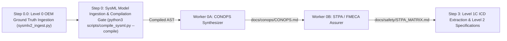

# Digital Engineering Agent Platform (DEAP) — Low-Altitude UAS Infrastructure Safety Platform -- Downstream Cyber-Physical Infrastructure Safety Project

> **Repository Role:** `DOMAIN_DISTRIBUTION_TEMPLATE`  
> **Primary Technology Profiles:** `ROS2 C++ Real-Time` | `Target Embedded Platform Execution Profile`  
> **Target Regulatory Frameworks:** `JARUS SORA v2.5 (SAIL I–VI)` | `ASTM F3269-17 RTA` | `ASTM F3411-22a Remote ID` | `RTCA DO-365B DAA`  

---

## 1. System Overview

This repository is an installed downstream implementation workspace governed by the **Digital Engineering Agent Platform (DEAP)** for cyber-physical infrastructure safety, real-time control, run-time assurance (RTA), and autonomous operations.

### 1.1 Clean Landing Zone Invariant

As a **Tier 1 Domain Distribution Template**, this repository maintains pristine, clean landing zones in `schema/`, `docs/epics/`, `docs/features/`, `docs/user-stories/`, and `docs/use-cases/` with only `.gitkeep` files (or domain-wide baseline SysML v2 schemas). Concrete customer project specifications, flight code, ROS2 nodes, and proprietary implementation artifacts belong exclusively in downstream customer application workspaces and must NOT be committed here.

### 1.2 Primary Commercial Toolchain Integration Context

This platform explicitly declares **MATLAB / Simulink / Stateflow / Embedded Coder** as the Primary Tier-1 Commercial Toolchain Integration Context (Model-Based Design, Control Law Synthesis, DO-178C C/SPARK Ada code generation).

---

## 2. Pipeline Structure & Governance

- `.agents/` & `AGENTS.md`: Agent behavior rules, role boundaries, and subagent dispatch protocols.
- `CLAUDE.md`: Claude Code guidelines and verification gates.
- `.pipeline/`: Constitution (`constitution.md`), active governance rules bundle (`ACTIVE_RULES_BUNDLE.md`), domain specifications, and execution profiles (`profiles/ros2_cpp.md`, `profiles/px4_module.md`).
- `rules/` & `skills/`: Platform engineering rules and agent workflow skills.
- `schema/`: Contract definitions and SysML v2 schemas.
- `tests/`: Automated baseline verification and safety compliance tests.

---

## 3. Customer Project Onboarding & Agent Initialization Sequence

### 3.1 Turnkey Customer Project Onboarding

To install this domain pipeline and its engineering baseline into an end-user customer application workspace, run the following turnkey command from your customer project root directory:

```bash
# Onboard customer application workspace
git clone https://github.com/gintatkinson/DEAP-profile-react-web.git ./.tmp-pipeline && bash ./.tmp-pipeline/scripts/install_pipeline.sh . && rm -rf ./.tmp-pipeline
```

This single self-contained command operates strictly inside the customer project directory with zero sibling path dependencies.

To update the pipeline and governance rules inside this domain distribution template at any time, run:

```bash
# Update domain distribution template tooling in-place
bash scripts/install_pipeline.sh .
```

### 3.2 Mandatory Agent Initialization Sequence

Immediately following installation, any AI agent (Antigravity, Claude Code, Gemini CLI, Cursor) initializing in this repository MUST execute the following sequence before accepting user directives or executing task implementations:

0. **Detect Repository Role & Scope**:
   - Inspect whether `.pipeline/upstream/` exists on disk.
   - If absent and repository name starts with `DEAP-` -> **Domain Distribution Template Mode**: Clean landing zones must be maintained.
1. **Read Governance Constitution**: Execute `view_file` on `.pipeline/constitution.md` to ingest the platform-independent functional governance layer and zero-mocking persistence mandates.
2. **Load Project Skills**: Execute `view_file` on `skills/feature-driven-implementation/SKILL.md` (and any active skills under `skills/` or `.agents/skills/`) to initialize feature-driven implementation protocols and review gates.
3. **Load Governance Rules**: Execute `view_file` on `.pipeline/ACTIVE_RULES_BUNDLE.md` to ingest the complete, consolidated suite of active governance rules in a single read (covering dual-track MBD, SysML SSOT completeness, role boundary locks, and TDD mandates).
4. **Load Platform Profile**: Read the target platform execution profile (`.pipeline/profiles/flutter.md`, `.pipeline/profiles/react.md`, `.pipeline/profiles/ros2_cpp.md`, or `.pipeline/profiles/px4_module.md`) to establish platform-specific build, test, and lifecycle constraints.
5. **Bootstrap Tracker Labels & Verify Baseline**: Verify that repository issue tracker labels and baseline conformance pass by running `python3 scripts/verify_downstream_baseline.py --no-domain`.

---

## 4. Multi-Pipeline Operator Prompt Catalog & Autonomous Execution Workflows

This catalog contains the complete, unabridged, copy-pasteable operator prompt suite for executing all stages of the Digital Engineering Agent Platform (DEAP) lifecycle across context-isolated subagents in Antigravity, Claude Code, Gemini CLI, Cursor, and Cascade.

### 4.1 Master-Worker Subagent Topology



### 4.2 Pipeline 0 Execution Prompts

Execute the following prompts in sequence using context-isolated subagents to transform unstructured intent, operational scenarios, and interface schemas into formal CONOPS, STPA hazard matrices, and SysML v2 AST models:

#### 4.2.0 Worker 00: OEM Prose / BOM Ingestion & Model Synthesis Prompt (Step 0.0)

**Step 0.0 Entrypoint for Unstructured / Prose Customer Documentation:**
For customer projects starting with unstructured OEM prose manuals, PDF documentation, markdown tables, or Bill of Materials (BOM) specifications, Worker 00 provides the sanctioned, deterministic entrypoint. Extracting OEM Bill of Materials (BOM) and physical parameters into `schema/extracted/` and synthesizing canonical SysML v2 textual models in `schema/model.sysml` (or `.pipeline/schema.sysml`) is fully authorized under Check 23 (Factual Grounding & Numeric Provenance Gate) and serves as the mandatory precursor to executing the Step 0 compilation gate (`python3 scripts/compile_sysml.py --compile`).

```text
Execute `view_file` on `skills/spec-orchestrator/SKILL.md` as your very first step before taking any action.

Repository Classification: UPSTREAM_SPEC_CORE_COMPILER (or DOWNSTREAM_CUSTOMER_PROJECT depending on execution context)

Role: Worker 00 -- OEM Prose / BOM Ingestion & Model Synthesizer (Step 0.0)

Primary Commercial Toolchain Integration Context:
This project explicitly declares MATLAB / Simulink / Stateflow / Embedded Coder as the Primary Tier-1 Commercial Toolchain Integration Context (Model-Based Design, Control Law Synthesis, DO-178C C/SPARK Ada code generation).

Directive:
Execute Level 0 OEM Ground Truth Ingestion and initial SysML v2 textual model synthesis for customer projects starting from unstructured OEM prose manuals, PDF documentation, markdown tables, or Bill of Materials (BOM) specifications:

1. Unstructured & Semi-Structured Ingestion Scope:
   - Ingest raw OEM technical documentation, flight/operating manuals, ICD tables, and BOM markdown tables located in `schema/` and `schema/extracted/`.
   - Authorized Under Check 23: Extract physical parameters, component hierarchies, mass/power budgets, port/pin interfaces, and operational envelopes into machine-readable Markdown tables in `schema/extracted/` (e.g., `schema/extracted/oem_bom.md`, `schema/extracted/interface_table.md`, `schema/extracted/parametric_limits.md`).

2. Canonical SysML v2 Model Synthesis:
   - Execute the Level 0 ingestion translator:
     python3 skills/spec-orchestrator/scripts/sysmlv2_ingest.py --schema "schema/extracted/" --format markdown --out "schema/model.sysml"
   - Alternatively, synthesize a formal SysML v2 textual model `schema/model.sysml` directly, defining:
     * Root `package` matching the target cyber-physical system.
     * All component definitions as canonical `part def` elements with typed attributes (mass, power, dimensions, channel count, part numbers).
     * Directional communication and electrical interface boundaries as `port def` elements (`in`, `out`, `inout`).
     * Physical, environmental, and operational constraints as `constraint def` / `assert constraint` blocks.
     * State machine structures and operational lifecycle phases as `state def` elements.

3. Compilation Gate Precursor Verification:
   - Verify that the generated `schema/model.sysml` passes the Step 0 SysML Compilation Gate:
     python3 scripts/compile_sysml.py --compile
   - Ensure `.pipeline/schema.sysml` and `.pipeline/schema-digest.json` are successfully generated without compilation errors.
   - Verify Check 23 compliance (Factual Grounding & Numeric Provenance Gate): all physical parameters and component counts in `schema/model.sysml` strictly match the Level 0 OEM ground truth in `schema/extracted/`.

Defect Filing Directive:
If any compiler fault, schema inconsistency, or invariant violation is discovered, you are strictly forbidden from filing raw issues directly. You MUST dispatch a fresh context-isolated subagent with `skills/adversarial-code-auditor/SKILL.md` to perform the 5-pillar audit, generate the verified 7-section defect dossier, and submit it via `python3 scripts/file_defect.py`. Issue auto-closing keywords or issue close commands are strictly forbidden.

PROCEED
```

#### 4.2.1 Worker 0A: CONOPS & Operational Scenario Synthesis Prompt

```text
Execute `view_file` on `skills/spec-conops-engineering/SKILL.md` as your very first step before taking any action.

Repository Classification: UPSTREAM_SPEC_CORE_COMPILER (or DOWNSTREAM_CUSTOMER_PROJECT depending on execution context)

Role: Worker 0A -- CONOPS & Operational Scenario Synthesizer

Primary Commercial Toolchain Integration Context:
This project explicitly declares MATLAB / Simulink / Stateflow / Embedded Coder as the Primary Tier-1 Commercial Toolchain Integration Context (Model-Based Design, Control Law Synthesis, DO-178C C/SPARK Ada code generation).

Directive:
Execute front-end modular CONOPS and Tactical Mission Intent synthesis for the target cyber-physical system using Universal Multi-Document & Schema Ingestion:

1. Ingestion & Pre-Flight Analysis:
   - Ingest Normative Research Baselines: Ingest `docs/research/RESEARCH_INVENTORY.md` and `docs/research/FAILURE_MODE_REGISTRY.md` to map allocated obligations (`OBL-*`) and component failure modes.
   - Interface & Model Schema Ingestion: Ingest canonical SysML v2 AST model (`.pipeline/schema.sysml`), `schema/`, and `.pipeline/schema-digest.json`. Enforce 100% representation of declared `part def` nodes in Section 4 physical architecture. Scan `schema/` for pre-existing customer models and interface definitions (`*.sysml`, `*.proto`, `*.arxml`, `*.json`, `*.yaml`, `*.idl`).
   - Architectural Blueprint Ingestion: Scan `docs/architecture/` (and `docs/architecture/blueprints/`) for existing architectural specifications, network blueprints, and safety frameworks (`*.md`). Reconcile customer interface schemas and architectural blueprints with system boundaries and MATLAB / Simulink / Stateflow control law synthesis hooks.
   - Operational Intent Discovery: Ingest mission directives, operational purpose statements, and domain operational boundaries.

2. Ingestion & Analysis Scope:
   - Schema-derived operational envelope (physical boundaries, operating dynamics, environmental constraints, payload/actuator configurations).
   - Domain-specific operational lifecycle phases: Initialization, Normal Operation, Degraded/Contingency Modes, and Safe Shutdown/Transition.
   - Dynamic stakeholder roles derived from the system operational context (e.g., System Operators, Dispatchers/Supervisors, Field Maintenance Technicians, External Management/Telemetry Interfaces).
   - Domain-specific regulatory and safety classification relevant to the operational envelope.

3. Modular Deliverable Generation:
   - Do NOT draft monolithic files directly. Author modular units conforming to JSON Schema contracts under:
     * `docs/conops/units/conops/`: 12 canonical units (`01_METADATA_AND_OVERVIEW.md` through `12_EMERGENCY_DECISION_MATRIX.md`), including decoupled 3-tier architecture in `04_SYSTEM_ARCHITECTURE.md`.
     * `docs/conops/units/mission_intent/`: 10 canonical units (`01_COMMANDERS_INTENT.md` through `10_OPERATIONAL_ALLOCATION_TAGS.md`), including operational `06_ROE_SAFETY_INTERLOCKS.md` and tactical `08_GO_NO_GO_MATRIX.md`.
   - Ensure clear operational phase boundaries, system physical and functional boundaries, and environmental envelope constraints.
   - Include MATLAB / Simulink / Stateflow model integration baseline hooks for downstream control law synthesis.
   - Relative Link Mandate: Intra-document and schema links must use valid file-relative paths (`../../schema/...`, `../<dir>/...`).
   - KaTeX / LaTeX Math Formatting Mandate: All multi-line aligned equations MUST be enclosed in `\begin{aligned} ... \end{aligned}` within `$$` delimiters on dedicated lines. Bare alignment tabs `&` outside an alignment environment (`aligned`, `matrix`, `cases`) and `\begin{align*}` environments are strictly forbidden. Markdown Table Math Prohibition Rule: Strictly ban `$ ... $` and `$$ ... $$` LaTeX math delimiters inside table headers, rows, and cells; plain text and Unicode (e.g. `Initial S`, `ΔV`, `λ`, `°C`, `≥`, `≤`, `→`, `10⁻⁶`) must be used instead, with 1:1 column count match between header and delimiter rows.

4. Assembly & Verification Gates:
   - Execute deterministic assembly: `python3 scripts/assemble_conops.py --input-dir docs/conops/units/ --output-dir docs/conops/ --verify`.
   - Compile master specification documents: `python3 scripts/assemble_conops.py --input-dir docs/conops/units/ --output-dir docs/conops/`.
   - Gate 26 Validation: Execute `python3 -m unittest tests.test_conops_and_mission_intent_validators`.

Defect Filing Directive:
If any compiler fault, schema inconsistency, or invariant violation is discovered, you are strictly forbidden from filing raw issues directly. You MUST dispatch a fresh context-isolated subagent with `skills/adversarial-code-auditor/SKILL.md` to perform the 5-pillar audit, generate the verified 7-section defect dossier, and submit it via `python3 scripts/file_defect.py`. Issue auto-closing keywords or issue close commands are strictly forbidden.

PROCEED
```

#### 4.2.2 Worker 0B: STPA Hazard Analysis, FMECA & Domain Safety Assurer Prompt

```text
Execute `view_file` on `skills/spec-orchestrator/SKILL.md` as your very first step before taking any action.

Repository Classification: UPSTREAM_SPEC_CORE_COMPILER (or DOWNSTREAM_CUSTOMER_PROJECT depending on execution context)

Role: Worker 0B -- STPA Hazard Analysis, FMECA & Domain Safety Assurer

Primary Commercial Toolchain Integration Context:
This project explicitly declares MATLAB / Simulink / Stateflow / Embedded Coder as the Primary Tier-1 Commercial Toolchain Integration Context (Model-Based Design, Control Law Synthesis, DO-178C C/SPARK Ada code generation).

Directive:
Perform STPA hazard analysis, FMECA failure mode criticality evaluation, and domain safety risk assessment based on `docs/conops/CONOPS.md`.

1. Standards Compliance & Domain Safety Framework:
   - Dynamic Domain Safety Framework Selection: Apply the applicable safety framework governing the target domain (e.g., ISO 14971/IEC 62304 for Medical, EN 50128 for Rail, DNV-GL for Marine, ECSS for Space, ISO 3691-4 for Industrial AGV, SORA/DO-178C for Aviation).
   - Run-Time Assurance (RTA) Monitor Architecture & Safety Net switching (e.g., ASTM F3269-17 or domain-equivalent safety monitor pattern).
   - Domain-specific hazard detection, telemetry monitoring, and contingency guidance standards.

2. Output Requirements:
   - Generate `STPA_MATRIX.md` under `docs/safety/STPA_MATRIX.md` adhering strictly to the 8-pillar schema:
     1. System Losses ($L-1..N$)
     2. System Hazards ($H-1..N$)
     3. Hierarchical Control Structure Topology (defining System Controllers, Supervisors/RTA Monitors, Actuators, Sensors)
     4. Unsafe Control Actions ($UCA-1..N$) covering all 4 failure modes: (a) Not providing causes hazard, (b) Providing causes hazard, (c) Providing too early, too late, or out of order, (d) Stopped too soon or applied too long
     5. Loss Scenarios ($LS-1..N$) & Causal Factors
     6. Formal Safety Constraints ($SC-1..N$)
     7. FMECA Criticality Matrix: Component failure modes with 15+ rows, Severity ($S$), Occurrence ($O$), Detection ($D$), and Risk Priority Numbers ($\text{RPN} = S \times O \times D$)
     8. Domain Safety Framework & Risk Mitigations Table: Risk class classification, integrity levels, and comprehensive mapping of domain safety objectives and mitigations (e.g., ISO 14971/IEC 62304, EN 50128, DNV-GL, ECSS, ISO 3691-4, SORA OSO-01..24)
   - Include Run-Time Assurance (RTA) Safety Net monitor architecture.
   - Include MATLAB / Simulink / Stateflow / Embedded Coder model integration baseline hooks and SLDV formal proof properties.
   - KaTeX / LaTeX Math Formatting Mandate: All multi-line aligned equations MUST be enclosed in `\begin{aligned} ... \end{aligned}` within `$$` delimiters on dedicated lines. Bare alignment tabs `&` outside an alignment environment (`aligned`, `matrix`, `cases`) and `\begin{align*}` environments are strictly forbidden. Markdown Table Math Prohibition Rule: Strictly ban `$ ... $` and `$$ ... $$` LaTeX math delimiters inside table headers, rows, and cells; plain text and Unicode (e.g. `Initial S`, `ΔV`, `λ`, `°C`, `≥`, `≤`, `→`, `10⁻⁶`) must be used instead, with 1:1 column count match between header and delimiter rows.

PROCEED
```

#### 4.2.3 Worker 0C: SysML v2 Architectural & Safety Model Author Prompt

```text
Execute `view_file` on `skills/spec-orchestrator/SKILL.md` as your very first step before taking any action.

Repository Classification: UPSTREAM_SPEC_CORE_COMPILER (or DOWNSTREAM_CUSTOMER_PROJECT depending on execution context)

Role: Worker 0C -- SysML v2 Architectural & Safety Model Author

Primary Commercial Toolchain Integration Context:
This project explicitly declares MATLAB / Simulink / Stateflow / Embedded Coder as the Primary Tier-1 Commercial Toolchain Integration Context (Model-Based Design, Control Law Synthesis, DO-178C C/SPARK Ada code generation).

Directive:
Formalize the CONOPS (`CONOPS.md`), STPA hazard matrices, FMECA ratings, and domain safety requirements (`STPA_MATRIX.md`) into a canonical SysML v2 textual model and serialized AST handoff contract based on the derived domain architecture.

1. Model Engineering Mandate:
   - Construct canonical `DEAP_MODEL.sysml` conforming to SysML v2 textual specification standards (`package`, `req`, `part`, `port`, `state`, `satisfy`, `verify`) based on the derived domain architecture.
   - Define safety statecharts for Run-Time Assurance (RTA) switching logic, contingency operational modes, and fail-safe transitions.
   - Establish MATLAB / Simulink / Stateflow export compatibility for safety-critical code synthesis.
   - KaTeX / LaTeX Math Formatting Mandate: Ensure any statechart/mathematical transition guards and formal expressions follow standard escaping and valid KaTeX blocks (all multi-line aligned equations MUST be enclosed in `\begin{aligned} ... \end{aligned}` within `$$` delimiters on dedicated lines; bare alignment tabs `&` outside an alignment environment and `\begin{align*}` are strictly forbidden). Markdown Table Math Prohibition Rule: Strictly ban `$ ... $` and `$$ ... $$` LaTeX math delimiters inside table headers, rows, and cells; plain text and Unicode (e.g. `Initial S`, `ΔV`, `λ`, `°C`, `≥`, `≤`, `→`, `10⁻⁶`) must be used instead, with 1:1 column count match between header and delimiter rows.

2. Output Requirements:
   - Generate canonical `DEAP_MODEL.sysml` under `schema/DEAP_MODEL.sysml` (or `.pipeline/schema.sysml`).
   - Generate canonical `pipeline0_handoff_contract.json` under `.pipeline/contracts/pipeline0_handoff_contract.json` for downstream Pipeline 1 Agile projection and Pipeline 2 code generation.

PROCEED
```

#### 4.2.4 Worker 0D: Interface Specification Worker (Logical ICD & Signal Dictionary) Prompt

```text
Execute `view_file` on `skills/spec-icd-engineering/SKILL.md` as your very first step before taking any action.

Repository Classification: UPSTREAM_SPEC_CORE_COMPILER (or DOWNSTREAM_CUSTOMER_PROJECT depending on execution context)

Role: Worker 0D -- Interface Specification Worker (Logical ICD & Signal Dictionary)

Primary Commercial Toolchain Integration Context:
This project explicitly declares MATLAB / Simulink / Stateflow / Embedded Coder as the Primary Tier-1 Commercial Toolchain Integration Context (Model-Based Design, Control Law Synthesis, DO-178C C/SPARK Ada code generation).

Directive:
Synthesize Level 1C Logical Interface Specifications and Signal Dictionaries from formal SysML v2 AST interface blocks:

1. AST Interface Parsing:
   - Ingest `.pipeline/schema.sysml` and `.pipeline/schema-digest.json`.
   - Extract directional ports (`port def`), connection bindings (`connection`), formal interface contracts (`interface def`), and information payloads (`item flow`).
   - Ingest safety constraints (`SC-1..N`) and hazard allocations from `docs/safety/STPA_MATRIX.md` to map safety-critical signal bounds.

2. Deliverable Generation & Quality Gate:
   - Generate `docs/interfaces/ICD_01_SYSTEM_INTERFACE_MATRIX.md` containing subsystem boundary graphs, N² communication matrix, and topological port bindings.
   - Generate `docs/interfaces/ICD_02_MASTER_SIGNAL_DICTIONARY.md` containing signal identifiers (`SIG-*`), data types, units, sampling frequencies, update rates, latency bounds, and fail-safe default values.
   - Run Gate 23 ICD completeness validation: `python3 skills/spec-orchestrator/parity_auditor/src/parity_auditor/validators/icd_completeness_validator.py`.
   - Register the ICD suite under the `icd` issue label using `./skills/spec-orchestrator/scripts/create_issue.sh "<file>" "icd" "<title>"`.
   - Verify published issue body integrity via live tracker inspection.

Defect Filing Directive:
If any compiler fault, schema inconsistency, or invariant violation is discovered, you are strictly forbidden from filing raw issues directly. You MUST dispatch a fresh context-isolated subagent with `skills/adversarial-code-auditor/SKILL.md` to perform the 5-pillar audit, generate the verified 7-section defect dossier, and submit it via `python3 scripts/file_defect.py`. Issue auto-closing keywords or issue close commands are strictly forbidden.

PROCEED
```

### 4.3 Pipeline 1 Agile Backlog Projection Prompts

Execute the following prompts to extract full Agile backlogs (Epics, Level 1C ICD Interface Matrices, BDD User Stories, and UML Use Cases) with closed-loop tracker synchronization:

#### 4.3.1 Worker 1A: Structural Spec Worker (Epics & Features) Prompt

```text
Execute `view_file` on `skills/schema-specification-engineering/SKILL.md` as your very first step before taking any action.

Repository Classification: DOWNSTREAM_CUSTOMER_PROJECT (or UPSTREAM_SPEC_CORE_COMPILER depending on execution context)

Role: Worker 1A -- Structural Specification Worker (Epics & Features)

Primary Commercial Toolchain Integration Context:
This project explicitly declares MATLAB / Simulink / Stateflow / Embedded Coder as the Primary Tier-1 Commercial Toolchain Integration Context (Model-Based Design, Control Law Synthesis, DO-178C C/SPARK Ada code generation).

Directive:
Transform structural schemas and SysML v2 AST models into formal Agile Epics and Features adhering to OOA/OOD principles:

1. AST Parsing & Subsystem Extraction:
   - Ingest canonical SysML v2 model (`.pipeline/schema.sysml`) and schema digest (`.pipeline/schema-digest.json`).
   - Parse all subsystem `package` declarations to identify Epic boundaries (`docs/epics/epic-*.md`).
   - Parse all `part def` (structural components) and `item def` (data payloads) elements to identify Feature boundaries (`docs/features/feat-*.md`).
   - Dispatch fresh context-isolated subagents for each individual Epic and Feature with YAML frontmatter declaring `generation_mode: "subagent"`.

2. Local Validation & Issue Registration:
   - Execute the local model coverage linter: `./skills/spec-orchestrator/scripts/verify_model_coverage.py --spec-only --allow-missing-specs --only <spec_file>`.
   - Register Features first via `./skills/spec-orchestrator/scripts/create_issue.sh "<file>" "feature" "<title>"`.
   - Verify live published payload on the issue tracker (`gh issue view <ID> --json body` or `glab issue view <ID>`).
   - Inject verified Feature Issue IDs into Epic tasklists.
   - Register Epics via `./skills/spec-orchestrator/scripts/create_issue.sh "<file>" "epic" "<title>"`.

Defect Filing Directive:
If any compiler fault, schema inconsistency, or invariant violation is discovered, you are strictly forbidden from filing raw issues directly. You MUST dispatch a fresh context-isolated subagent with `skills/adversarial-code-auditor/SKILL.md` to perform the 5-pillar audit, generate the verified 7-section defect dossier, and submit it via `python3 scripts/file_defect.py`. Issue auto-closing keywords or issue close commands are strictly forbidden.

PROCEED
```


#### 4.3.2 Worker 1B: Behavioral Spec Worker (User Stories & Statecharts) Prompt

```text
Execute `view_file` on `skills/spec-user-story-engineering/SKILL.md` as your very first step before taking any action.

Repository Classification: DOWNSTREAM_CUSTOMER_PROJECT (or UPSTREAM_SPEC_CORE_COMPILER depending on execution context)

Role: Worker 1B -- Behavioral Specification Worker (User Stories & Statecharts)

Primary Commercial Toolchain Integration Context:
This project explicitly declares MATLAB / Simulink / Stateflow / Embedded Coder as the Primary Tier-1 Commercial Toolchain Integration Context (Model-Based Design, Control Law Synthesis, DO-178C C/SPARK Ada code generation).

Directive:
Extract Behavior-Driven Development (BDD) User Stories, UML Sequence Lifelines, and Stateflow transition triggers from SysML v2 behavioral AST nodes:

1. Behavioral AST Ingestion:
   - Ingest `.pipeline/schema.sysml` and operational text.
   - Parse `action def` (computations & transformations), `state def` (lifecycle states & transition guards), `port def` (message triggers), and `interaction def` (lifeline sequences).
   - Extract algorithmic calculation stories for dynamic computations and temporal expiration stories for state lifecycles.
   - Map acceptance criteria BDD scenarios to formal SysML `test case def` elements with `verify requirement` tags.

2. Deliverable Generation & Issue Registration:
   - Dispatch fresh context-isolated subagents per User Story (`docs/user-stories/us-*.md`) with YAML frontmatter (`generation_mode: "subagent"`).
   - Execute local model coverage linter: `./skills/spec-orchestrator/scripts/verify_model_coverage.py --spec-only --allow-missing-specs --only <spec_file>`.
   - Register User Stories via `./skills/spec-orchestrator/scripts/create_issue.sh "<file>" "user-story" "<title>"`.
   - Verify live published payload on the issue tracker (`gh issue view <ID> --json body` or `glab issue view <ID>`).

Defect Filing Directive:
If any compiler fault, schema inconsistency, or invariant violation is discovered, you are strictly forbidden from filing raw issues directly. You MUST dispatch a fresh context-isolated subagent with `skills/adversarial-code-auditor/SKILL.md` to perform the 5-pillar audit, generate the verified 7-section defect dossier, and submit it via `python3 scripts/file_defect.py`. Issue auto-closing keywords or issue close commands are strictly forbidden.

PROCEED
```

#### 4.3.3 Worker 1C: Operational Spec Worker (Use Cases & Realization Matrices) Prompt

```text
Execute `view_file` on `skills/spec-usecase-engineering/SKILL.md` as your very first step before taking any action.

Repository Classification: DOWNSTREAM_CUSTOMER_PROJECT (or UPSTREAM_SPEC_CORE_COMPILER depending on execution context)

Role: Worker 1C -- Operational Spec Worker (Use Cases & Realization Matrices)

Primary Commercial Toolchain Integration Context:
This project explicitly declares MATLAB / Simulink / Stateflow / Embedded Coder as the Primary Tier-1 Commercial Toolchain Integration Context (Model-Based Design, Control Law Synthesis, DO-178C C/SPARK Ada code generation).

Directive:
Derive formal UML System Use Cases directly from SysML v2 `use case def` AST blocks and system interaction scenarios:

1. Use Case AST Ingestion:
   - Ingest `.pipeline/schema.sysml`, `docs/features/`, and `docs/user-stories/`.
   - Extract `use case def` AST nodes, identifying `subject` (`part def`), typed `actor` ports, `objective`, and `include`/`extend` relations.
   - Maintain 1:1 Use Case Def mapping with Primary/Secondary Actors, Preconditions, Trigger, Main Success Scenario, Alternate/Exception Flows (covering 100% of validation constraints across realized features), and Postconditions (Success & Failure Guarantees).
   - Construct UML Use Case diagrams and UML State Machine diagrams.

2. Realization Matrix & Registration:
   - Construct `## Realization Matrix` resolving specific, unique tracker Issue IDs for each intersecting User Story and Feature.
   - Execute local model coverage check: `./skills/spec-orchestrator/scripts/verify_model_coverage.py --spec-only --allow-missing-specs --only <spec_file>`.
   - Register Use Cases via `./skills/spec-orchestrator/scripts/create_issue.sh "<file>" "use-case" "<title>"`.
   - Verify live published payload on the issue tracker (`gh issue view <ID> --json body` or `glab issue view <ID>`).

Defect Filing Directive:
If any compiler fault, schema inconsistency, or invariant violation is discovered, you are strictly forbidden from filing raw issues directly. You MUST dispatch a fresh context-isolated subagent with `skills/adversarial-code-auditor/SKILL.md` to perform the 5-pillar audit, generate the verified 7-section defect dossier, and submit it via `python3 scripts/file_defect.py`. Issue auto-closing keywords or issue close commands are strictly forbidden.

PROCEED
```

#### 4.3.4 Worker 1D: WBS & Work Package Decomposition Spec Worker Prompt

```text
Execute `view_file` on `skills/spec-wbs-engineering/SKILL.md` as your very first step before taking any action.

Repository Classification: DOWNSTREAM_CUSTOMER_PROJECT (or UPSTREAM_SPEC_CORE_COMPILER depending on execution context)

Role: Worker 1D -- WBS & Work Package Decomposition Spec Worker

Primary Commercial Toolchain Integration Context:
This project explicitly declares MATLAB / Simulink / Stateflow / Embedded Coder as the Primary Tier-1 Commercial Toolchain Integration Context (Model-Based Design, Control Law Synthesis, DO-178C C/SPARK Ada code generation).

Directive:
Synthesize MIL-STD-881E Work Breakdown Structures (WBS), Technical Realization Registers, and Enterprise Project Management Exports (Jira, Monday.com, MS Project CSV and JSON AST) from SysML AST, ConOps, Safety Matrices, and Agile Backlog items:

1. WBS & Enterprise Realization Synthesis:
   - Ingest `.pipeline/schema.sysml`, `docs/conops/`, `docs/safety/`, `docs/epics/`, `docs/features/`, `docs/user-stories/`, and `docs/use-cases/`.
   - Synthesize the complete 5-tier WBS hierarchy and 7 concrete Model-Based Design (MBD) work packages per feature (`WP-xxx-SPEC`, `WP-xxx-MAT-PARAM`, `WP-xxx-SL-BLD`, `WP-xxx-PY-DOM`, `WP-xxx-PY-ENG`, `WP-xxx-TST`, `WP-xxx-REP`).
   - Construct the authoritative 7-Column End-to-End Traceability Matrix linking SysML components, Feature specs, User Stories, MATLAB/Simulink models, Python 250 Hz engines, Pytest verification suites, and DO-178C/DO-331 simulation evidence.
   - Run the deterministic WBS suite generator: `python3 scripts/generate_wbs_suite.py`.

2. Deliverable Generation & Issue Registration:
   - Generate `docs/management/WBS_DELIVERABLES_SUITE.md` with CommonMark metadata table.
   - Generate multi-platform export `docs/management/wbs_export_jira_monday_ms_project.csv` (RFC 4180 compliant with Jira, Monday.com, and MS Project field mappings).
   - Generate validated machine-readable JSON AST `docs/management/wbs_export.json`.
   - Register the WBS suite under the `wbs` issue label using `./skills/spec-orchestrator/scripts/create_issue.sh "docs/management/WBS_DELIVERABLES_SUITE.md" "wbs" "<title>"`.
   - Verify published issue body integrity via live tracker inspection (`gh issue view <ID> --json body` or `glab issue view <ID>`).

Defect Filing Directive:
If any compiler fault, schema inconsistency, or invariant violation is discovered, you are strictly forbidden from filing raw issues directly. You MUST dispatch a fresh context-isolated subagent with `skills/adversarial-code-auditor/SKILL.md` to perform the 5-pillar audit, generate the verified 7-section defect dossier, and submit it via `python3 scripts/file_defect.py`. Issue auto-closing keywords or issue close commands are strictly forbidden.

PROCEED
```

### 4.4 Multi-Provider Backlog Reconciliation Commands

Execute backlog reconciliation and model parity verification across your target VCS platform or offline air-gapped environment:

#### 4.4.1 Option A: GitLab SaaS Reconciliation
```bash
./scripts/reconcile_backlog.py --provider gitlab
```

#### 4.4.2 Option B: GitLab Self-Managed / SCIF Air-Gapped Reconciliation
```bash
./scripts/reconcile_backlog.py --provider gitlab --gitlab-url https://gitlab.internal.defense.gov --project uas-safety/uav-010
```

#### 4.4.3 Option C: GitHub Issues Reconciliation
```bash
./scripts/reconcile_backlog.py --provider github
```

#### 4.4.4 Option D: Offline Verification & 23-Gate Parity Lock
```bash
# Closed-loop reverse SysML v2 AST synchronization
python3 scripts/compile_sysml.py --reverse-sync

# Offline backlog checklist and status synchronization
./scripts/reconcile_backlog.py --offline

# 23-Gate Model Coverage & UML Compliance Lock
./skills/spec-orchestrator/scripts/verify_model_coverage.py schema docs/features --spec-only
```

### 4.5 Pipeline 2 Autonomous Feature Implementation Prompts

Execute the following prompts to drive feature implementation and two-path (dual-track) simulation verification through context-isolated TDD micro-tasks:

#### 4.5.1 Worker 2A / Synthesis Driver: Feature-Driven Implementation Prompt

```text
Execute `view_file` on `skills/feature-driven-implementation/SKILL.md` as your very first step before taking any action.

Repository Classification: DOWNSTREAM_CUSTOMER_PROJECT (or UPSTREAM_SPEC_CORE_COMPILER depending on execution context)

Role: Worker 2A -- Feature-Driven Implementation & Synthesis Driver

Primary Commercial Toolchain Integration Context:
This project explicitly declares MATLAB / Simulink / Stateflow / Embedded Coder as the Primary Tier-1 Commercial Toolchain Integration Context (Model-Based Design, Control Law Synthesis, DO-178C C/SPARK Ada code generation).

Governance Preamble & Execution Directive:
Adopt the feature-driven-implementation skill by reading `.pipeline/constitution.md`, `.pipeline/ACTIVE_RULES_BUNDLE.md`, and the target platform profile (`.pipeline/profiles/<target-platform>.md`, e.g. `ros2_cpp.md`, `px4_module.md`, or `flutter.md`).

Implement prioritized Feature [Issue Number, e.g. #1] adhering strictly to the 3-Layer Definition of Done (DoD):
1. Layer 1: Domain Model / Safety Statechart -- Platform-independent domain entities, transition guards, mathematical invariants, and safety statecharts.
2. Layer 2: Safety Statechart / ViewModel -- State management, event handling, lifecycle hooks, and reactive telemetry bindings.
3. Layer 3: Interface Binding / Middleware & BDD Tests -- Platform interface bindings (ROS2 lifecycle nodes, PX4 uORB modules, or Flutter widgets) verified via automated BDD integration tests against live emulators / simulation harnesses.

Execution Standards:
- Execute TDD RED-GREEN-REFACTOR cycles using context-isolated subagents for each 2-5 minute micro-task.
- Dual-Track MBD Verification: Enforce Track A (Native MATLAB / Simulink / Stateflow synthesis) and Track B (Headless CI Digital Twin Engine) with numerical tolerance verification (error <= 10^-6) and zero license blockers.
- Zero-Mocking Live Persistence Mandate: Validate all transactions against live databases / emulators.
- Closed-Loop Payload Verification: Deliver cumulative solution walkthrough (`docs/designs/feat-<ID>-solution.md`), verify live published payload, comment on issue with walkthrough link, and apply `status:fixed-resolved` (GitHub) or `status::fixed-resolved` (GitLab). Leave issue open for Product Owner review.

Defect Filing Directive:
If any compiler fault, schema inconsistency, or invariant violation is discovered, you are strictly forbidden from filing raw issues directly. You MUST dispatch a fresh context-isolated subagent with `skills/adversarial-code-auditor/SKILL.md` to perform the 5-pillar audit, generate the verified 7-section defect dossier, and submit it via `python3 scripts/file_defect.py`. Issue auto-closing keywords or issue close commands are strictly forbidden.

PROCEED
```

#### 4.5.2 Worker 2B / Simulation Driver: Two-Path (Dual-Track) Simulation & Digital Twin Verification Prompt

```text
Execute `view_file` on `skills/feature-driven-implementation/SKILL.md` as your very first step before taking any action.

Repository Classification: DOWNSTREAM_CUSTOMER_PROJECT (or UPSTREAM_SPEC_CORE_COMPILER depending on execution context)

Role: Worker 2B -- Two-Path (Dual-Track) Simulation & Digital Twin Verification Driver

Primary Commercial Toolchain Integration Context:
This project explicitly declares MATLAB / Simulink / Stateflow / Embedded Coder as the Primary Tier-1 Commercial Toolchain Integration Context (Model-Based Design, Control Law Synthesis, DO-178C C/SPARK Ada code generation).

Governance Preamble & Execution Directive:
Adopt the feature-driven-implementation skill by reading `.pipeline/constitution.md`, `.pipeline/ACTIVE_RULES_BUNDLE.md`, and `docs/architecture/blueprints/SYSML_SSOT_BIDIRECTIONAL_SYNCHRONIZATION_ARCHITECTURE.md`.

Execute Two-Path (Dual-Track) Model-Based Design (MBD) simulation synthesis and digital twin verification for Feature [Issue Number, e.g. #1]:

1. Track A (Native MATLAB / Simulink / Stateflow Synthesis):
   - Programmatic Model Construction: Deliver `models/scripts/build_<feature_slug>_model.m` to programmatically synthesize native `.slx` block diagrams and Stateflow charts using official MATLAB APIs.
   - Parameter & Signal Dictionaries: Deliver physical parameter dictionary `models/matlab/<feature_slug>_params.m` and Simulink Data Dictionary `models/matlab/<feature_slug>_data.sldd`.
   - Solver & Synthesis Baseline: Configure models for deterministic fixed-step discrete solvers (`FixedStepDiscrete`, $dt = 0.004\,\text{s}$ / 250 Hz) and Embedded Coder DO-178C C / SPARK Ada code synthesis.

2. Track B (Headless CI Digital Twin Engine):
   - License-Free Discrete Execution Engine: Deliver standalone Python simulation engine (`models/python/<feature_slug>_domain.py` and `models/python/<feature_slug>_engine.py`) executing at identical discrete loop rate ($dt$) with exact transition guards, polynomial transfer curves, and 6-DOF kinematics.
   - Zero License Blocker CI Harness: Deliver automated regression test suite `tests/test_<feature_slug>_simulation.py` running 100% offline in containerized CI environments without MathWorks licenses.

3. Mathematical & Discrete Equivalence Mandate:
   - Numerical Tolerance Verification: Guarantee state vector and output trajectory error between Track A reference and Track B digital twin satisfies $\|x_{\text{Simulink}} - x_{\text{DigitalTwin}}\|_\infty \le 10^{-6}$.
   - Formal DO-331 Verification Report: Generate comprehensive verification report `docs/reports/simulink_results/<FEATURE-ID>_simulation_results.md` detailing MC/DC coverage mapping, transition truth tables, fault-injection scenarios, and numerical parity logs.

Defect Filing Directive:
If any compiler fault, schema inconsistency, or invariant violation is discovered, you are strictly forbidden from filing raw issues directly. You MUST dispatch a fresh context-isolated subagent with `skills/adversarial-code-auditor/SKILL.md` to perform the 5-pillar audit, generate the verified 7-section defect dossier, and submit it via `python3 scripts/file_defect.py`. Issue auto-closing keywords or issue close commands are strictly forbidden.

PROCEED
```

#### 4.5.3 Two-Path MBD Artifact & Deliverable Hierarchy

Every feature containing control laws, operating dynamics, physical plant estimators, or safety state machines delivers the canonical two-path MBD artifact suite:

```text
models/
├── scripts/
│   └── build_<feature_slug>_model.m        # Track A: Programmatic Simulink/Stateflow builder script
├── matlab/
│   ├── <feature_slug>_params.m            # Track A: MATLAB physical plant & control parameters
│   └── <feature_slug>_data.sldd           # Track A: Simulink Data Dictionary (data types & signals)
└── python/
    ├── <feature_slug>_domain.py           # Track B: Strongly-typed domain models & state vectors
    └── <feature_slug>_engine.py           # Track B: Standalone discrete-time simulation engine

tests/
└── test_<feature_slug>_simulation.py      # Automated CI regression suite for Track B engine

docs/reports/simulink_results/
└── <FEATURE-ID>_simulation_results.md     # Formal DO-331 simulation & numerical parity report
```

##### Dual-Track Artifact Descriptions:

1. **`models/scripts/build_<feature_slug>_model.m` (Track A Builder)**:
   Programmatically constructs native MATLAB / Simulink (`.slx`) block diagrams and Stateflow charts via official MATLAB APIs (`new_system`, `add_block`, `Stateflow.Data`, `Stateflow.State`, `Stateflow.Transition`). Configures deterministic discrete fixed-step solvers (`FixedStepDiscrete`) and Embedded Coder DO-178C C / SPARK Ada code synthesis.

2. **`models/matlab/<feature_slug>_params.m` & `.sldd` (Track A Dictionaries)**:
   Declares physical plant constants, control gains, rate limits, sensor noise variances, and discrete sample time ($dt = 0.004\,\text{s}$ / 250 Hz) in typed MATLAB structures and Simulink Data Dictionaries.

3. **`models/python/<feature_slug>_domain.py` & `_engine.py` (Track B Digital Twin)**:
   Pure Python, license-free, headless discrete simulation engine executing identical algebraic formulations, cubic polynomial blending curves ($\lambda(\tau) = 3\tau^2 - 2\tau^3$), and safety transition guards. Exposes typed state vectors and `step(dt, inputs) -> outputs` execution interface.

4. **`tests/test_<feature_slug>_simulation.py` (Automated CI Verification Suite)**:
   Pytest / Unittest test suite executing offline in CI/CD runners without MathWorks license blockers. Validates nominal control tracks, fault-injection responses, emergency safety transitions, and state invariants.

5. **`docs/reports/simulink_results/<FEATURE-ID>_simulation_results.md` (DO-331 Verification Report)**:
   Formal DO-178C / DO-331 verification deliverable documenting mathematical equivalence, step-by-step state transition logs, fault injection test results, and numerical tolerance parity ($\le 10^{-6}$).

---

## 5. Verification & Quality Gates

Execute baseline and safety governance verification:

```bash
# Run downstream conformance gate
python3 scripts/verify_downstream_baseline.py --no-domain
```
