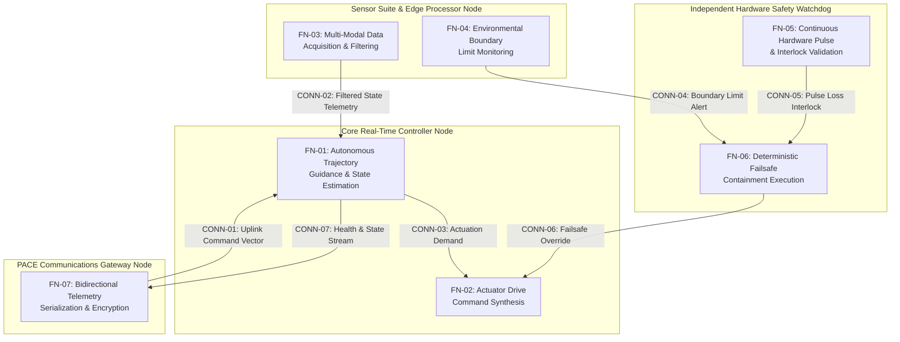

| Attribute | Value |
| :--- | :--- |
| **Title** | System Operational Architecture & Physical Subsystem Decomposition |
| **Version** | 1.0.0 |
| **Date** | 2026-09-02 |

## 4. System Operational Architecture & Physical Subsystem Decomposition

### 4.1 Super-System Operational Architecture & Segment Boundaries
In accordance with IEEE 1362:1998 Clause 5.3, ISO/IEC/IEEE 29148:2018 §6.4.3, and DoDAF 2.02 SV-1, the operational system is partitioned across major physical segments and operational boundaries.

{{SUPER_SYSTEM_ARCHITECTURE}}

### 4.2 Super-System Segment Allocation Matrix
Physical subsystems, computational nodes, and functional elements are allocated across operational segments to enforce clear physical and organizational ownership boundaries.

| Subsystem Part | Operational Segment | SSOT Ground Truth Source & Citation | Primary Functional Role |
| :--- | :--- | :--- | :--- |
| `CoreController` | Primary Operational Segment | [../../schema/<source_file>](../../schema/<source_file>#anchor) ("OEM Clause Title") \| SysML v2: `part def <NodeName>` | Realizes core operational mission functions |
| `TelemetryTerminal` | Command & Control Segment | [../../schema/<source_file>](../../schema/<source_file>#anchor) ("OEM Clause Title") \| SysML v2: `part def <NodeName>` | Encrypted PACE Communications |
| `GroundSupportUnit` | Auxiliary Support Segment | [../../schema/<source_file>](../../schema/<source_file>#anchor) ("OEM Clause Title") \| SysML v2: `part def <NodeName>` | Pre-Operation Power & Diagnostics |

{{SEGMENT_ALLOCATION_MATRIX}}

### 4.3 Subsystem Architecture (100% AST Part Coverage)
Detailed architectural decomposition of all physical and logical subsystems derived deterministically from the abstract SysML v2 AST part definitions.

#### 4.3.x `<SubsystemName>` Subsystem Architecture
- **Functional Purpose & Scope:** Dedicated operational capability, deterministic state processing, and safety-critical execution.
- **Physical & Logical Interface / Port Allocations:** Declared input, output, and bidirectional ports (`PORT-... (IN/OUT/INOUT)`) and high-level bus interconnects.
- **Power, Mass & Resource Envelopes:** Operating electrical power draw, mass partition budget ($m_{\mathrm{alloc}}$), and thermal operating envelopes.
- **Operational Role & Statechart Integration:** Lifecycle mode allocation ($\Phi_{\mathrm{lifecycle}}$) and active operational states.
- **Safety Invariants, Containment Interlocks & FMECA Linkage:** Watchdog interlocks, emergency trigger containment bindings (`EMG-01`..`EMG-07`), and safety criticalities.
- **SSOT Ground Truth Mapping:** [../../schema/<source_file>](../../schema/<source_file>#anchor) ("OEM Clause Title") | SysML v2: `part def <NodeName>`

{{SUBSYSTEM_ARCHITECTURE_SECTION}}

### 4.4 Port Taxonomy & Interface Interconnects
Taxonomy of operational and physical interface ports connecting subsystems, communication buses, and external interaction points.

{{PORT_TAXONOMY_SECTION}}

### 4.5 Level 0 SSOT Model Binding Statement
Formal declaration binding this operational architecture specification to the authoritative Single Source of Truth (SSOT) Model-Based Systems Engineering (MBSE) AST schema.

{{MODEL_BINDING_STATEMENT}}

### 4.6 DoDAF SV-4 / UAF Rs-Fn Function-to-Subsystem Allocation Architecture
In accordance with DoDAF 2.02 SV-4, OMG UAF v2.0 Resource Functions (Rs-Fn), and ISO/IEC/IEEE 15288:2023 §6.4.4, system functional operations and actions are allocated deterministically to physical subsystem performer nodes. This allocation enforces strict operational decoupling, modular real-time determinism, and direct traceability to executable MATLAB / Simulink / Stateflow / Embedded Coder digital twin control synthesis models.

