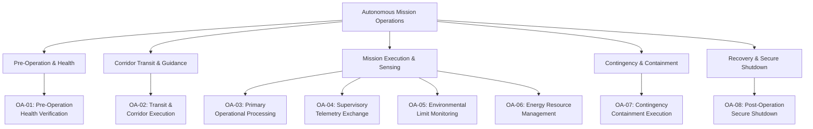
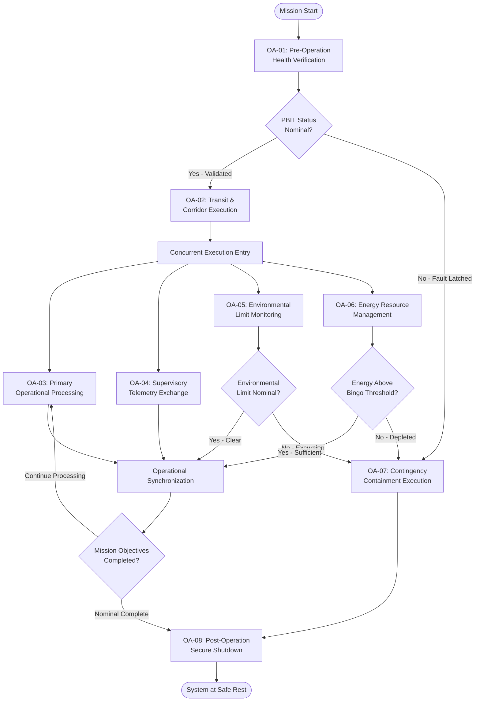

| Attribute | Value |
| :--- | :--- |
| **Title** | OMG UAF Operational Activity Taxonomy |
| **Version** | 1.0.0 |
| **Date** | 2026-09-02 |

## 6. OMG UAF Operational Activity Taxonomy

### 6.1 Operational Activity Decomposition
In accordance with OMG Unified Architecture Framework (UAF) v2.0 Operational Processes (Op-Pr) and Operational Taxonomy (Op-Tx), the system operational activities are formally decomposed and allocated 100% to system performer nodes, logical subsystems, and physical resources.

Every operational activity is bound to a machine-verifiable Gate 24 allocation tag (`/// OperationalAllocation: [OA-XX]`) and realization tag (`/// Realises: [UAF-ACT-XX]`).

#### 6.1.1 DoDAF OV-5a / UAF Op-Tx Operational Activity Decomposition Tree
The following tree specifies the top-down hierarchical decomposition of autonomous mission operations into lifecycle operational phases and granular operational activities (`OA-01` through `OA-08`) in accordance with DoDAF 2.02 OV-5a, OMG UAF v2.0 Op-Tx, and ISO/IEC/IEEE 29148 §6.4.3:

| Activity ID | Activity Name | Allocated Performer Node & Resource | Operational Description | Traceability & Gate 24 Allocation Tag | SSOT Ground Truth Source & Citation |
| :--- | :--- | :--- | :--- | :--- | :--- |
| **OA-01** | `PreOperationHealthVerification` | Core Controller / Safety Watchdog | Executes power-on Built-In-Tests (PBIT), cross-checks redundant sensor biases, validates actuator end-stops, verifies cryptographic root of trust, and logs calibration status within t_PBIT <= tau_PBIT_max. | `/// OperationalAllocation: [OA-01]` `/// Realises: [UAF-ACT-01]` | `SysML v2 AST: action def PreOperationHealthVerification`, `ISO/IEC/IEEE 15288:2023 §6.4.4` |
| **OA-02** | `TransitAndCorridorExecution` | Core Controller / Guidance Subsystem | Computes and tracks multi-dimensional trajectory corridors, executes closed-loop state control at loop rate f_control, and minimizes trajectory tracking error (e_track <= epsilon_track_max). | `/// OperationalAllocation: [OA-02]` `/// Realises: [UAF-ACT-02]` | `SysML v2 AST: action def TransitAndCorridorExecution`, `ISO/IEC/IEEE 15288:2023 §6.4.4` |
| **OA-03** | `PrimaryOperationalProcessing` | Sensor Suite / Edge Processing Node | Captures system sensor data, executes deterministic feature extraction and state estimation, and formats geo-referenced state telemetry. | `/// OperationalAllocation: [OA-03]` `/// Realises: [UAF-ACT-03]` | `SysML v2 AST: action def PrimaryOperationalProcessing`, `ISO/IEC/IEEE 15288:2023 §6.4.3` |
| **OA-04** | `SupervisoryTelemetryExchange` | PACE Communications Transceiver Node | Manages bidirectional telemetry exchange, encrypts control commands, and streams consolidated system state data to the supervisory operator station. | `/// OperationalAllocation: [OA-04]` `/// Realises: [UAF-ACT-04]` | `SysML v2 AST: action def SupervisoryTelemetryExchange`, `ISO/IEC/IEEE 15288:2023 §6.4.5` |
| **OA-05** | `EnvironmentalLimitMonitoring` | Sensor Suite / Safety Watchdog | Continuously evaluates ambient thermal, mechanical, dynamic, and operational boundary parameters against operating limits at monitoring rate f_monitor. | `/// OperationalAllocation: [OA-05]` `/// Realises: [UAF-ACT-05]` | `SysML v2 AST: action def EnvironmentalLimitMonitoring`, `ISO/IEC/IEEE 15288:2023 §6.4.9` |
| **OA-06** | `EnergyResourceManagement` | Power & Resource Management Subsystem | Monitors stored energy/resource state-of-charge (SoC), computes dynamic closed-loop Bingo return thresholds, and regulates power bus distribution. | `/// OperationalAllocation: [OA-06]` `/// Realises: [UAF-ACT-06]` | `SysML v2 AST: action def EnergyResourceManagement`, `ISO/IEC/IEEE 15288:2023 §6.4.4` |
| **OA-07** | `ContingencyContainmentExecution` | Deterministic Failsafe State Machine | Detects canonical emergency triggers (`EMG-01`..`EMG-07`), arbitrates priorities, and executes deterministic containment maneuvers within t_resp <= tau_containment. | `/// OperationalAllocation: [OA-07]` `/// Realises: [UAF-ACT-07]` | `SysML v2 AST: action def ContingencyContainmentExecution`, `ISO/IEC/IEEE 15288:2023 §6.4.11` |
| **OA-08** | `PostOperationSecureShutdown` | Core Controller / Security Partition | Executes controlled deceleration to safe state, actuator power isolation, cryptographic data zeroization, and post-operation diagnostic log archival. | `/// OperationalAllocation: [OA-08]` `/// Realises: [UAF-ACT-08]` | `SysML v2 AST: action def PostOperationSecureShutdown`, `ISO/IEC/IEEE 15288:2023 §6.4.14` |

#### 6.1.2 DoDAF OV-5b / UAF Op-Pr Operational Activity Functional Flow Diagram
The operational activity functional flow diagram traces the sequential, concurrent, and branching execution flow of operational activities OA-01 through OA-08 across pre-operation, corridor transit, operational execution, real-time monitoring, contingency containment, and secure shutdown:

### 6.2 DoDAF SV-5a / OMG UAF Op-to-Res Operational-to-Resource Allocation Matrix
The following 2D cross-reference matrix establishes complete operational-to-resource traceability allocating canonical operational activities (`OA-01` through `OA-08`) across system performer nodes, physical subsystems/partitions, software functions/partitions, interface/bus bindings, and criticality/safety assurance levels in accordance with DoDAF 2.02 SV-5a, OMG UAF v2.0 Op-to-Res, and ISO/IEC/IEEE 15288:2023 §6.4.4:

| Operational Activity ID | Activity Name | System Performer Node | Physical Subsystem / Partition | Software Function / Partition | Interface / Bus Binding | Criticality & Safety Level |
| :--- | :--- | :--- | :--- | :--- | :--- | :--- |
| **OA-01** | `PreOperationHealthVerification` | Core Controller Node / Safety Watchdog Node | Main Processing Unit / Watchdog Hardware Partition | `BootBITPartition` / `HardwareIntegrityMonitor` | System Control Bus / SPI Watchdog Bus | Criticality: High (Safety-Critical) |
| **OA-02** | `TransitAndCorridorExecution` | Core Controller Node | Guidance Computer Partition | `TrajectoryCorridorTracker` / `ClosedLoopController` | Deterministic CAN / Ethernet Bus | Criticality: High (Safety-Critical) |
| **OA-03** | `PrimaryOperationalProcessing` | Sensor Suite Node | Edge Processing Unit | `FeatureExtractionModule` / `StateEstimator` | High-Speed Sensor Serial Link | Criticality: Medium (Mission-Critical) |
| **OA-04** | `SupervisoryTelemetryExchange` | PACE Transceiver Node | Communications Router Partition | `TelemetryEncapsulationTask` / `CryptoManager` | Point-to-Point Datalink Bus | Criticality: Medium (Mission-Critical) |
| **OA-05** | `EnvironmentalLimitMonitoring` | Sensor Suite Node / Safety Watchdog Node | Environmental Monitoring Unit | `BoundaryEvaluationService` / `ThresholdComparator` | Sensor Telemetry Bus | Criticality: High (Safety-Critical) |
| **OA-06** | `EnergyResourceManagement` | Resource Management Node | Power & BMS Controller Partition | `StateOfChargeEstimator` / `BingoThresholdCalculator` | Power Distribution Bus | Criticality: High (Safety-Critical) |
| **OA-07** | `ContingencyContainmentExecution` | Safety Watchdog Node / Core Controller Node | Deterministic Failsafe Partition | `EmergencyStateManager` / `ContainmentActuatorDriver` | Isolated Failsafe Interlock Bus | Criticality: High (Safety-Critical) |
| **OA-08** | `PostOperationSecureShutdown` | Core Controller Node | Secure Storage & Core Controller Partition | `ActuatorIsolationService` / `LogArchivalTask` | System Maintenance Bus | Criticality: Medium (Mission-Critical) |

#### 6.2.1 Performer Node Summary Table
The following matrix demonstrates 100% allocation coverage across system nodes:

| System Performer Node | Node Type | Primary Resource | Allocated Activities |
| :--- | :--- | :--- | :--- |
| Core Controller Node | Cyber-Physical Controller | Deterministic Real-Time Core | OA-01, OA-02, OA-08 |
| Sensor Suite Node | Sensor Edge Node | Multi-Modal Sensor Array & Edge Compute | OA-03, OA-05 |
| Safety Watchdog Node | Safety Critical Hardware | Independent Hardware Watchdog | OA-01, OA-05, OA-07 |
| PACE Transceiver Node | Datalink Router | Multi-Channel Communications Modem | OA-04 |
| Resource Management Node | Power / Energy Hub | Smart Battery & BMS Controller | OA-06 |
| Operator Station Node | Operator Performer | Supervisory Operator Console | OA-01, OA-04, OA-08 |

### 6.3 Operational Traceability Invariant
Per DEAP Governance Rule `rules/conops-mission-intent-integrity.md`, all downstream SysML v2 architectural blocks, state machine behavioral charts, and software requirement units must carry direct traceability back to these eight canonical operational activities using the formalized allocation syntax:
- `/// OperationalAllocation: [OA-01]`
- `/// OperationalAllocation: [OA-02]`
- `/// OperationalAllocation: [OA-03]`
- `/// OperationalAllocation: [OA-04]`
- `/// OperationalAllocation: [OA-05]`
- `/// OperationalAllocation: [OA-06]`
- `/// OperationalAllocation: [OA-07]`
- `/// OperationalAllocation: [OA-08]`
